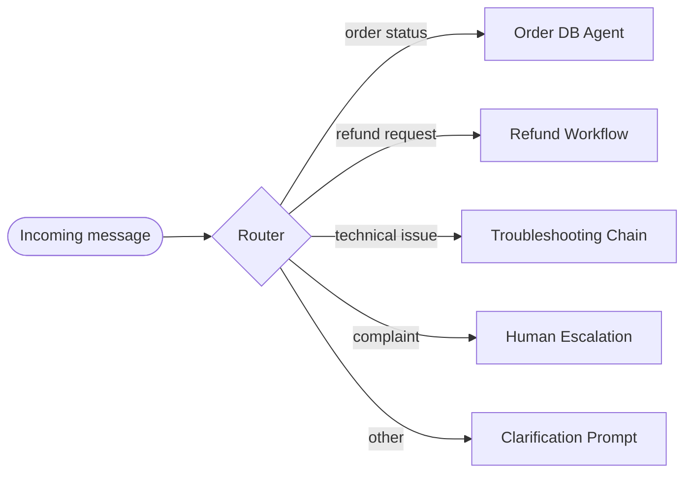
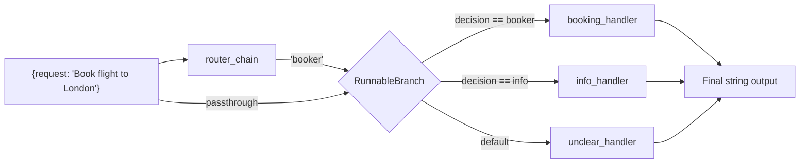
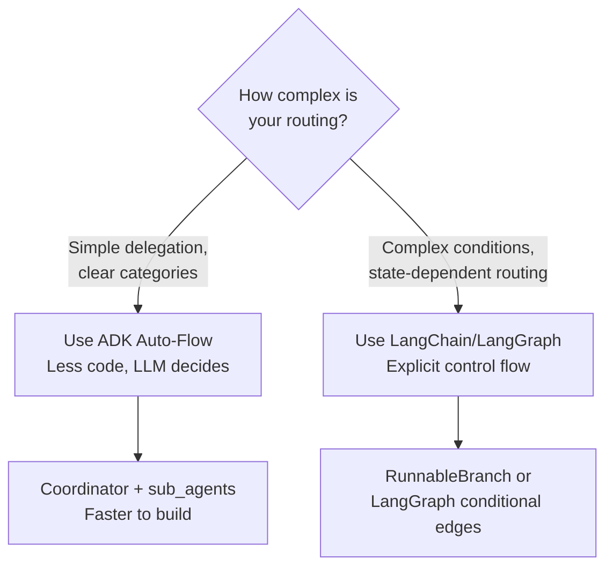

## The Limitation of Chains

In [Chapter 1](/kohshh-portfolio/blog/2026/prompt-chaining/), we saw how breaking a task into sequential steps makes LLMs more reliable. Every step has one job. Output of step N feeds step N+1. Clean, predictable.

But here's the problem: **what if you don't know which sequence to run until you see the input?**

Imagine a customer support bot. Every incoming message is different:
- *"Where's my order?"* → check the database
- *"Your product broke after one use"* → escalate to a human
- *"How do I reset my password?"* → search the knowledge base
- *"blah blah blah gibberish"* → ask for clarification

You can't write a fixed chain for this. The right action depends on what the user actually said. You need the system to *decide* before it *acts*.

That's **routing**.


## What Routing Is

Routing adds **conditional logic** to an agent's execution. Instead of always following the same path, the agent first evaluates the input — then chooses which path to take.

<div class="ns-diagram">
  <div class="ns-diagram-header">
    <span class="ns-diagram-label">ROUTING PATTERN</span>
    <button class="ns-expand-btn" onclick="openNsDiagram(this)"><svg width="11" height="11" viewBox="0 0 12 12" fill="none" stroke="currentColor" stroke-width="1.5"><path d="M1 5V1h4M11 7v4H7M1 5l4-4M11 7l-4 4"/></svg> Expand</button>
  </div>
  <div class="ns-diagram-body">
    <div class="ns-node ns-node-cyan">
      <div class="ns-node-title">User Query</div>
      <div class="ns-node-sub">Unclassified input arrives</div>
    </div>
    <div class="ns-arrow"></div>
    <div class="ns-decision">
      <div class="ns-node-title">Router</div>
      <div class="ns-node-sub">Classifies intent</div>
    </div>
    <div class="ns-arrow"></div>
    <div class="ns-row">
      <div class="ns-node">
        <div class="ns-node-title">Database Agent</div>
        <div class="ns-node-sub">Order status</div>
      </div>
      <div class="ns-node ns-node-red">
        <div class="ns-node-title">Escalation</div>
        <div class="ns-node-sub">Complaint → human</div>
      </div>
      <div class="ns-node">
        <div class="ns-node-title">Knowledge Base</div>
        <div class="ns-node-sub">How-to questions</div>
      </div>
      <div class="ns-node ns-node-amber">
        <div class="ns-node-title">Clarify</div>
        <div class="ns-node-sub">Unclear input</div>
      </div>
    </div>
    <div class="ns-arrow"></div>
    <div class="ns-node ns-node-green">
      <div class="ns-node-title">Response</div>
      <div class="ns-node-sub">Right handler, right answer</div>
    </div>
  </div>
</div>

The router is the decision-maker. Everything downstream is a **handler** — a function, tool, sub-agent, or prompt chain that handles one specific type of request.

> **The key insight:** Routing separates *what to do* from *how to do it*. The router decides. The handler executes. Neither knows about the other's internals.


## The Four Types of Routing

Not all routers work the same way. There are four distinct mechanisms — each with different trade-offs in speed, flexibility, and accuracy.

<div class="routing-compare-wrapper">
  <div class="routing-compare-header">
    <span class="routing-compare-title">ROUTING METHOD COMPARISON</span>
    <span class="routing-compare-sub">Hover a bar to see details</span>
  </div>
  <div class="routing-compare-chart-area">
    <canvas id="routingCompareChart" width="680" height="320"></canvas>
  </div>
  <div class="routing-compare-legend" id="routingLegend">
    <div class="rcl-item"><span class="rcl-dot" style="background:#2698ba"></span> Flexibility</div>
    <div class="rcl-item"><span class="rcl-dot" style="background:#4fc97e"></span> Speed</div>
    <div class="rcl-item"><span class="rcl-dot" style="background:#e6a817"></span> Novel-input accuracy</div>
    <div class="rcl-item"><span class="rcl-dot" style="background:#c97af2"></span> Cost-efficiency</div>
  </div>
  <div class="routing-compare-tooltip" id="rcTooltip" style="display:none"></div>
</div>

<style>
.routing-compare-wrapper {
  border: 1px solid var(--global-divider-color);
  border-radius: 10px;
  overflow: hidden;
  margin: 2rem 0;
  position: relative;
}
.routing-compare-header {
  padding: 0.85rem 1.25rem;
  border-bottom: 1px solid var(--global-divider-color);
  background: rgba(128,128,128,0.05);
}
.routing-compare-title {
  font-size: 0.7rem;
  font-weight: 700;
  letter-spacing: 0.12em;
  text-transform: uppercase;
  color: var(--global-text-color);
  display: block;
}
.routing-compare-sub {
  font-size: 0.65rem;
  color: var(--global-text-color-light);
  opacity: 0.7;
}
.routing-compare-chart-area { padding: 0.75rem; overflow-x: auto; }
#routingCompareChart { display: block; max-width: 100%; }
.routing-compare-legend {
  display: flex;
  gap: 1.25rem;
  padding: 0.6rem 1.25rem;
  border-top: 1px solid var(--global-divider-color);
  flex-wrap: wrap;
  background: rgba(128,128,128,0.03);
}
.rcl-item {
  display: flex;
  align-items: center;
  gap: 0.4rem;
  font-size: 0.72rem;
  color: var(--global-text-color-light);
}
.rcl-dot { width: 9px; height: 9px; border-radius: 2px; flex-shrink: 0; }
.routing-compare-tooltip {
  position: fixed;
  background: var(--global-bg-color);
  border: 1px solid var(--global-divider-color);
  border-radius: 6px;
  padding: 0.5rem 0.75rem;
  font-size: 0.75rem;
  color: var(--global-text-color);
  pointer-events: none;
  z-index: 100;
  max-width: 220px;
  line-height: 1.5;
  box-shadow: 0 4px 16px rgba(0,0,0,0.3);
}
</style>

<script>
(function(){
  var methods = ['LLM-based','Rule-based','Embedding-based','ML classifier'];
  var dims = ['Flexibility','Speed','Novel accuracy','Cost efficiency'];
  var colors = ['#2698ba','#4fc97e','#e6a817','#c97af2'];
  // scores[method][dim]: 1-5
  var scores = [
    [5, 2, 4, 2], // LLM-based
    [2, 5, 1, 5], // Rule-based
    [4, 4, 4, 3], // Embedding-based
    [3, 4, 3, 3], // ML classifier
  ];
  var descriptions = [
    'The LLM itself classifies the input at runtime. Handles novel and nuanced queries well. Slow and expensive per-call. Best when flexibility matters most.',
    'Explicit if/else on keywords or regex patterns. Blazing fast, zero API cost. Breaks on anything outside the predefined rules.',
    'Converts input to a vector and finds the nearest route by cosine similarity. Fast after setup, handles semantic variation well. Needs embeddings infra.',
    'A small classifier fine-tuned on labeled examples. Fast at inference, very accurate for known categories. Requires training data and retraining to extend.',
  ];

  document.addEventListener('DOMContentLoaded', function(){
    var canvas = document.getElementById('routingCompareChart');
    if (!canvas) return;
    var ctx = canvas.getContext('2d');
    var tooltip = document.getElementById('rcTooltip');

    var dpr = window.devicePixelRatio || 1;
    var W = Math.min(680, canvas.parentElement.getBoundingClientRect().width - 16);
    var H = 320;
    canvas.width = W * dpr; canvas.height = H * dpr;
    canvas.style.width = W+'px'; canvas.style.height = H+'px';
    ctx.scale(dpr, dpr);

    var ML = 110, MR = 20, MT = 30, MB = 44;
    var PW = W - ML - MR, PH = H - MT - MB;
    var barGroups = methods.length, nDims = dims.length;
    var groupW = PW / barGroups;
    var barW = (groupW * 0.7) / nDims;
    var barGap = (groupW * 0.3) / (nDims + 1);

    var hitRects = [];

    function getTheme() {
      var s = getComputedStyle(document.documentElement);
      return {
        text:  s.getPropertyValue('--global-text-color').trim()       || '#e0e0e0',
        muted: s.getPropertyValue('--global-text-color-light').trim() || '#888',
        div:   s.getPropertyValue('--global-divider-color').trim()    || '#333',
      };
    }

    function drawChart(hoverGroup, hoverDim) {
      ctx.clearRect(0, 0, W, H);
      hitRects = [];
      var th = getTheme();

      // Y grid + labels
      ctx.font = '10px monospace';
      [1,2,3,4,5].forEach(function(v){
        var y = MT + (1-(v-1)/4)*PH;
        ctx.strokeStyle = th.div; ctx.lineWidth = 0.5;
        ctx.setLineDash([3,3]);
        ctx.beginPath(); ctx.moveTo(ML,y); ctx.lineTo(ML+PW,y); ctx.stroke();
        ctx.setLineDash([]);
        ctx.fillStyle = th.muted; ctx.textAlign = 'right';
        ctx.fillText(v, ML-6, y+3.5);
      });

      // Y axis label
      ctx.save(); ctx.translate(12, MT+PH/2); ctx.rotate(-Math.PI/2);
      ctx.textAlign = 'center'; ctx.fillStyle = th.muted;
      ctx.font = '10px monospace'; ctx.fillText('score (1–5)', 0, 0); ctx.restore();

      // Bars
      methods.forEach(function(method, gi){
        var gx = ML + gi * groupW;
        dims.forEach(function(dim, di){
          var bx = gx + barGap*(di+1) + barW*di;
          var score = scores[gi][di];
          var barH = (score-1)/4 * PH;
          var by = MT + PH - barH;
          var isHover = (hoverGroup===gi && hoverDim===di);
          var alpha = (hoverGroup===null) ? 1 : (isHover ? 1 : 0.3);
          ctx.globalAlpha = alpha;
          ctx.fillStyle = colors[di];
          ctx.beginPath();
          if (ctx.roundRect) {
            ctx.roundRect(bx, by, barW, barH, [3,3,0,0]);
          } else {
            ctx.rect(bx, by, barW, barH);
          }
          ctx.fill();
          ctx.globalAlpha = 1;
          hitRects.push({x:bx,y:by,w:barW,h:barH,gi:gi,di:di,score:score,method:method,dim:dim});
        });
        // Group label
        ctx.fillStyle = th.muted; ctx.textAlign = 'center';
        ctx.font = '10px monospace';
        ctx.fillText(method, gx + groupW/2, H - MB + 16);
      });
    }

    drawChart(null, null);

    canvas.addEventListener('mousemove', function(e){
      var rect = canvas.getBoundingClientRect();
      var mx = (e.clientX - rect.left) * (W / rect.width);
      var my = (e.clientY - rect.top)  * (H / rect.height);
      var found = null;
      hitRects.forEach(function(r){ if(mx>=r.x && mx<=r.x+r.w && my>=r.y && my<=r.y+r.h) found=r; });
      if (found) {
        drawChart(found.gi, found.di);
        tooltip.style.display = 'block';
        tooltip.style.left = (e.clientX + 12) + 'px';
        tooltip.style.top  = (e.clientY - 10) + 'px';
        tooltip.innerHTML = '<strong>' + found.method + '</strong><br>' + found.dim + ': ' + found.score + '/5<br><small style="opacity:0.7">' + descriptions[found.gi] + '</small>';
      } else {
        drawChart(null, null);
        tooltip.style.display = 'none';
      }
    });
    canvas.addEventListener('mouseleave', function(){
      drawChart(null,null); tooltip.style.display='none';
    });
  });
})();
</script>

**Quick summary of each method:**

**LLM-based routing** — You ask the LLM itself: *"Read this query. Output exactly one word: `booking`, `info`, or `unclear`."* The most flexible approach. Handles nuanced or unusual inputs. Trade-off: one extra API call per request, which adds latency and cost.

**Rule-based routing** — Pure code. `if "flight" in query or "hotel" in query → booking`. Zero API cost, sub-millisecond speed. Falls apart the moment a user says something you didn't explicitly anticipate.

**Embedding-based routing** — Convert the query into a vector (a list of numbers capturing its meaning). Compare to pre-computed vectors for each route. Route to the closest match. Handles semantic variation well (*"get me a room"* matches *"book a hotel"*). Needs embedding infrastructure.

**ML classifier routing** — A small discriminative model fine-tuned on labelled examples. *"Here are 500 examples of booking requests, 500 info requests..."* Fast at inference, very accurate for known categories. Needs training data, and retraining every time you add a new route.


## How It Works: Step by Step

Let's walk through exactly what happens when a routing system processes a request.

<div class="routing-demo-wrapper">
  <div class="routing-demo-header">
    <span class="routing-demo-label">INTERACTIVE — click a query to route it</span>
  </div>
  <div class="routing-demo-queries">
    <button class="rq-btn" data-query="Book me a flight to Tokyo next Friday." data-route="booking">✈ Book flight to Tokyo</button>
    <button class="rq-btn" data-query="What is the capital of France?" data-route="info">? Capital of France</button>
    <button class="rq-btn" data-query="I need help with something important." data-route="unclear">⚠ Vague request</button>
    <button class="rq-btn" data-query="Find me a hotel in Paris for 3 nights." data-route="booking">🏨 Hotel in Paris</button>
  </div>
  <div class="routing-demo-pipeline" id="rdPipeline">
    <div class="rdp-node rdp-node--input" id="rdInput">
      <div class="rdp-node-label">QUERY</div>
      <div class="rdp-node-text" id="rdInputText">Select a query above</div>
    </div>
    <div class="rdp-arrow rdp-arrow--down" id="rdArrow1">
      <div class="rdp-arrow-line"></div>
      <div class="rdp-arrow-tip">↓</div>
      <div class="rdp-arrow-label">LLM analyses intent</div>
    </div>
    <div class="rdp-node" id="rdRouter">
      <div class="rdp-node-label">ROUTER</div>
      <div class="rdp-node-text" id="rdRouterText">Waiting…</div>
    </div>
    <div class="rdp-arrow rdp-arrow--down" id="rdArrow2">
      <div class="rdp-arrow-line"></div>
      <div class="rdp-arrow-tip">↓</div>
      <div class="rdp-arrow-label">routes to correct handler</div>
    </div>
    <div class="rdp-handlers">
      <div class="rdp-handler" id="rdH-booking">
        <div class="rdp-handler-icon">✈</div>
        <div class="rdp-handler-name">Booking Agent</div>
        <div class="rdp-handler-desc">Interacts with flight/hotel APIs</div>
      </div>
      <div class="rdp-handler" id="rdH-info">
        <div class="rdp-handler-icon">📚</div>
        <div class="rdp-handler-name">Info Agent</div>
        <div class="rdp-handler-desc">Searches knowledge base</div>
      </div>
      <div class="rdp-handler" id="rdH-unclear">
        <div class="rdp-handler-icon">❓</div>
        <div class="rdp-handler-name">Clarifier</div>
        <div class="rdp-handler-desc">Asks for more information</div>
      </div>
    </div>
  </div>
  <div class="routing-demo-status" id="rdStatus">Pick a query to see how it flows through the router.</div>
</div>

<style>
.routing-demo-wrapper {
  border: 1px solid var(--global-divider-color);
  border-radius: 10px;
  overflow: hidden;
  margin: 2rem 0;
}
.routing-demo-header {
  padding: 0.75rem 1.25rem;
  border-bottom: 1px solid var(--global-divider-color);
  background: rgba(128,128,128,0.05);
  font-size: 0.65rem;
  font-weight: 700;
  letter-spacing: 0.1em;
  text-transform: uppercase;
  color: var(--global-text-color-light);
}
.routing-demo-queries {
  display: flex;
  flex-wrap: wrap;
  gap: 0.5rem;
  padding: 1rem 1.25rem;
  border-bottom: 1px solid var(--global-divider-color);
}
.rq-btn {
  background: rgba(128,128,128,0.08);
  border: 1px solid var(--global-divider-color);
  border-radius: 6px;
  padding: 0.4rem 0.85rem;
  font-size: 0.78rem;
  color: var(--global-text-color-light);
  cursor: pointer;
  transition: border-color 0.2s, color 0.2s;
}
.rq-btn:hover, .rq-btn.rq-btn--active {
  border-color: var(--global-theme-color);
  color: var(--global-theme-color);
}
.routing-demo-pipeline {
  display: flex;
  flex-direction: column;
  align-items: center;
  padding: 1.5rem 1.25rem 1rem;
  gap: 0;
}
.rdp-node {
  width: 100%;
  max-width: 480px;
  border: 1px solid var(--global-divider-color);
  border-radius: 8px;
  padding: 0.85rem 1.1rem;
  transition: border-color 0.3s, box-shadow 0.3s;
}
.rdp-node--input { background: rgba(128,128,128,0.04); }
.rdp-node.rdp-active {
  border-color: var(--global-theme-color);
  box-shadow: 0 0 0 1px var(--global-theme-color);
}
.rdp-node-label {
  font-size: 0.58rem;
  font-weight: 700;
  letter-spacing: 0.12em;
  text-transform: uppercase;
  color: var(--global-text-color-light);
  margin-bottom: 0.4rem;
}
.rdp-node-text {
  font-size: 0.875rem;
  color: var(--global-text-color);
  min-height: 1.2rem;
}
.rdp-arrow {
  display: flex;
  flex-direction: column;
  align-items: center;
  gap: 0.1rem;
  padding: 0.25rem 0;
}
.rdp-arrow-line {
  width: 2px; height: 20px;
  background: var(--global-divider-color);
  border-radius: 1px;
  transition: background 0.3s;
}
.rdp-arrow.rdp-active .rdp-arrow-line { background: var(--global-theme-color); }
.rdp-arrow-tip {
  font-size: 0.9rem;
  color: var(--global-text-color-light);
  transition: color 0.3s;
  line-height: 1;
}
.rdp-arrow.rdp-active .rdp-arrow-tip { color: var(--global-theme-color); }
.rdp-arrow-label {
  font-size: 0.6rem;
  font-weight: 600;
  letter-spacing: 0.08em;
  text-transform: uppercase;
  color: var(--global-text-color-light);
  opacity: 0.55;
  transition: opacity 0.3s;
}
.rdp-arrow.rdp-active .rdp-arrow-label { opacity: 1; color: var(--global-theme-color); }
.rdp-handlers {
  display: flex;
  gap: 0.75rem;
  width: 100%;
  max-width: 480px;
  flex-wrap: wrap;
}
.rdp-handler {
  flex: 1;
  min-width: 120px;
  border: 1px solid var(--global-divider-color);
  border-radius: 8px;
  padding: 0.75rem 0.85rem;
  text-align: center;
  transition: border-color 0.3s, box-shadow 0.3s, opacity 0.3s;
  opacity: 0.45;
}
.rdp-handler.rdp-handler--active {
  border-color: var(--global-theme-color);
  box-shadow: 0 0 0 1px var(--global-theme-color);
  opacity: 1;
}
.rdp-handler-icon { font-size: 1.2rem; margin-bottom: 0.3rem; }
.rdp-handler-name { font-size: 0.78rem; font-weight: 700; color: var(--global-text-color); margin-bottom: 0.2rem; }
.rdp-handler-desc { font-size: 0.7rem; color: var(--global-text-color-light); line-height: 1.3; }
.routing-demo-status {
  padding: 0.65rem 1.25rem;
  border-top: 1px solid var(--global-divider-color);
  font-size: 0.78rem;
  color: var(--global-text-color-light);
  background: rgba(128,128,128,0.04);
}
</style>

<script>
(function(){
  var routerMessages = {
    booking: 'Output: <strong style="color:var(--global-theme-color)">"booker"</strong> — intent is flight or hotel booking',
    info:    'Output: <strong style="color:var(--global-theme-color)">"info"</strong> — intent is a factual question',
    unclear: 'Output: <strong style="color:var(--global-theme-color)">"unclear"</strong> — intent is ambiguous',
  };
  var statusMessages = {
    booking: 'Routed to <strong>Booking Agent</strong> — will call flight/hotel APIs to fulfil the request.',
    info:    'Routed to <strong>Info Agent</strong> — will search the knowledge base and return an answer.',
    unclear: 'Routed to <strong>Clarifier</strong> — will ask the user for more detail before proceeding.',
  };

  function resetAll() {
    document.getElementById('rdInput').classList.remove('rdp-active');
    document.getElementById('rdRouter').classList.remove('rdp-active');
    document.getElementById('rdArrow1').classList.remove('rdp-active');
    document.getElementById('rdArrow2').classList.remove('rdp-active');
    document.getElementById('rdRouterText').textContent = 'Waiting…';
    document.querySelectorAll('.rdp-handler').forEach(function(h){ h.classList.remove('rdp-handler--active'); });
    document.querySelectorAll('.rq-btn').forEach(function(b){ b.classList.remove('rq-btn--active'); });
  }

  function animateRoute(query, route, btn) {
    resetAll();
    btn.classList.add('rq-btn--active');

    var inputNode = document.getElementById('rdInput');
    var routerNode = document.getElementById('rdRouter');
    var arrow1 = document.getElementById('rdArrow1');
    var arrow2 = document.getElementById('rdArrow2');
    var inputText = document.getElementById('rdInputText');
    var routerText = document.getElementById('rdRouterText');
    var status = document.getElementById('rdStatus');

    status.innerHTML = 'Sending query to router…';
    inputText.textContent = '"' + query + '"';
    inputNode.classList.add('rdp-active');

    setTimeout(function(){
      arrow1.classList.add('rdp-active');
      routerText.innerHTML = '<em style="opacity:0.5">Analysing intent…</em>';
    }, 400);

    setTimeout(function(){
      routerNode.classList.add('rdp-active');
      routerText.innerHTML = routerMessages[route];
    }, 900);

    setTimeout(function(){
      arrow2.classList.add('rdp-active');
    }, 1300);

    setTimeout(function(){
      var handler = document.getElementById('rdH-' + route);
      if (handler) handler.classList.add('rdp-handler--active');
      status.innerHTML = statusMessages[route];
    }, 1700);
  }

  document.addEventListener('DOMContentLoaded', function(){
    document.querySelectorAll('.rq-btn').forEach(function(btn){
      btn.addEventListener('click', function(){
        animateRoute(btn.dataset.query, btn.dataset.route, btn);
      });
    });
  });
})();
</script>


## Practical Applications

### Customer Service Bots

The most obvious use case. A single entry point receives all user messages. The router classifies intent and dispatches to the right sub-agent:



Without routing, you'd need separate endpoints for each query type — and users would have to know which one to use.

### Document & Email Pipelines

Incoming emails get classified before any processing happens:
- **Sales lead** → CRM ingestion workflow
- **Support ticket** → ticketing system + priority score
- **Invoice** → accounts payable extraction chain
- **Spam** → discard

The router is the first step. Everything after it is specialised.

### Multi-Agent Research Systems

A research system with separate agents for *web search*, *paper summarisation*, *data analysis*, and *report writing* needs a router to decide which agent gets each sub-task. The router looks at the current objective and dispatches accordingly.

### AI Coding Assistants

Before passing a code snippet to any tool, the assistant routes based on **language** × **intent**:
- Python + debug → Python linter + error explainer
- TypeScript + explain → TypeScript-aware explainer
- SQL + optimise → query plan analyser

Two routing dimensions at once: language detection and intent classification.


## LangChain Implementation

Here's a working routing system using LangChain and Google's Gemini. A coordinator LLM classifies the intent, then `RunnableBranch` dispatches to the right handler.

### Install

```bash
pip install langchain langgraph langchain-google-genai python-dotenv
```

### The Full Code, Explained Line by Line

**1. Imports**

```python
from langchain_google_genai import ChatGoogleGenerativeAI
from langchain_core.prompts import ChatPromptTemplate
from langchain_core.output_parsers import StrOutputParser
from langchain_core.runnables import RunnablePassthrough, RunnableBranch
```

- `ChatGoogleGenerativeAI` — LangChain's wrapper around Gemini. Swap for `ChatOpenAI` if using OpenAI.
- `ChatPromptTemplate` — builds reusable prompts with named placeholders.
- `StrOutputParser` — strips the LLM's response object down to a plain Python string.
- `RunnablePassthrough` — passes input through unchanged. Used to keep the original request available downstream.
- `RunnableBranch` — the routing mechanism. Takes a list of `(condition, runnable)` pairs. Runs the first branch whose condition is `True`.

**2. Initialise the model**

```python
import os
from dotenv import load_dotenv
load_dotenv()  # reads GOOGLE_API_KEY from .env

llm = ChatGoogleGenerativeAI(model="gemini-2.0-flash", temperature=0)
# temperature=0 → deterministic output
# Critical for routing: you need a consistent, single-word answer every time
```

**3. Define the handler functions**

These simulate what each specialised sub-agent would actually do:

```python
def booking_handler(request: str) -> str:
    """Called when the router decides this is a booking request."""
    # In production: call a flight/hotel API, check availability, etc.
    print("→ DELEGATING TO: Booking Handler")
    return f"Booking confirmed for: '{request}'"

def info_handler(request: str) -> str:
    """Called when the router decides this is an information request."""
    # In production: search a knowledge base, fetch from a database, etc.
    print("→ DELEGATING TO: Info Handler")
    return f"Information retrieved for: '{request}'"

def unclear_handler(request: str) -> str:
    """Fallback for anything the router can't classify."""
    print("→ DELEGATING TO: Clarification Handler")
    return f"Could not process: '{request}'. Please clarify your request."
```

**4. Build the router chain**

This is the classification step — the LLM reads the request and outputs exactly one word:

```python
router_prompt = ChatPromptTemplate.from_messages([
    ("system", """Analyze the user's request and output the correct category.

Rules:
- If the request involves booking flights or hotels → output: booker
- If the request is a general information question  → output: info
- If the request is unclear or doesn't fit either   → output: unclear

IMPORTANT: Output exactly ONE word. No punctuation, no explanation."""),
    ("user", "{request}")
])

# Chain: fill the prompt → call LLM → strip to plain string
# Result is a single word: "booker", "info", or "unclear"
router_chain = router_prompt | llm | StrOutputParser()
```

Why `temperature=0` matters here: if temperature > 0, the model might output `"Booker"` (capitalised), `"booking"`, or `"I think this is a booking request..."` — all of which break the downstream string comparison.

**5. Build the routing branch**

```python
# RunnableBranch takes:
#   [(condition_fn, runnable), (condition_fn, runnable), ..., default_runnable]
# It evaluates conditions in order and runs the FIRST matching branch.
# The default (no condition) runs if nothing matches.

delegation = RunnableBranch(
    # condition: is the decision "booker"?
    # x is the dict {"decision": "booker", "request": {...}}
    (
        lambda x: x["decision"].strip().lower() == "booker",
        RunnablePassthrough.assign(
            output=lambda x: booking_handler(x["request"]["request"])
        )
    ),
    (
        lambda x: x["decision"].strip().lower() == "info",
        RunnablePassthrough.assign(
            output=lambda x: info_handler(x["request"]["request"])
        )
    ),
    # Default branch — runs if neither condition matched
    RunnablePassthrough.assign(
        output=lambda x: unclear_handler(x["request"]["request"])
    ),
)
```

**6. Combine into a single runnable**

```python
# Step 1: run router_chain → get decision
# Step 2: keep original request alongside the decision
# Step 3: delegation branch picks the right handler
# Step 4: extract just the output string

coordinator = (
    {
        "decision": router_chain,       # ← runs classifier, stores result
        "request": RunnablePassthrough() # ← passes original input through unchanged
    }
    | delegation
    | (lambda x: x["output"])           # ← extract the handler's response string
)
```

The `RunnablePassthrough()` here is critical: without it, the `delegation` branch would only see the router's decision (a single word), and couldn't pass the original request to the handler.

**7. Run it**

```python
# Each invoke() call: classify → route → handle → return

print(coordinator.invoke({"request": "Book me a flight to London."}))
# → DELEGATING TO: Booking Handler
# → "Booking confirmed for: 'Book me a flight to London.'"

print(coordinator.invoke({"request": "What is the capital of Italy?"}))
# → DELEGATING TO: Info Handler
# → "Information retrieved for: 'What is the capital of Italy?'"

print(coordinator.invoke({"request": "Do the thing."}))
# → DELEGATING TO: Clarification Handler
# → "Could not process: 'Do the thing.'. Please clarify your request."
```

### What the Data Flow Looks Like




## Google ADK Implementation

The Agent Development Kit (ADK) takes a fundamentally different approach. Instead of building explicit routing logic in code, you define **agents with descriptions** and **tools with docstrings**, and let the framework figure out routing.

### The Philosophy

| LangChain approach | ADK approach |
|---|---|
| You write the routing logic explicitly | The framework routes via the LLM's understanding of agent descriptions |
| `RunnableBranch` with explicit conditions | `sub_agents=` list — ADK Auto-Flow handles dispatch |
| Full control over routing criteria | More automatic, less code |
| Better for complex conditional logic | Better for simple delegation patterns |

### Install

```bash
pip install google-adk google-generativeai python-dotenv
```

### The Full Code, Explained

**1. Define tool functions**

In ADK, a **tool** is just a Python function with a descriptive docstring. The docstring is critical — ADK's LLM reads it to decide when to call this tool.

```python
from google.adk.tools import FunctionTool

def booking_handler(request: str) -> str:
    """
    Handles booking requests for flights and hotels.
    Call this tool when the user wants to book, reserve, or schedule
    a flight, hotel room, or accommodation.

    Args:
        request: The user's booking request in natural language.
    Returns:
        Confirmation that the booking action was simulated.
    """
    print("→ Booking Handler called")
    return f"Booking action simulated for: '{request}'"

def info_handler(request: str) -> str:
    """
    Handles general information and factual questions.
    Call this tool when the user asks a factual question, wants
    an explanation, or is looking for general knowledge.

    Args:
        request: The user's information request.
    Returns:
        The result of the simulated information retrieval.
    """
    print("→ Info Handler called")
    return f"Information retrieved for: '{request}'"

# Wrap functions as FunctionTool objects
booking_tool = FunctionTool(booking_handler)
info_tool    = FunctionTool(info_handler)
```

**2. Define specialised sub-agents**

Each sub-agent has a `description` — used by the coordinator to decide which agent to delegate to:

```python
from google.adk.agents import Agent

booking_agent = Agent(
    name="Booker",
    model="gemini-2.0-flash",
    description="Specialist agent for all flight and hotel booking requests.",
    tools=[booking_tool]  # this agent can call booking_handler
)

info_agent = Agent(
    name="Info",
    model="gemini-2.0-flash",
    description="Specialist agent for general information and factual questions.",
    tools=[info_tool]  # this agent can call info_handler
)
```

**3. Define the coordinator**

The coordinator's `instruction` tells it what its job is. The `sub_agents` list enables ADK's **Auto-Flow**: the coordinator reads the user message and the sub-agent descriptions, then delegates automatically.

```python
coordinator = Agent(
    name="Coordinator",
    model="gemini-2.0-flash",
    instruction="""
    You are a coordinator. Your ONLY job is to route incoming requests.
    Do NOT answer the user directly. Delegate every request to a sub-agent.

    - Flight/hotel booking requests  → delegate to Booker
    - All information/factual questions → delegate to Info
    """,
    description="Routes user requests to the appropriate specialist.",
    sub_agents=[booking_agent, info_agent]  # enables Auto-Flow routing
)
```

**4. Run it**

```python
import asyncio, uuid
from google.adk.runners import InMemoryRunner
from google.genai import types

async def run(runner: InMemoryRunner, request: str) -> str:
    user_id    = "user_001"
    session_id = str(uuid.uuid4())

    # Create a fresh session for this request
    await runner.session_service.create_session(
        app_name=runner.app_name,
        user_id=user_id,
        session_id=session_id,
    )

    final = ""
    for event in runner.run(
        user_id=user_id,
        session_id=session_id,
        new_message=types.Content(
            role="user",
            parts=[types.Part(text=request)]
        ),
    ):
        if event.is_final_response() and event.content:
            # Extract the text from the final response event
            if event.content.parts:
                final = "".join(p.text for p in event.content.parts if p.text)
            break
    return final

async def main():
    runner = InMemoryRunner(coordinator)

    result = await run(runner, "Book me a hotel in Paris.")
    print("Result:", result)
    # → Booking Handler called
    # → "Booking action simulated for: 'Book me a hotel in Paris.'"

    result = await run(runner, "What is the tallest mountain in the world?")
    print("Result:", result)
    # → Info Handler called
    # → "Information retrieved for: '...'"

if __name__ == "__main__":
    import nest_asyncio; nest_asyncio.apply()
    asyncio.run(main())
```

### ADK Auto-Flow vs. Explicit Routing

Here's what ADK does automatically that you write manually in LangChain:

```
User message
     ↓
Coordinator LLM reads:
  - The user's message
  - The description of each sub-agent
  - Its own instruction
     ↓
Decides: "This sounds like a booking. Delegate to Booker."
     ↓
Booker agent activates
     ↓
Booker LLM reads the request + its tools
     ↓
Calls booking_handler(request=...)
     ↓
Returns result to coordinator
     ↓
Coordinator returns final response to user
```

The routing decision is embedded in the LLM's reasoning — you don't write it explicitly. This is more concise, but also harder to debug when it routes incorrectly.


## LangChain vs. ADK: Which to Use



| | LangChain + RunnableBranch | Google ADK Auto-Flow |
|---|---|---|
| **Routing control** | You write explicit conditions | LLM decides based on descriptions |
| **Debuggability** | Easy — conditions are plain Python | Harder — routing is inside LLM reasoning |
| **Flexibility** | Very high | Medium |
| **Code volume** | More | Less |
| **Best for** | Complex multi-step routing, state machines | Simple agent delegation |


## Key Takeaways

**What routing is.** Routing adds conditional logic to an agent — instead of always following the same path, the agent evaluates the input and chooses the appropriate handler.

**The four methods.** LLM-based is most flexible. Rule-based is fastest. Embedding-based handles semantic variation. ML classifier is most accurate for known categories.

**The mechanism.** A router classifies the input → outputs a decision → the dispatcher picks the matching handler → the handler runs.

**In LangChain:** explicit routing with `RunnableBranch` + conditions. Full control. More code.

**In ADK:** implicit routing via `sub_agents` and agent descriptions. Less code. Less debuggable.

> **Rule of thumb:** If you can write an `if` statement to describe the routing logic — use rules or LangChain. If the categories are fuzzy and overlap — use LLM-based or embedding routing.


## References

1. LangGraph Documentation — [langchain.com](https://www.langchain.com/)
2. Google ADK Documentation — [google.github.io/adk-docs](https://google.github.io/adk-docs/)
3. LangChain RunnableBranch — [python.langchain.com](https://python.langchain.com/)
