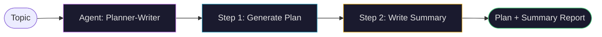
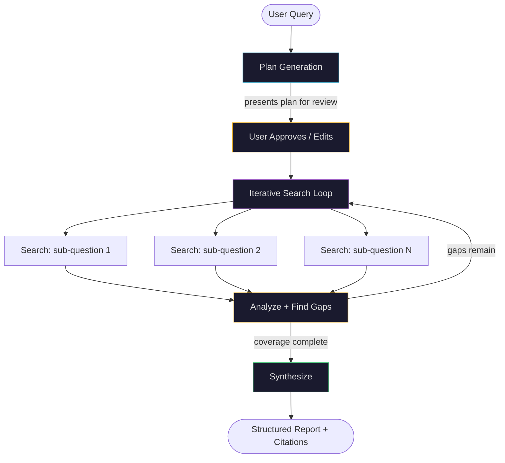

## When Reacting Isn't Enough

Every pattern so far — [chaining](/kohshh-portfolio/blog/2026/prompt-chaining/), [routing](/kohshh-portfolio/blog/2026/routing/), [parallelization](/kohshh-portfolio/blog/2026/parallelization/), [reflection](/kohshh-portfolio/blog/2026/reflection/), [tool use](/kohshh-portfolio/blog/2026/tool-use/) — processes one input and produces one output. The "how" is determined by the developer at design time. The agent executes what was pre-wired.

That works when you know exactly what needs to happen. But real goals are often messier:

> *"Organize a team offsite for 30 people in Q3, keep it under $15k, and make sure everyone can attend."*

There's no fixed sequence here. You don't know in advance whether you'll need to try three venues before one is available, renegotiate the catering, or push the dates by a week. The "how" needs to be **discovered** from the goal — not hard-coded before execution begins.

That's **planning**: the agent first generates the route, then follows it — adapting when the terrain changes.

---

## What Planning Is

A planning agent receives a high-level objective and does two things before acting:

1. **Decomposes** the goal into a sequence of smaller, actionable steps
2. **Adapts** when steps fail, constraints change, or new information arrives

<div class="ns-diagram">
  <div class="ns-diagram-header">
    <span class="ns-diagram-label">PLANNING PATTERN</span>
    <button class="ns-expand-btn" onclick="openNsDiagram(this)"><svg width="11" height="11" viewBox="0 0 12 12" fill="none" stroke="currentColor" stroke-width="1.5"><path d="M1 5V1h4M11 7v4H7M1 5l4-4M11 7l-4 4"/></svg> Expand</button>
  </div>
  <div class="ns-diagram-body">
    <div class="ns-node ns-node-cyan">
      <div class="ns-node-title">Complex Goal</div>
      <div class="ns-node-sub">High-level objective · solution unknown in advance</div>
    </div>
    <div class="ns-arrow"></div>
    <div class="ns-node ns-node-purple">
      <div class="ns-node-title">Planning Agent</div>
      <div class="ns-node-sub">Decomposes goal · generates step sequence</div>
    </div>
    <div class="ns-arrow"></div>
    <div class="ns-phase">
      <div class="ns-phase-title">Execute Plan Steps</div>
      <div class="ns-phase-sub">Sequential or parallel · each step may call tools or sub-agents</div>
      <div class="ns-row">
        <div class="ns-node">
          <div class="ns-node-title">Step 1</div>
          <div class="ns-node-sub">Search / Gather</div>
        </div>
        <div class="ns-node">
          <div class="ns-node-title">Step 2</div>
          <div class="ns-node-sub">Analyse</div>
        </div>
        <div class="ns-node">
          <div class="ns-node-title">Step N</div>
          <div class="ns-node-sub">Draft / Act</div>
        </div>
      </div>
    </div>
    <div class="ns-arrow"></div>
    <div class="ns-node">
      <div class="ns-node-title">Synthesize Results</div>
      <div class="ns-node-sub">Merge step outputs into coherent answer</div>
    </div>
    <div class="ns-arrow"></div>
    <div class="ns-decision">
      <div class="ns-node-title">Goal met?</div>
    </div>
    <div class="ns-arrow"></div>
    <div class="ns-branch-row">
      <div class="ns-branch">
        <span class="ns-label-red">Obstacle / Gap</span>
        <div class="ns-arrow ns-arrow-red"></div>
        <div class="ns-node ns-node-red">
          <div class="ns-node-title">Re-plan</div>
          <div class="ns-node-sub">Adapt to new constraint · revise steps</div>
        </div>
        <div class="ns-arrow ns-arrow-red"></div>
        <div class="ns-node ns-node-dim">
          <div class="ns-node-title">↑ Back to Planning Agent</div>
        </div>
      </div>
      <div class="ns-branch">
        <span class="ns-label-green">Complete</span>
        <div class="ns-arrow ns-arrow-green"></div>
        <div class="ns-node ns-node-green">
          <div class="ns-node-title">Final Output</div>
          <div class="ns-node-sub">Goal achieved · deliver result</div>
        </div>
      </div>
    </div>
  </div>
</div>

The critical loop is the feedback arc from "Goal met?" back to the Planning Agent. When an obstacle blocks a step — a venue is booked, a search returns nothing useful, a dependency fails — a capable planner doesn't stop. It re-evaluates and generates a revised plan.

---

## Static vs Dynamic: The Core Decision

Before choosing planning, ask one question: **does the "how" need to be discovered, or is it already known?**

<div class="plan-matrix-wrapper">
  <div class="plan-matrix-header">
    <span class="plan-matrix-title">WHEN TO USE PLANNING — DECISION MATRIX</span>
  </div>
  <div class="plan-matrix-grid">
    <div class="plan-matrix-cell plan-cell-tl">
      <div class="plan-cell-label">Complex + Known Solution</div>
      <div class="plan-cell-rec plan-rec-fixed">Use Fixed Workflow</div>
      <div class="plan-cell-ex">e.g. Invoice processing, payroll runs, CI/CD pipelines</div>
      <div class="plan-cell-why">Solution is understood and repeatable. Hard-coding it reduces risk and guarantees consistency.</div>
    </div>
    <div class="plan-matrix-cell plan-cell-tr plan-cell-highlight">
      <div class="plan-cell-label">Complex + Unknown Solution</div>
      <div class="plan-cell-rec plan-rec-plan">Use Planning Agent</div>
      <div class="plan-cell-ex">e.g. Research report, onboarding a new hire, competitive analysis</div>
      <div class="plan-cell-why">The "how" must be discovered. Planning handles dependencies, unknowns, and adaptation.</div>
    </div>
    <div class="plan-matrix-cell plan-cell-bl">
      <div class="plan-cell-label">Simple + Known Solution</div>
      <div class="plan-cell-rec plan-rec-fixed">Single Prompt / Chain</div>
      <div class="plan-cell-ex">e.g. Summarize this article, translate this text</div>
      <div class="plan-cell-why">One step, known output. No planning overhead needed.</div>
    </div>
    <div class="plan-matrix-cell plan-cell-br">
      <div class="plan-cell-label">Simple + Unknown Solution</div>
      <div class="plan-cell-rec plan-rec-route">Routing + Fallback</div>
      <div class="plan-cell-ex">e.g. Customer support triage, intent classification</div>
      <div class="plan-cell-why">Classify and dispatch. Routing (Chapter 2) handles this cleanly.</div>
    </div>
  </div>
  <div class="plan-matrix-axes">
    <div class="plan-axis-x">← Known &nbsp;&nbsp;&nbsp;&nbsp;&nbsp; Solution &nbsp;&nbsp;&nbsp;&nbsp;&nbsp; Unknown →</div>
    <div class="plan-axis-y">↑ Complex &nbsp;/&nbsp; Simple ↓</div>
  </div>
</div>

<style>
.plan-matrix-wrapper {
  border: 1px solid var(--global-divider-color);
  border-radius: 10px;
  overflow: hidden;
  margin: 2rem 0;
}
.plan-matrix-header {
  padding: 0.75rem 1.1rem;
  border-bottom: 1px solid var(--global-divider-color);
  background: rgba(128,128,128,0.05);
  font-size: 0.68rem;
  font-weight: 700;
  letter-spacing: 0.12em;
  text-transform: uppercase;
  color: var(--global-text-color);
}
.plan-matrix-grid {
  display: grid;
  grid-template-columns: 1fr 1fr;
  gap: 0;
}
@media (max-width: 560px) { .plan-matrix-grid { grid-template-columns: 1fr; } }
.plan-matrix-cell {
  padding: 1.1rem;
  border-right: 1px solid var(--global-divider-color);
  border-bottom: 1px solid var(--global-divider-color);
  display: flex;
  flex-direction: column;
  gap: 0.4rem;
}
.plan-matrix-cell:nth-child(even) { border-right: none; }
.plan-matrix-cell:nth-child(3), .plan-matrix-cell:nth-child(4) { border-bottom: none; }
.plan-cell-highlight { background: rgba(38,152,186,0.05); }
.plan-cell-label { font-size: 0.68rem; font-weight: 700; letter-spacing: 0.07em; color: var(--global-text-color-light); text-transform: uppercase; }
.plan-cell-rec { font-size: 0.82rem; font-weight: 700; padding: 0.2rem 0; }
.plan-rec-plan  { color: #2698ba; }
.plan-rec-fixed { color: #4fc97e; }
.plan-rec-route { color: #e6a817; }
.plan-cell-ex   { font-size: 0.72rem; font-family: monospace; color: var(--global-text-color-light); }
.plan-cell-why  { font-size: 0.75rem; color: var(--global-text-color-light); line-height: 1.5; margin-top: 0.2rem; }
.plan-matrix-axes {
  display: flex;
  justify-content: space-between;
  align-items: center;
  padding: 0.5rem 1.1rem;
  border-top: 1px solid var(--global-divider-color);
  background: rgba(128,128,128,0.03);
}
.plan-axis-x, .plan-axis-y {
  font-size: 0.65rem;
  font-family: monospace;
  color: var(--global-text-color-light);
  opacity: 0.6;
}
</style>

---

## Watch an Agent Build a Plan

Pick a complex task. Click **Generate Plan** to watch the agent decompose it into executable steps.

<div class="plan-gen-wrapper">
  <div class="plan-gen-header">
    <span class="plan-gen-title">PLAN GENERATION DEMO</span>
    <div class="plan-gen-controls">
      <button class="plan-gen-run" id="planRunBtn" disabled>▶ Generate Plan</button>
      <span class="plan-gen-status" id="planStatus"></span>
    </div>
  </div>
  <div class="plan-gen-tasks">
    <button class="plan-task-btn active" data-idx="0" onclick="planSelect(0)">📄 Research Report</button>
    <button class="plan-task-btn" data-idx="1" onclick="planSelect(1)">👤 Employee Onboarding</button>
    <button class="plan-task-btn" data-idx="2" onclick="planSelect(2)">🏢 Team Offsite</button>
    <button class="plan-task-btn" data-idx="3" onclick="planSelect(3)">📊 Competitive Analysis</button>
  </div>
  <div class="plan-gen-body">
    <div class="plan-gen-goal" id="planGoal">
      <span class="plan-gen-goal-label">GOAL</span>
      <span class="plan-gen-goal-text" id="planGoalText">Write a research report on AI in healthcare</span>
    </div>
    <div class="plan-steps-container" id="planSteps"></div>
  </div>
</div>

<style>
.plan-gen-wrapper {
  border: 1px solid var(--global-divider-color);
  border-radius: 10px;
  overflow: hidden;
  margin: 2rem 0;
}
.plan-gen-header {
  display: flex;
  align-items: center;
  justify-content: space-between;
  padding: 0.75rem 1.1rem;
  border-bottom: 1px solid var(--global-divider-color);
  background: rgba(128,128,128,0.05);
  flex-wrap: wrap;
  gap: 0.5rem;
}
.plan-gen-title { font-size: 0.68rem; font-weight: 700; letter-spacing: 0.12em; text-transform: uppercase; color: var(--global-text-color); }
.plan-gen-controls { display: flex; align-items: center; gap: 0.75rem; }
.plan-gen-run {
  font-family: monospace; font-size: 0.72rem; padding: 0.3rem 0.8rem;
  border-radius: 4px; border: 1px solid var(--global-divider-color);
  background: transparent; color: var(--global-text-color); cursor: pointer; transition: background 0.15s;
}
.plan-gen-run:not(:disabled):hover { background: rgba(38,152,186,0.15); border-color:#2698ba; color:#2698ba; }
.plan-gen-run:disabled { opacity: 0.4; cursor: default; }
.plan-gen-status { font-size: 0.68rem; font-family: monospace; color: var(--global-text-color-light); min-width: 80px; }
.plan-gen-tasks { display: flex; border-bottom: 1px solid var(--global-divider-color); overflow-x: auto; }
.plan-task-btn {
  flex: 1; min-width: 120px; padding: 0.55rem 0.5rem;
  font-family: monospace; font-size: 0.68rem;
  border: none; border-right: 1px solid var(--global-divider-color);
  background: transparent; color: var(--global-text-color-light);
  cursor: pointer; transition: background 0.15s; white-space: nowrap;
}
.plan-task-btn:last-child { border-right: none; }
.plan-task-btn.active { background: rgba(38,152,186,0.1); color: #2698ba; font-weight: 700; }
.plan-task-btn:hover:not(.active) { background: rgba(128,128,128,0.08); }
.plan-gen-body { padding: 1rem 1.1rem; }
.plan-gen-goal {
  border: 1px solid var(--global-divider-color); border-radius: 6px;
  padding: 0.6rem 0.9rem; display: flex; align-items: center; gap: 0.75rem;
  background: rgba(128,128,128,0.04); margin-bottom: 1rem;
}
.plan-gen-goal-label { font-size: 0.6rem; font-weight: 700; letter-spacing: 0.1em; color: #2698ba; flex-shrink: 0; }
.plan-gen-goal-text { font-size: 0.85rem; color: var(--global-text-color); font-family: monospace; }
.plan-steps-container { display: flex; flex-direction: column; gap: 0.5rem; min-height: 40px; }
.plan-step-item {
  display: flex; align-items: flex-start; gap: 0.75rem;
  padding: 0.7rem 0.85rem; border: 1px solid var(--global-divider-color);
  border-radius: 7px; background: rgba(128,128,128,0.03);
  animation: planStepIn 0.35s ease;
}
@keyframes planStepIn { from { opacity: 0; transform: translateX(-8px); } to { opacity: 1; transform: none; } }
.plan-step-num {
  font-family: monospace; font-size: 0.65rem; font-weight: 700;
  color: #2698ba; flex-shrink: 0; padding-top: 0.1rem; min-width: 1.5rem;
}
.plan-step-body { flex: 1; }
.plan-step-title { font-size: 0.82rem; font-weight: 700; color: var(--global-text-color); margin-bottom: 0.2rem; }
.plan-step-desc { font-size: 0.73rem; color: var(--global-text-color-light); line-height: 1.45; }
.plan-step-badge {
  font-size: 0.6rem; font-family: monospace; padding: 0.1em 0.4em;
  border-radius: 3px; flex-shrink: 0; margin-top: 0.05rem;
}
.badge-tool   { background: rgba(230,168,23,0.12); color: #e6a817; border: 1px solid rgba(230,168,23,0.2); }
.badge-llm    { background: rgba(201,122,242,0.12); color: #c97af2; border: 1px solid rgba(201,122,242,0.2); }
.badge-action { background: rgba(79,201,126,0.12); color: #4fc97e; border: 1px solid rgba(79,201,126,0.2); }
</style>

<script>
var PLAN_DATA = [
  {
    goal: "Write a research report on AI in healthcare",
    steps: [
      { num:"01", title:"Define scope and research questions", desc:"Identify key themes: diagnostics, drug discovery, patient care, ethics. Set 5 core research questions.", badge:"llm", badgeTxt:"LLM" },
      { num:"02", title:"Search academic and industry sources", desc:"Query PubMed, arXiv, and industry reports. Retrieve top 15 relevant papers and studies.", badge:"tool", badgeTxt:"Search Tool" },
      { num:"03", title:"Extract key findings per theme", desc:"For each of the 5 themes, pull the most significant statistics and conclusions.", badge:"llm", badgeTxt:"LLM" },
      { num:"04", title:"Identify gaps and cross-reference", desc:"Check for conflicting data. Search for additional sources where evidence is thin.", badge:"tool", badgeTxt:"Search Tool" },
      { num:"05", title:"Structure and draft the report", desc:"Generate sections: Introduction, Findings per theme, Limitations, Conclusion.", badge:"llm", badgeTxt:"LLM" },
      { num:"06", title:"Add citations and final review", desc:"Attach inline citations to all claims. Self-review for coherence and completeness.", badge:"action", badgeTxt:"Reflect" },
    ]
  },
  {
    goal: "Onboard a new software engineer",
    steps: [
      { num:"01", title:"Create system accounts", desc:"Provision GitHub, Slack, Jira, and email accounts. Set correct team permissions.", badge:"tool", badgeTxt:"API Tool" },
      { num:"02", title:"Send welcome package", desc:"Email onboarding guide, team handbook, and first-week schedule.", badge:"action", badgeTxt:"Email Tool" },
      { num:"03", title:"Schedule intro meetings", desc:"Book 1-on-1s with manager, team leads, and cross-functional partners for week 1.", badge:"tool", badgeTxt:"Calendar API" },
      { num:"04", title:"Assign training modules", desc:"Enroll in required security, compliance, and codebase training tracks.", badge:"action", badgeTxt:"LMS API" },
      { num:"05", title:"Set up dev environment", desc:"Run setup script, verify CI/CD access, confirm local build works end-to-end.", badge:"tool", badgeTxt:"Code Tool" },
      { num:"06", title:"Create 30/60/90 day goals", desc:"Draft milestone targets in collaboration with the manager. Store in the performance system.", badge:"llm", badgeTxt:"LLM" },
    ]
  },
  {
    goal: "Plan a company team offsite for 30 people",
    steps: [
      { num:"01", title:"Survey team availability and preferences", desc:"Send availability poll for Q3 window. Collect preferences for format and activities.", badge:"action", badgeTxt:"Form Tool" },
      { num:"02", title:"Set budget and constraints", desc:"Confirm $500/person cap, dietary requirements, travel limits, and accessibility needs.", badge:"llm", badgeTxt:"LLM" },
      { num:"03", title:"Research and shortlist venues", desc:"Search venue databases for 30-person capacity within budget. Shortlist top 3.", badge:"tool", badgeTxt:"Search Tool" },
      { num:"04", title:"Check availability and book", desc:"Contact venues. If first choice is unavailable, fall back to shortlist — adapt plan.", badge:"action", badgeTxt:"Book API" },
      { num:"05", title:"Plan agenda and activities", desc:"Draft day-by-day schedule: workshops, team activities, meals, free time.", badge:"llm", badgeTxt:"LLM" },
      { num:"06", title:"Send invitations and logistics", desc:"Email itinerary, travel instructions, hotel options, and Slack event channel link.", badge:"action", badgeTxt:"Email Tool" },
    ]
  },
  {
    goal: "Conduct a competitive analysis of the market",
    steps: [
      { num:"01", title:"Identify top competitors", desc:"Define the competitive set: 5 direct + 3 adjacent competitors. Confirm with stakeholders.", badge:"llm", badgeTxt:"LLM" },
      { num:"02", title:"Gather product and feature data", desc:"Scrape product pages, changelogs, and feature lists. Extract structured comparison data.", badge:"tool", badgeTxt:"Search Tool" },
      { num:"03", title:"Collect pricing information", desc:"Retrieve public pricing tiers. Flag where pricing is hidden for follow-up.", badge:"tool", badgeTxt:"Web Tool" },
      { num:"04", title:"Analyze positioning and messaging", desc:"Summarize each competitor's value proposition, ICP, and differentiators.", badge:"llm", badgeTxt:"LLM" },
      { num:"05", title:"Review customer sentiment", desc:"Scan G2, Capterra, and Reddit reviews. Extract recurring praise and complaints.", badge:"tool", badgeTxt:"Search Tool" },
      { num:"06", title:"Synthesize into comparison matrix", desc:"Build a structured table: features, pricing, strengths, weaknesses, opportunities.", badge:"llm", badgeTxt:"LLM" },
    ]
  }
];

var planIdx = 0;
var planRunning = false;

function planSelect(idx) {
  planIdx = idx;
  document.querySelectorAll('.plan-task-btn').forEach(function(b){ b.classList.remove('active'); });
  var chosen = document.querySelector('.plan-task-btn[data-idx="'+idx+'"]');
  if (chosen) chosen.classList.add('active');
  document.getElementById('planGoalText').textContent = PLAN_DATA[idx].goal;
  document.getElementById('planSteps').innerHTML = '';
  document.getElementById('planStatus').textContent = '';
  var runBtn = document.getElementById('planRunBtn');
  runBtn.disabled = false;
  runBtn.textContent = '▶ Generate Plan';
}

document.addEventListener('DOMContentLoaded', function(){
  planSelect(0);
  var runBtn = document.getElementById('planRunBtn');
  runBtn.addEventListener('click', async function(){
    if (planRunning) return;
    planRunning = true;
    runBtn.disabled = true;
    runBtn.textContent = '⏳ Planning…';
    var statusEl = document.getElementById('planStatus');
    statusEl.textContent = 'Decomposing goal…';

    var container = document.getElementById('planSteps');
    container.innerHTML = '';
    var steps = PLAN_DATA[planIdx].steps;

    for (var i = 0; i < steps.length; i++) {
      await new Promise(function(r){ setTimeout(r, 400); });
      var s = steps[i];
      var div = document.createElement('div');
      div.className = 'plan-step-item';
      div.innerHTML =
        '<div class="plan-step-num">' + s.num + '</div>' +
        '<div class="plan-step-body">' +
          '<div class="plan-step-title">' + s.title + '</div>' +
          '<div class="plan-step-desc">' + s.desc + '</div>' +
        '</div>' +
        '<span class="plan-step-badge badge-' + s.badge + '">' + s.badgeTxt + '</span>';
      container.appendChild(div);
      statusEl.textContent = 'Step ' + (i+1) + ' / ' + steps.length;
    }

    statusEl.textContent = '✓ Plan ready';
    runBtn.textContent = '↺ Regenerate';
    runBtn.disabled = false;
    planRunning = false;
  });
});
</script>

Notice the badges on each step — some call **tools** (search, APIs), others are pure **LLM** reasoning steps, and some trigger **actions**. Planning isn't a monolith; it's an orchestration of all the prior patterns working in sequence.

---

## Use Cases Where Planning Is Essential

<div class="plan-usecases-grid">
  <div class="plan-uc-card">
    <span class="plan-uc-num">01</span>
    <h4>Research & Synthesis</h4>
    <p>Multi-phase tasks: gather sources, extract findings, identify gaps, refine, write. Each phase depends on the previous one's output.</p>
    <span class="plan-uc-ex">Research reports, literature reviews</span>
  </div>
  <div class="plan-uc-card">
    <span class="plan-uc-num">02</span>
    <h4>Workflow Automation</h4>
    <p>Business processes with ordered, interdependent steps — each must complete successfully before the next begins.</p>
    <span class="plan-uc-ex">Employee onboarding, invoice processing</span>
  </div>
  <div class="plan-uc-card">
    <span class="plan-uc-num">03</span>
    <h4>Robotics & Navigation</h4>
    <p>Physical or virtual agents must plan a path through state space — optimizing for constraints while avoiding obstacles.</p>
    <span class="plan-uc-ex">Autonomous vehicles, warehouse robots</span>
  </div>
  <div class="plan-uc-card">
    <span class="plan-uc-num">04</span>
    <h4>Competitive Intelligence</h4>
    <p>Gather data from multiple sources, cross-reference, identify gaps, synthesize into a structured report with citations.</p>
    <span class="plan-uc-ex">Market analysis, product benchmarking</span>
  </div>
  <div class="plan-uc-card">
    <span class="plan-uc-num">05</span>
    <h4>Customer Support (Multi-step)</h4>
    <p>Complex issues requiring diagnosis, solution search, implementation, and verification — not a single-turn response.</p>
    <span class="plan-uc-ex">Technical troubleshooting, escalations</span>
  </div>
  <div class="plan-uc-card">
    <span class="plan-uc-num">06</span>
    <h4>Content Production</h4>
    <p>Plan → outline → draft → research → refine → publish. Each phase is distinct and builds on the previous output.</p>
    <span class="plan-uc-ex">Blog posts, documentation, reports</span>
  </div>
</div>

<style>
.plan-usecases-grid {
  display: grid;
  grid-template-columns: repeat(auto-fill, minmax(185px, 1fr));
  gap: 0.85rem;
  margin: 1.5rem 0;
}
.plan-uc-card {
  border: 1px solid var(--global-divider-color);
  border-radius: 8px; padding: 1rem;
  background: rgba(128,128,128,0.04);
  display: flex; flex-direction: column; gap: 0.4rem;
}
.plan-uc-num { font-family: monospace; font-size: 0.65rem; font-weight: 700; letter-spacing: 0.1em; color: #c97af2; }
.plan-uc-card h4 { font-size: 0.85rem; font-weight: 700; margin: 0; color: var(--global-text-color); }
.plan-uc-card p  { font-size: 0.78rem; color: var(--global-text-color-light); margin: 0; line-height: 1.5; }
.plan-uc-ex { font-size: 0.68rem; font-family: monospace; color: #4fc97e; margin-top: auto; padding-top: 0.35rem; border-top: 1px solid var(--global-divider-color); }
</style>

---

## CrewAI: Plan-then-Execute

CrewAI implements planning by having a single agent receive a two-part task: first produce the plan, then execute it. The key is in how the task description and `expected_output` are structured.

```python
from crewai import Agent, Task, Crew, Process
from langchain_openai import ChatOpenAI

llm = ChatOpenAI(model="gpt-4-turbo")
```

> **Why `gpt-4-turbo` for planning?** Planning requires multi-step reasoning, coherent goal decomposition, and the ability to maintain context across a long task. More capable models produce more reliable, logical plans. Use the strongest model your budget allows for the planning stage — the cost is justified by the quality improvement.

### The Planning Agent

```python
planner_writer_agent = Agent(
    role      = 'Article Planner and Writer',
    goal      = 'Plan and then write a concise, engaging summary on a specified topic.',
    backstory  = (
        'You are an expert technical writer and content strategist. '
        'Your strength lies in creating a clear, actionable plan before writing, '
        'ensuring the final summary is both informative and easy to digest.'
    ),
    verbose          = True,
    allow_delegation = False,
    llm              = llm,
)
```

> **The backstory shapes the plan.** In CrewAI, the `backstory` is injected into the system prompt. Saying "your strength lies in creating a clear, actionable plan **before** writing" directly nudges the model to produce a plan first rather than diving straight into content. This is prompt engineering embedded in the agent definition.

### The Two-Stage Task

```python
topic = "The importance of Reinforcement Learning in AI"

task = Task(
    description = (
        f"1. Create a bullet-point plan for a summary on: '{topic}'.\n"
        f"2. Write the summary based on your plan, keeping it around 200 words."
    ),
    expected_output = (
        "A final report with two distinct sections:\n\n"
        "### Plan\n"
        "- A bulleted list of the main points.\n\n"
        "### Summary\n"
        "- A concise, well-structured summary."
    ),
    agent = planner_writer_agent,
)
```

> **The two-part task description is the planning mechanism.** Step 1 forces the agent to create a plan. Step 2 forces it to execute the plan it just created. This isn't magic — it's a structured prompt that makes the "plan first" behavior explicit and verifiable.
>
> **`expected_output` with section headers.** Specifying `### Plan` and `### Summary` as required headings makes the output machine-readable. Downstream agents, parsers, or quality checks can verify that both sections are present and non-empty.

### Execution Flow

```python
crew = Crew(
    agents  = [planner_writer_agent],
    tasks   = [task],
    process = Process.sequential,
)

result = crew.kickoff()
```

> **`Process.sequential`**: ensures tasks run in defined order. Relevant when a multi-agent crew has a planner agent followed by an executor agent — the plan must exist before execution begins.



---

## Google Deep Research: Planning at Scale

Google's Deep Research is a production planning agent built on Gemini. It doesn't just generate a plan and execute it once — it **continuously re-plans** based on what each search returns.

### The Architecture



### What Makes It Different

<div class="deep-research-pipeline">
  <div class="dr-stage" id="drStage0">
    <div class="dr-stage-icon">🎯</div>
    <div class="dr-stage-content">
      <div class="dr-stage-title">Plan Generation</div>
      <div class="dr-stage-desc">Decomposes the query into a multi-point research plan. Presents it to the user for review and modification before any search begins.</div>
      <div class="dr-stage-tag">User-in-the-loop</div>
    </div>
  </div>
  <div class="dr-connector">↓</div>
  <div class="dr-stage" id="drStage1">
    <div class="dr-stage-icon">🔍</div>
    <div class="dr-stage-content">
      <div class="dr-stage-title">Iterative Search Loop</div>
      <div class="dr-stage-desc">Dynamically formulates search queries based on what it has already found. Doesn't just run the plan — adapts it as new information arrives. Can analyze hundreds of sources.</div>
      <div class="dr-stage-tag">Asynchronous — resilient to single-point failures</div>
    </div>
  </div>
  <div class="dr-connector">↓</div>
  <div class="dr-stage" id="drStage2">
    <div class="dr-stage-icon">🧠</div>
    <div class="dr-stage-content">
      <div class="dr-stage-title">Gap Analysis + Re-planning</div>
      <div class="dr-stage-desc">After each search round, evaluates coverage gaps and corroborates conflicting data points. Triggers new searches to fill holes before moving to synthesis.</div>
      <div class="dr-stage-tag">Reflection (Chapter 4) + Planning combined</div>
    </div>
  </div>
  <div class="dr-connector">↓</div>
  <div class="dr-stage dr-stage-final" id="drStage3">
    <div class="dr-stage-icon">📋</div>
    <div class="dr-stage-content">
      <div class="dr-stage-title">Structured Report</div>
      <div class="dr-stage-desc">Synthesizes findings into a multi-page report with logical sections, inline citations, and links to all sources. Optionally includes audio overview and interactive charts.</div>
      <div class="dr-stage-tag">Citations · Verifiable · Interactive</div>
    </div>
  </div>
</div>

<style>
.deep-research-pipeline {
  display: flex;
  flex-direction: column;
  gap: 0;
  border: 1px solid var(--global-divider-color);
  border-radius: 10px;
  overflow: hidden;
  margin: 1.5rem 0;
}
.dr-stage {
  display: flex;
  align-items: flex-start;
  gap: 1rem;
  padding: 1rem 1.1rem;
  border-bottom: 1px solid var(--global-divider-color);
  background: rgba(128,128,128,0.03);
  transition: background 0.2s;
}
.dr-stage:hover { background: rgba(38,152,186,0.05); }
.dr-stage-final { border-bottom: none; }
.dr-stage-icon { font-size: 1.25rem; flex-shrink: 0; padding-top: 0.1rem; }
.dr-stage-content { flex: 1; }
.dr-stage-title { font-size: 0.85rem; font-weight: 700; color: var(--global-text-color); margin-bottom: 0.3rem; }
.dr-stage-desc  { font-size: 0.78rem; color: var(--global-text-color-light); line-height: 1.55; margin-bottom: 0.35rem; }
.dr-stage-tag   { font-size: 0.65rem; font-family: monospace; color: #2698ba; }
.dr-connector   { text-align: center; padding: 0; font-size: 1rem; color: var(--global-text-color-light); line-height: 1; border-left: 1px solid var(--global-divider-color); margin-left: 2.35rem; height: 0; overflow: visible; }
</style>

### Key Properties

| Property | Detail |
|---|---|
| **User review step** | Plan is shown to the user before execution. You can edit research questions before the agent searches. |
| **Adaptive queries** | Doesn't run predefined searches — formulates queries dynamically based on what's been found so far |
| **Gap detection** | After each round, identifies what's missing and generates targeted follow-up searches |
| **Asynchronous** | Long-running; user can disengage and is notified on completion |
| **Source transparency** | Returns full citation list with direct links to all consulted sources |
| **Private doc integration** | Can combine uploaded documents with web research in a single synthesis |

---

## OpenAI Deep Research API

The OpenAI Deep Research API gives programmatic access to the same plan → search → synthesize pipeline, with full visibility into every intermediate step.

```python
from openai import OpenAI

client = OpenAI(api_key="YOUR_OPENAI_API_KEY")
```

### The API Call

```python
system_message = """You are a professional researcher preparing a structured report.
Focus on data-rich insights, use reliable sources, and include inline citations."""

user_query = "Research the economic impact of semaglutide on global healthcare systems."

response = client.responses.create(
    model  = "o3-deep-research-2025-06-26",
    input  = [
        {"role": "developer", "content": [{"type": "input_text", "text": system_message}]},
        {"role": "user",      "content": [{"type": "input_text", "text": user_query}]},
    ],
    reasoning = {"summary": "auto"},
    tools     = [{"type": "web_search_preview"}],
)
```

> **`o3-deep-research-2025-06-26`** — the model trained specifically for long-horizon research tasks. It internally manages: query decomposition, web search invocation, result analysis, gap identification, and synthesis. The `o4-mini-deep-research-2025-06-26` variant trades quality for speed.
>
> **`reasoning={"summary": "auto"}`** — tells the API to include summaries of the model's internal reasoning steps in the response. This exposes the agent's "thinking" — what it was trying to figure out before each search — making the process auditable.
>
> **`tools=[{"type": "web_search_preview"}]`** — enables the model to call web search as a tool. Without this, it's just a standard completion. With it, the model can issue multiple search queries and incorporate live web results.

### Accessing the Report

```python
# Final synthesized report
final_report = response.output[-1].content[0].text
print(final_report)
```

> **`response.output[-1]`** — the output is a list of events (reasoning steps, search calls, code executions, final response). The last item is always the final response. This event-based structure is what enables transparency into intermediate steps.

### Extracting Citations

```python
annotations = response.output[-1].content[0].annotations

for i, citation in enumerate(annotations):
    cited_text = final_report[citation.start_index : citation.end_index]
    print(f"Citation {i+1}:")
    print(f"  Cited Text: {cited_text}")
    print(f"  Title:      {citation.title}")
    print(f"  URL:        {citation.url}")
    print(f"  Position:   chars {citation.start_index}–{citation.end_index}")
```

> **Inline citations** are the critical feature for enterprise use. Every factual claim in the report has `start_index` and `end_index` pointing to the exact text span in the report. `citation.url` links to the original source. This means every claim is verifiable — not just a confident-sounding hallucination.

### Inspecting Intermediate Steps

```python
# The agent's internal reasoning (what it was planning)
reasoning_step = next(
    item for item in response.output if item.type == "reasoning"
)
for part in reasoning_step.summary:
    print(f"  Reasoning: {part.text}")

# The exact search queries it executed
search_step = next(
    item for item in response.output if item.type == "web_search_call"
)
print(f"  Query executed: '{search_step.action['query']}'")
print(f"  Status: {search_step.status}")

# Any code it ran (if code_interpreter tool was included)
code_step = next(
    item for item in response.output if item.type == "code_interpreter_call"
)
print(f"  Code ran:\n{code_step.input}")
print(f"  Output: {code_step.output}")
```

> **This is the key advantage over ChatGPT Deep Research.** The API exposes every intermediate step:
> - **Reasoning steps**: the model's planning narrative — what it was trying to determine
> - **Search calls**: the exact query strings submitted to the web, and their status
> - **Code calls**: any Python it executed for data analysis or computation
>
> This makes debugging possible. If the report gets something wrong, you can trace exactly which search query returned bad data.

### Full Response Structure

```
response.output = [
  { type: "reasoning",        summary: [{text: "I'll start by..."}] },
  { type: "web_search_call",  action: {query: "semaglutide cost analysis"}, status: "completed" },
  { type: "web_search_call",  action: {query: "GLP-1 drugs healthcare budget 2024"}, status: "completed" },
  { type: "reasoning",        summary: [{text: "I found conflicting data on..."}] },
  { type: "web_search_call",  action: {query: "..."}, status: "completed" },
  ... (more searches as needed) ...
  { type: "message",          content: [{text: "## Economic Impact of Semaglutide\n\n..."}] }
]
```

---

## Planning Systems Compared

<div class="plan-compare-wrapper">
  <div class="plan-compare-header">
    <span class="plan-compare-title">PLANNING SYSTEMS — CAPABILITY COMPARISON</span>
    <span class="plan-compare-sub">Hover a bar for details</span>
  </div>
  <div style="overflow-x:auto;padding:0.75rem;">
    <canvas id="planCompareChart" width="620" height="280"></canvas>
  </div>
  <div class="plan-compare-legend">
    <div class="pcl-item"><span class="pcl-dot" style="background:#2698ba"></span>CrewAI (Plan-then-Execute)</div>
    <div class="pcl-item"><span class="pcl-dot" style="background:#c97af2"></span>Google Deep Research</div>
    <div class="pcl-item"><span class="pcl-dot" style="background:#4fc97e"></span>OpenAI Deep Research API</div>
  </div>
  <div class="plan-compare-tooltip" id="planTooltip" style="display:none"></div>
</div>

<style>
.plan-compare-wrapper { border: 1px solid var(--global-divider-color); border-radius: 10px; overflow: hidden; margin: 2rem 0; position: relative; }
.plan-compare-header { display: flex; align-items: center; justify-content: space-between; padding: 0.75rem 1.1rem; border-bottom: 1px solid var(--global-divider-color); background: rgba(128,128,128,0.05); flex-wrap: wrap; gap: 0.4rem; }
.plan-compare-title { font-size: 0.68rem; font-weight: 700; letter-spacing: 0.12em; text-transform: uppercase; color: var(--global-text-color); }
.plan-compare-sub   { font-size: 0.65rem; color: var(--global-text-color-light); opacity: 0.7; }
.plan-compare-legend { display: flex; gap: 1.25rem; padding: 0.6rem 1.1rem; border-top: 1px solid var(--global-divider-color); flex-wrap: wrap; }
.pcl-item { display: flex; align-items: center; gap: 0.4rem; font-size: 0.72rem; color: var(--global-text-color-light); }
.pcl-dot  { width: 9px; height: 9px; border-radius: 2px; flex-shrink: 0; }
.plan-compare-tooltip { position: fixed; background: var(--global-bg-color); border: 1px solid var(--global-divider-color); border-radius: 6px; padding: 0.5rem 0.75rem; font-size: 0.73rem; color: var(--global-text-color); pointer-events: none; z-index: 200; max-width: 240px; line-height: 1.5; box-shadow: 0 4px 16px rgba(0,0,0,0.35); }
</style>

<script>
(function(){
  var canvas = document.getElementById('planCompareChart');
  if (!canvas) return;
  var ctx = canvas.getContext('2d');
  var tooltip = document.getElementById('planTooltip');

  var dims = ['Adaptability', 'Transparency', 'Customizable', 'Speed', 'Scalability'];
  var systems = ['CrewAI', 'Google DR', 'OpenAI API'];
  var colors  = ['#2698ba', '#c97af2', '#4fc97e'];
  var scores  = [
    [4, 3, 4], // Adaptability
    [3, 3, 5], // Transparency
    [5, 2, 4], // Customizable
    [4, 3, 3], // Speed
    [3, 5, 5], // Scalability
  ];
  var descs = [
    ['Plan adapts if tasks fail; re-planning is manual.', 'Fully adaptive — re-plans mid-research based on findings.', 'Adaptive — model manages re-planning internally.'],
    ['Verbose output shows agent steps.', 'Shows plan and sources, not internal queries.', 'Full access: reasoning, queries, code, citations.'],
    ['Fully customizable: agents, tools, prompts.', 'Limited — uses Gemini + Google Search natively.', 'Customizable via system prompt + MCP tools.'],
    ['Fast — bounded by task complexity.', 'Slow — long-running async process.', 'Slow — designed for thoroughness over speed.'],
    ['Scales within a single Crew.', 'Google infrastructure scale — hundreds of sources.', 'API-grade scalability for production apps.'],
  ];

  var dpr = window.devicePixelRatio || 1;
  var W = Math.min(620, canvas.parentElement.getBoundingClientRect().width - 24);
  var H = 280;
  canvas.width = W*dpr; canvas.height = H*dpr;
  canvas.style.width = W+'px'; canvas.style.height = H+'px';
  ctx.scale(dpr, dpr);

  var ML=100, MR=20, MT=24, MB=40;
  var PW=W-ML-MR, PH=H-MT-MB;
  var nD=dims.length, nS=systems.length;
  var gW=PW/nD, bW=(gW*0.68)/nS, bGap=(gW*0.32)/(nS+1);
  var hitRects=[];

  function getTheme(){ var s=getComputedStyle(document.documentElement); return { text:s.getPropertyValue('--global-text-color').trim()||'#e0e0e0', muted:s.getPropertyValue('--global-text-color-light').trim()||'#888', div:s.getPropertyValue('--global-divider-color').trim()||'#333' }; }

  function draw(hD,hS){
    ctx.clearRect(0,0,W,H); hitRects=[];
    var th=getTheme();
    for(var v=1;v<=5;v++){
      var gy=MT+(1-(v-1)/4)*PH;
      ctx.strokeStyle=th.div; ctx.lineWidth=0.5; ctx.setLineDash([3,3]);
      ctx.beginPath(); ctx.moveTo(ML,gy); ctx.lineTo(ML+PW,gy); ctx.stroke();
      ctx.setLineDash([]);
      ctx.fillStyle=th.muted; ctx.font='10px monospace'; ctx.textAlign='right';
      ctx.fillText(v,ML-6,gy+3.5);
    }
    for(var di=0;di<nD;di++){
      var gx=ML+di*gW;
      for(var si=0;si<nS;si++){
        var bx=gx+bGap*(si+1)+bW*si;
        var sc=scores[di][si];
        var bh=(sc-1)/4*PH; var by=MT+PH-bh;
        var isH=(hD===di&&hS===si);
        var alpha=(hD===null)?1:(isH?1:0.22);
        ctx.globalAlpha=alpha; ctx.fillStyle=colors[si];
        ctx.fillRect(bx,by,bW,bh);
        ctx.globalAlpha=1;
        hitRects.push({x:bx,y:by,w:bW,h:bh,di:di,si:si,sc:sc});
      }
      ctx.fillStyle=th.muted; ctx.font='9px monospace'; ctx.textAlign='center';
      var lx=gx+gW/2;
      ctx.fillText(dims[di],lx,H-MB+14);
    }
  }
  draw(null,null);

  canvas.addEventListener('mousemove',function(e){
    var rect=canvas.getBoundingClientRect();
    var mx=e.clientX-rect.left, my=e.clientY-rect.top;
    var hit=null;
    for(var i=0;i<hitRects.length;i++){ var r=hitRects[i]; if(mx>=r.x&&mx<=r.x+r.w&&my>=r.y&&my<=r.y+r.h){hit=r;break;} }
    if(hit){
      draw(hit.di,hit.si);
      tooltip.style.display='block';
      tooltip.style.left=(e.clientX+12)+'px'; tooltip.style.top=(e.clientY-10)+'px';
      tooltip.innerHTML='<strong>'+systems[hit.si]+' — '+dims[hit.di]+'</strong><br><span style="color:var(--global-text-color-light)">'+descs[hit.di][hit.si]+'</span>';
      canvas.style.cursor='pointer';
    } else { draw(null,null); tooltip.style.display='none'; canvas.style.cursor='default'; }
  });
  canvas.addEventListener('mouseleave',function(){ draw(null,null); tooltip.style.display='none'; });
})();
</script>

| | CrewAI Plan-then-Execute | Google Deep Research | OpenAI Deep Research API |
|---|---|---|---|
| **Access** | Open source | Gemini app (UI) | REST API |
| **Transparency** | Agent steps verbose | Plan + citations | Full: reasoning + queries + code |
| **Adaptability** | Manual re-plan | Fully autonomous | Autonomous |
| **Customization** | Full control | Minimal | System prompt + MCP tools |
| **Use case** | Custom workflows | Ad-hoc research | Production apps |
| **Output** | Task result | Structured report | Structured report + metadata |

---

## At a Glance

<div class="plan-summary-card">
  <div class="plan-summary-col">
    <div class="plan-summary-label">WHAT</div>
    <p>An agent receives a high-level goal and generates a sequence of steps to achieve it — before acting. The plan is not known in advance; it's created in response to the request and adapted when obstacles arise.</p>
  </div>
  <div class="plan-summary-divider"></div>
  <div class="plan-summary-col">
    <div class="plan-summary-label">WHY</div>
    <p>Complex goals have unknown "how." Planning transforms a reactive system into a strategic executor — capable of handling multi-step tasks, dependencies, and dynamic obstacles.</p>
  </div>
  <div class="plan-summary-divider"></div>
  <div class="plan-summary-col">
    <div class="plan-summary-label">RULE OF THUMB</div>
    <p>Use planning when the solution to a problem needs to be discovered, not just executed. If the steps are already known and repeatable — use a fixed workflow instead.</p>
  </div>
</div>

<style>
.plan-summary-card { display: flex; border: 1px solid var(--global-divider-color); border-radius: 10px; overflow: hidden; margin: 1.5rem 0; }
@media (max-width: 640px) { .plan-summary-card { flex-direction: column; } }
.plan-summary-col { flex: 1; padding: 1.1rem; background: rgba(128,128,128,0.03); }
.plan-summary-col p { font-size: 0.8rem; color: var(--global-text-color-light); line-height: 1.6; margin: 0.4rem 0 0; }
.plan-summary-divider { width: 1px; background: var(--global-divider-color); flex-shrink: 0; }
.plan-summary-label { font-size: 0.62rem; font-weight: 700; letter-spacing: 0.12em; color: #c97af2; }
</style>

---

## Key Takeaways

- **Planning separates goal from method.** The user defines *what*. The agent discovers *how*. This is what enables autonomous behavior on complex, open-ended tasks.
- **Static vs dynamic** is the central decision. Known, repeatable processes → fixed workflow. Unknown, context-dependent processes → planning agent.
- **Plans are starting points, not scripts.** A capable planning agent re-plans when obstacles appear — venue is booked, search returns nothing, a step fails. Adaptability is the feature.
- **CrewAI implements planning through task structure.** The two-part `description` (plan, then execute) and the `expected_output` with explicit section headers force explicit plan-then-act behavior.
- **Google Deep Research is an iterative planner.** It presents the plan for user review, then runs a search loop that continuously re-formulates queries based on what it finds — combining planning, parallelization, and reflection.
- **The OpenAI Deep Research API exposes every step.** Unlike the UI, the API returns reasoning summaries, search queries, and code executions as inspectable objects — enabling debugging, auditing, and downstream integration.
- **Citations are non-negotiable for trust.** Both deep research systems link every factual claim to a source. For planning agents in enterprise use, verifiability is a requirement, not a feature.

---

*Next up — Chapter 7: Multi-Agent Systems, where individual agents become coordinated teams — each specialized, each accountable, working in parallel toward shared goals.*
