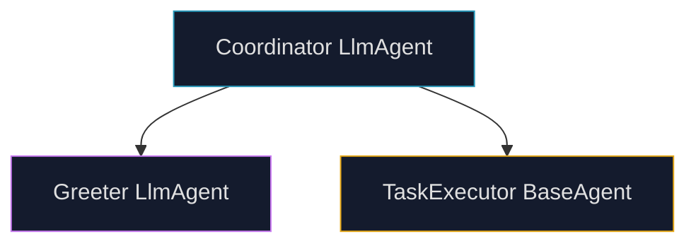
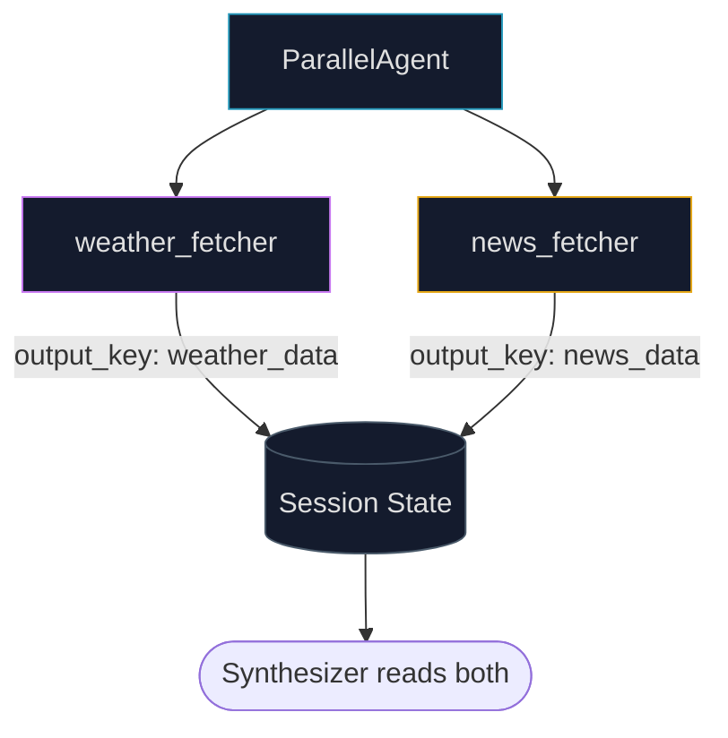

## Why One Agent Isn't Enough

Every chapter up to now has been about making a single agent smarter — chain it, route it, run it in parallel, give it tools, make it reflect, make it plan. All of these improve a single agent's performance.

But there's a ceiling.

A single agent handling a complex research project needs to be: a domain expert, a search specialist, a statistical analyst, a fact-checker, and a polished writer — simultaneously. The more roles you pile onto one system prompt, the worse it performs at each of them.

The same problem that prompted humans to build teams applies to agents: **specialization beats generalism at scale**.

Multi-agent collaboration breaks a complex goal into sub-tasks, assigns each to an agent built specifically for that task, and coordinates their outputs into a unified result. The researcher does the research. The analyst runs the numbers. The writer assembles the draft. The reviewer catches errors. Each agent excels at its role. The system as a whole exceeds what any single agent could produce.

---

## What Multi-Agent Collaboration Is

Multi-agent collaboration is a system design pattern where:

1. A **complex goal** is decomposed into discrete sub-tasks
2. Each sub-task is assigned to a **specialized agent** with the right tools, knowledge, or reasoning approach
3. Agents **coordinate** through defined communication protocols — passing outputs, delegating tasks, sharing state
4. A **final output** emerges from the coordinated work of the team

<div class="ns-diagram">
  <div class="ns-diagram-header">
    <span class="ns-diagram-label">MULTI-AGENT COLLABORATION PATTERN</span>
    <button class="ns-expand-btn" onclick="openNsDiagram(this)"><svg width="11" height="11" viewBox="0 0 12 12" fill="none" stroke="currentColor" stroke-width="1.5"><path d="M1 5V1h4M11 7v4H7M1 5l4-4M11 7l-4 4"/></svg> Expand</button>
  </div>
  <div class="ns-diagram-body">
    <div class="ns-node ns-node-cyan">
      <div class="ns-node-title">Complex Goal</div>
      <div class="ns-node-sub">Too large for any single agent</div>
    </div>
    <div class="ns-arrow"></div>
    <div class="ns-node ns-node-purple">
      <div class="ns-node-title">Orchestrator Agent</div>
      <div class="ns-node-sub">Decomposes goal · delegates to specialists</div>
    </div>
    <div class="ns-arrow"></div>
    <div class="ns-phase">
      <div class="ns-phase-title">Specialist Agents — each owns a distinct role</div>
      <div class="ns-phase-sub">Separate tools, knowledge, and system prompts per agent</div>
      <div class="ns-row">
        <div class="ns-node ns-node-cyan">
          <div class="ns-node-title">Research Agent</div>
          <div class="ns-node-sub">Search · retrieve</div>
        </div>
        <div class="ns-node ns-node-amber">
          <div class="ns-node-title">Analysis Agent</div>
          <div class="ns-node-sub">Process · compute</div>
        </div>
        <div class="ns-node ns-node-purple">
          <div class="ns-node-title">Writer Agent</div>
          <div class="ns-node-sub">Draft · format</div>
        </div>
      </div>
    </div>
    <div class="ns-arrow"></div>
    <div class="ns-node">
      <div class="ns-node-title">Synthesis Agent</div>
      <div class="ns-node-sub">Merges all specialist outputs · resolves conflicts</div>
    </div>
    <div class="ns-arrow"></div>
    <div class="ns-node ns-node-green">
      <div class="ns-node-title">Final Result</div>
      <div class="ns-node-sub">Exceeds what any single agent could produce</div>
    </div>
  </div>
</div>

The critical ingredient is **inter-agent communication**: a standardized way for agents to exchange data, delegate work, and signal completion. Without it, you just have isolated agents running in parallel — not a team.

---

## The Six Interaction Models

Agent teams can be structured in fundamentally different ways. The choice of structure changes autonomy, fault tolerance, complexity, and scalability.

<div class="mas-models-wrapper">
  <div class="mas-models-tabs">
    <button class="mas-tab active" data-model="0" onclick="masSelect(0)">Single</button>
    <button class="mas-tab" data-model="1" onclick="masSelect(1)">Network</button>
    <button class="mas-tab" data-model="2" onclick="masSelect(2)">Supervisor</button>
    <button class="mas-tab" data-model="3" onclick="masSelect(3)">Supervisor as Tool</button>
    <button class="mas-tab" data-model="4" onclick="masSelect(4)">Hierarchical</button>
    <button class="mas-tab" data-model="5" onclick="masSelect(5)">Custom</button>
  </div>
  <div class="mas-models-body">
    <div class="mas-model-content" id="masContent">
      <div class="mas-model-left">
        <div class="mas-model-name" id="masName">Single Agent</div>
        <div class="mas-model-desc" id="masDesc">One agent handles everything autonomously. Simple to build and manage, but constrained by a single agent's scope and resources. No inter-agent communication overhead. Suitable only when the task is fully self-contained.</div>
        <div class="mas-model-props" id="masProps">
          <div class="mas-prop"><span class="mas-prop-label">Autonomy</span><div class="mas-prop-bar"><div class="mas-prop-fill" style="width:20%"></div></div></div>
          <div class="mas-prop"><span class="mas-prop-label">Fault tolerance</span><div class="mas-prop-bar"><div class="mas-prop-fill" style="width:10%"></div></div></div>
          <div class="mas-prop"><span class="mas-prop-label">Scalability</span><div class="mas-prop-bar"><div class="mas-prop-fill" style="width:15%"></div></div></div>
          <div class="mas-prop"><span class="mas-prop-label">Complexity</span><div class="mas-prop-bar"><div class="mas-prop-fill" style="width:10%"></div></div></div>
        </div>
        <div class="mas-model-usecase" id="masUsecase">Best for: simple, self-contained tasks with no need for specialization</div>
      </div>
      <div class="mas-model-right">
        <svg id="masSvg" viewBox="0 0 240 180" width="240" height="180"></svg>
      </div>
    </div>
  </div>
</div>

<style>
.mas-models-wrapper {
  border: 1px solid var(--global-divider-color);
  border-radius: 10px;
  overflow: hidden;
  margin: 2rem 0;
}
.mas-models-tabs {
  display: flex;
  overflow-x: auto;
  border-bottom: 1px solid var(--global-divider-color);
  background: rgba(128,128,128,0.04);
}
.mas-tab {
  flex-shrink: 0;
  padding: 0.5rem 0.85rem;
  font-family: monospace;
  font-size: 0.68rem;
  border: none;
  border-right: 1px solid var(--global-divider-color);
  background: transparent;
  color: var(--global-text-color-light);
  cursor: pointer;
  transition: background 0.15s, color 0.15s;
  white-space: nowrap;
}
.mas-tab:last-child { border-right: none; }
.mas-tab.active { background: rgba(38,152,186,0.1); color: #2698ba; font-weight: 700; }
.mas-tab:hover:not(.active) { background: rgba(128,128,128,0.08); }
.mas-models-body { padding: 1.1rem; }
.mas-model-content { display: flex; gap: 1.5rem; align-items: flex-start; flex-wrap: wrap; }
.mas-model-left { flex: 1; min-width: 220px; display: flex; flex-direction: column; gap: 0.75rem; }
.mas-model-name { font-size: 1rem; font-weight: 700; color: var(--global-text-color); }
.mas-model-desc { font-size: 0.8rem; color: var(--global-text-color-light); line-height: 1.6; }
.mas-model-props { display: flex; flex-direction: column; gap: 0.45rem; }
.mas-prop { display: flex; align-items: center; gap: 0.75rem; }
.mas-prop-label { font-size: 0.68rem; font-family: monospace; color: var(--global-text-color-light); width: 100px; flex-shrink: 0; }
.mas-prop-bar { flex: 1; height: 4px; background: rgba(128,128,128,0.15); border-radius: 2px; overflow: hidden; }
.mas-prop-fill { height: 100%; background: #2698ba; border-radius: 2px; transition: width 0.4s ease; }
.mas-model-usecase { font-size: 0.7rem; font-family: monospace; color: #4fc97e; padding-top: 0.35rem; border-top: 1px solid var(--global-divider-color); }
.mas-model-right { flex-shrink: 0; }
#masSvg { display: block; }
</style>

<script>
var MAS_MODELS = [
  {
    name: "Single Agent",
    desc: "One agent handles everything autonomously. Simple to build and manage, but constrained by a single agent's scope and resources. No inter-agent communication overhead. Suitable only when the task is fully self-contained.",
    props: [20, 10, 15, 10],
    usecase: "Best for: simple, self-contained tasks with no need for specialization",
    draw: function(svg) {
      svg.innerHTML = '';
      addNode(svg, 120, 90, 'Agent', '#2698ba', 40, 20);
    }
  },
  {
    name: "Network",
    desc: "Multiple agents interact peer-to-peer in a decentralized mesh. Agents share information, resources, and tasks directly. Resilient — no single point of failure. Challenging to coordinate at scale without explicit orchestration.",
    props: [80, 80, 60, 70],
    usecase: "Best for: distributed tasks where agents need to share information freely",
    draw: function(svg) {
      svg.innerHTML = '';
      var pts = [[120,40],[60,100],[180,100],[80,155],[160,155]];
      // Edges
      var edges = [[0,1],[0,2],[1,3],[2,4],[1,2],[3,4],[0,3],[0,4]];
      edges.forEach(function(e){
        addEdge(svg,pts[e[0]][0],pts[e[0]][1],pts[e[1]][0],pts[e[1]][1],'#4a5a6a');
      });
      pts.forEach(function(p,i){
        addNode(svg,p[0],p[1],'A'+(i+1),'#c97af2',26,14);
      });
    }
  },
  {
    name: "Supervisor",
    desc: "A central supervisor agent coordinates and delegates to subordinate workers. Clear authority and task allocation. The supervisor is a single point of failure and can become a bottleneck with many subordinates.",
    props: [50, 30, 70, 45],
    usecase: "Best for: tasks with clear decomposition and one central coordinator",
    draw: function(svg) {
      svg.innerHTML = '';
      var workers = [[50,140],[100,140],[150,140],[200,140]];
      workers.forEach(function(p){
        addEdge(svg,120,50,p[0],p[1],'#4a5a6a');
      });
      addNode(svg,120,50,'Supervisor','#2698ba',42,18);
      workers.forEach(function(p,i){
        addNode(svg,p[0],p[1],'W'+(i+1),'#c97af2',28,14);
      });
    }
  },
  {
    name: "Supervisor as Tool",
    desc: "The supervisor provides resources, guidance, or analytical capabilities to other agents rather than commanding them. Workers can query the supervisor for support without rigid top-down control.",
    props: [60, 40, 65, 50],
    usecase: "Best for: teams that need shared expertise without strict hierarchy",
    draw: function(svg) {
      svg.innerHTML = '';
      var workers = [[40,140],[120,140],[200,140]];
      workers.forEach(function(p){
        addEdgeDashed(svg,120,55,p[0],p[1],'#e6a817');
      });
      addNode(svg,120,50,'Supervisor\n(Tool)','#e6a817',52,20);
      workers.forEach(function(p,i){
        addNode(svg,p[0],p[1],'Agent '+(i+1),'#c97af2',36,14);
      });
    }
  },
  {
    name: "Hierarchical",
    desc: "Multiple layers of supervisors, each managing the layer below. Higher supervisors oversee lower ones; operational agents sit at the bottom. Handles complexity at scale. Requires careful boundary design at each layer.",
    props: [70, 50, 90, 80],
    usecase: "Best for: large-scale systems with natural sub-problem decomposition",
    draw: function(svg) {
      svg.innerHTML = '';
      addNode(svg,120,28,'Root','#2698ba',36,14);
      addEdge(svg,120,42,70,80,'#4a5a6a');
      addEdge(svg,120,42,170,80,'#4a5a6a');
      addNode(svg,70,85,'Mgr A','#e6a817',36,14);
      addNode(svg,170,85,'Mgr B','#e6a817',36,14);
      [[40,145],[100,145]].forEach(function(p){addEdge(svg,70,99,p[0],p[1],'#4a5a6a');addNode(svg,p[0],p[1],'W','#c97af2',22,12);});
      [[140,145],[200,145]].forEach(function(p){addEdge(svg,170,99,p[0],p[1],'#4a5a6a');addNode(svg,p[0],p[1],'W','#c97af2',22,12);});
    }
  },
  {
    name: "Custom",
    desc: "A bespoke structure combining elements of multiple models — or an entirely novel design. Optimized for specific metrics, highly dynamic environments, or domain-specific constraints. Requires the deepest understanding of multi-agent design principles.",
    props: [90, 70, 85, 95],
    usecase: "Best for: complex, unique domains where no standard model fits",
    draw: function(svg) {
      svg.innerHTML = '';
      // Mix of hierarchical + peer links
      addNode(svg,120,28,'Orch','#2698ba',34,14);
      addEdge(svg,120,42,60,90,'#4a5a6a');
      addEdge(svg,120,42,180,90,'#4a5a6a');
      addNode(svg,60,95,'Expert A','#c97af2',38,14);
      addNode(svg,180,95,'Expert B','#4fc97e',38,14);
      addEdgeDashed(svg,60,111,180,111,'#e6a817');
      addEdge(svg,120,42,120,150,'#4a5a6a');
      addNode(svg,120,155,'Tool Agent','#e6a817',42,14);
      addEdgeDashed(svg,60,111,120,143,'#4a5a6a');
      addEdgeDashed(svg,180,111,120,143,'#4a5a6a');
    }
  }
];

function addNode(svg, cx, cy, label, color, rx, ry) {
  rx = rx || 36; ry = ry || 16;
  var rect = document.createElementNS('http://www.w3.org/2000/svg','rect');
  rect.setAttribute('x', cx - rx); rect.setAttribute('y', cy - ry);
  rect.setAttribute('width', rx*2); rect.setAttribute('height', ry*2);
  rect.setAttribute('rx', 6); rect.setAttribute('fill', '#141b2d');
  rect.setAttribute('stroke', color); rect.setAttribute('stroke-width', '1.5');
  svg.appendChild(rect);
  var lines = label.split('\n');
  lines.forEach(function(line, i) {
    var text = document.createElementNS('http://www.w3.org/2000/svg','text');
    text.setAttribute('x', cx); text.setAttribute('y', cy + (i - (lines.length-1)/2) * 13 + 4);
    text.setAttribute('text-anchor','middle'); text.setAttribute('fill','#e0e0e0');
    text.setAttribute('font-size','10'); text.setAttribute('font-family','monospace');
    text.textContent = line;
    svg.appendChild(text);
  });
}
function addEdge(svg, x1, y1, x2, y2, color) {
  var line = document.createElementNS('http://www.w3.org/2000/svg','line');
  line.setAttribute('x1',x1);line.setAttribute('y1',y1);line.setAttribute('x2',x2);line.setAttribute('y2',y2);
  line.setAttribute('stroke',color);line.setAttribute('stroke-width','1.2');
  line.setAttribute('marker-end','url(#arr)');
  svg.appendChild(line);
  ensureArrow(svg);
}
function addEdgeDashed(svg, x1, y1, x2, y2, color) {
  var line = document.createElementNS('http://www.w3.org/2000/svg','line');
  line.setAttribute('x1',x1);line.setAttribute('y1',y1);line.setAttribute('x2',x2);line.setAttribute('y2',y2);
  line.setAttribute('stroke',color);line.setAttribute('stroke-width','1.2');
  line.setAttribute('stroke-dasharray','4 3');
  svg.appendChild(line);
}
function ensureArrow(svg) {
  if (svg.querySelector('#arr')) return;
  var defs = document.createElementNS('http://www.w3.org/2000/svg','defs');
  defs.innerHTML = '<marker id="arr" markerWidth="6" markerHeight="6" refX="5" refY="3" orient="auto"><path d="M0,0 L0,6 L6,3 z" fill="#4a5a6a"/></marker>';
  svg.insertBefore(defs, svg.firstChild);
}

function masSelect(idx) {
  document.querySelectorAll('.mas-tab').forEach(function(t){t.classList.remove('active');});
  document.querySelector('[data-model="'+idx+'"]').classList.add('active');
  var m = MAS_MODELS[idx];
  document.getElementById('masName').textContent = m.name;
  document.getElementById('masDesc').textContent = m.desc;
  document.getElementById('masUsecase').textContent = m.usecase;
  var fills = document.querySelectorAll('.mas-prop-fill');
  var labels = ['Autonomy','Fault tolerance','Scalability','Complexity'];
  var propContainer = document.getElementById('masProps');
  propContainer.innerHTML = '';
  labels.forEach(function(lbl, i) {
    var div = document.createElement('div'); div.className = 'mas-prop';
    div.innerHTML = '<span class="mas-prop-label">'+lbl+'</span><div class="mas-prop-bar"><div class="mas-prop-fill" style="width:'+m.props[i]+'%"></div></div>';
    propContainer.appendChild(div);
  });
  var svg = document.getElementById('masSvg');
  m.draw(svg);
}
document.addEventListener('DOMContentLoaded', function(){ masSelect(0); });
</script>

---

## The Five Collaboration Patterns

Within multi-agent systems, agents interact through five fundamental patterns:

<div class="mas-patterns-grid">
  <div class="mas-pattern-card">
    <div class="mas-pattern-icon">→</div>
    <h4>Sequential Handoff</h4>
    <p>Agent A completes its task and passes its output directly to Agent B. Output of A becomes input to B. Clean pipeline with clear dependencies.</p>
    <span class="mas-pattern-ex">Research → Write → Edit → Publish</span>
  </div>
  <div class="mas-pattern-card">
    <div class="mas-pattern-icon">⇉</div>
    <h4>Parallel Workstreams</h4>
    <p>Multiple agents work on independent sub-tasks simultaneously. Results are merged by a synthesizer. Reduces total latency for independent work.</p>
    <span class="mas-pattern-ex">News + Weather + Stocks → Report</span>
  </div>
  <div class="mas-pattern-card">
    <div class="mas-pattern-icon">⇄</div>
    <h4>Debate & Consensus</h4>
    <p>Agents with different perspectives evaluate options and discuss. The group reaches a more informed decision than any single agent could.</p>
    <span class="mas-pattern-ex">Pro + Con agents → Moderator → Verdict</span>
  </div>
  <div class="mas-pattern-card">
    <div class="mas-pattern-icon">↕</div>
    <h4>Hierarchical Delegation</h4>
    <p>A manager agent dynamically assigns sub-tasks to worker agents based on their tool access. Workers report back, manager synthesizes.</p>
    <span class="mas-pattern-ex">Coordinator → Specialist A / B / C → Result</span>
  </div>
  <div class="mas-pattern-card">
    <div class="mas-pattern-icon">✓✗</div>
    <h4>Critic-Reviewer</h4>
    <p>A creator agent produces output. A critic agent evaluates it for quality, compliance, or correctness. Creator revises based on critique.</p>
    <span class="mas-pattern-ex">Generator → Critic → Revised Output</span>
  </div>
</div>

<style>
.mas-patterns-grid {
  display: grid;
  grid-template-columns: repeat(auto-fill, minmax(190px, 1fr));
  gap: 0.85rem;
  margin: 1.5rem 0;
}
.mas-pattern-card {
  border: 1px solid var(--global-divider-color);
  border-radius: 8px;
  padding: 1rem;
  background: rgba(128,128,128,0.04);
  display: flex;
  flex-direction: column;
  gap: 0.4rem;
}
.mas-pattern-icon { font-size: 1.1rem; color: #2698ba; font-weight: 700; }
.mas-pattern-card h4 { font-size: 0.85rem; font-weight: 700; margin: 0; color: var(--global-text-color); }
.mas-pattern-card p  { font-size: 0.78rem; color: var(--global-text-color-light); margin: 0; line-height: 1.5; }
.mas-pattern-ex { font-size: 0.68rem; font-family: monospace; color: #4fc97e; margin-top: auto; padding-top: 0.35rem; border-top: 1px solid var(--global-divider-color); }
</style>

---

## Watch a Two-Agent Team Work

A Researcher and a Writer collaborate on a blog post. Click **Run Team** to watch the sequential handoff:

<div class="mas-team-wrapper">
  <div class="mas-team-header">
    <span class="mas-team-title">MULTI-AGENT TEAM DEMO — Research + Write Pipeline</span>
    <button class="mas-team-btn" id="masTeamRunBtn">▶ Run Team</button>
  </div>
  <div class="mas-team-body">
    <div class="mas-team-goal">
      <span class="mas-tg-label">SHARED GOAL</span>
      <span class="mas-tg-text">Write a blog post on the top 3 AI trends in 2025</span>
    </div>
    <div class="mas-agents-row">
      <div class="mas-agent-panel" id="masAgentA">
        <div class="mas-agent-header">
          <span class="mas-agent-icon">🔍</span>
          <div>
            <div class="mas-agent-name">Research Agent</div>
            <div class="mas-agent-role">Senior Research Analyst</div>
          </div>
          <span class="mas-agent-badge" id="masAgentABadge">Idle</span>
        </div>
        <div class="mas-agent-track"><div class="mas-agent-fill cyan" id="masAgentAFill"></div></div>
        <div class="mas-agent-output" id="masAgentAOut" style="display:none">
          <strong>Research findings:</strong><br>
          1. <strong>Multimodal AI</strong> — models handling text, image, audio, video simultaneously (GPT-4o, Gemini 1.5).<br>
          2. <strong>Agentic systems</strong> — AI moving from Q&amp;A to autonomous multi-step task execution.<br>
          3. <strong>On-device inference</strong> — compact models running locally on phones and laptops (Phi-3, Gemma).
        </div>
      </div>
      <div class="mas-handoff-arrow" id="masHandoff">→</div>
      <div class="mas-agent-panel" id="masAgentB" style="opacity:0.35">
        <div class="mas-agent-header">
          <span class="mas-agent-icon">✍</span>
          <div>
            <div class="mas-agent-name">Writer Agent</div>
            <div class="mas-agent-role">Technical Content Writer</div>
          </div>
          <span class="mas-agent-badge" id="masAgentBBadge">Waiting</span>
        </div>
        <div class="mas-agent-track"><div class="mas-agent-fill purple" id="masAgentBFill"></div></div>
        <div class="mas-agent-output" id="masAgentBOut" style="display:none">
          <strong>Blog post draft:</strong><br><br>
          <em>The AI landscape in 2025 is defined by three transformative forces. First, multimodal models now process text, images, and audio as a unified stream — eliminating the boundary between media types. Second, agentic AI has crossed from demo to deployment: systems now autonomously plan, use tools, and course-correct across multi-step workflows. Third, on-device inference is making capable AI private and offline-ready, removing the cloud as a prerequisite for intelligence.</em>
        </div>
      </div>
    </div>
    <div class="mas-team-result" id="masTeamResult" style="display:none">
      <span class="mas-result-icon">✓</span>
      Two specialized agents. One coherent output. <strong>Sequential handoff complete.</strong>
    </div>
  </div>
</div>

<style>
.mas-team-wrapper { border: 1px solid var(--global-divider-color); border-radius: 10px; overflow: hidden; margin: 2rem 0; }
.mas-team-header { display: flex; align-items: center; justify-content: space-between; padding: 0.75rem 1.1rem; border-bottom: 1px solid var(--global-divider-color); background: rgba(128,128,128,0.05); }
.mas-team-title { font-size: 0.68rem; font-weight: 700; letter-spacing: 0.12em; text-transform: uppercase; color: var(--global-text-color); }
.mas-team-btn { font-family: monospace; font-size: 0.72rem; padding: 0.3rem 0.8rem; border-radius: 4px; border: 1px solid var(--global-divider-color); background: transparent; color: var(--global-text-color); cursor: pointer; transition: background 0.15s; }
.mas-team-btn:hover { background: rgba(38,152,186,0.15); border-color:#2698ba; color:#2698ba; }
.mas-team-body { padding: 1rem 1.1rem; display: flex; flex-direction: column; gap: 0.85rem; }
.mas-team-goal { border: 1px solid var(--global-divider-color); border-radius: 6px; padding: 0.6rem 0.9rem; display: flex; align-items: center; gap: 0.75rem; background: rgba(128,128,128,0.04); }
.mas-tg-label { font-size: 0.6rem; font-weight: 700; letter-spacing: 0.1em; color: #2698ba; flex-shrink: 0; }
.mas-tg-text { font-size: 0.82rem; color: var(--global-text-color); font-family: monospace; }
.mas-agents-row { display: flex; align-items: center; gap: 0.75rem; flex-wrap: wrap; }
.mas-agent-panel { flex: 1; min-width: 220px; border: 1.5px solid var(--global-divider-color); border-radius: 8px; padding: 0.85rem; background: rgba(128,128,128,0.03); display: flex; flex-direction: column; gap: 0.5rem; transition: border-color 0.3s, opacity 0.4s; }
.mas-agent-panel.active { border-color: #2698ba; }
.mas-agent-panel.done   { border-color: #4fc97e; opacity: 1 !important; }
.mas-agent-header { display: flex; align-items: center; gap: 0.6rem; }
.mas-agent-icon { font-size: 1.1rem; }
.mas-agent-name { font-size: 0.82rem; font-weight: 700; color: var(--global-text-color); }
.mas-agent-role { font-size: 0.65rem; color: var(--global-text-color-light); font-family: monospace; }
.mas-agent-badge { font-size: 0.6rem; font-family: monospace; padding: 0.1em 0.4em; border-radius: 3px; border: 1px solid var(--global-divider-color); color: var(--global-text-color-light); margin-left: auto; transition: all 0.3s; }
.mas-agent-badge.running { color: #2698ba; border-color: #2698ba; background: rgba(38,152,186,0.1); }
.mas-agent-badge.done    { color: #4fc97e; border-color: #4fc97e; background: rgba(79,201,126,0.1); }
.mas-agent-track { height: 5px; background: rgba(128,128,128,0.12); border-radius: 3px; overflow: hidden; }
.mas-agent-fill { height: 100%; width: 0%; border-radius: 3px; transition: width 0.05s linear; }
.mas-agent-fill.cyan   { background: #2698ba; }
.mas-agent-fill.purple { background: #c97af2; }
.mas-agent-output { font-size: 0.77rem; color: var(--global-text-color-light); line-height: 1.6; border-top: 1px solid var(--global-divider-color); padding-top: 0.5rem; animation: masOutIn 0.3s ease; }
@keyframes masOutIn { from { opacity: 0; } to { opacity: 1; } }
.mas-handoff-arrow { font-size: 1.4rem; color: var(--global-text-color-light); flex-shrink: 0; transition: color 0.4s; }
.mas-handoff-arrow.active { color: #2698ba; }
.mas-team-result { display: flex; align-items: center; gap: 0.6rem; padding: 0.6rem 0.85rem; background: rgba(79,201,126,0.07); border: 1px solid rgba(79,201,126,0.2); border-radius: 6px; font-size: 0.8rem; color: var(--global-text-color); animation: masOutIn 0.3s ease; }
.mas-result-icon { color: #4fc97e; font-weight: 700; }
</style>

<script>
document.addEventListener('DOMContentLoaded', function(){
  var btn = document.getElementById('masTeamRunBtn');
  if (!btn) return;
  var running = false;

  btn.addEventListener('click', async function(){
    if (running) return;
    running = true;
    btn.textContent = '⏳ Running…';
    btn.disabled = true;

    // Reset
    ['masAgentA','masAgentB'].forEach(function(id){
      var p = document.getElementById(id);
      p.classList.remove('active','done');
      p.style.opacity = id === 'masAgentB' ? '0.35' : '1';
    });
    document.getElementById('masAgentAFill').style.width = '0%';
    document.getElementById('masAgentBFill').style.width = '0%';
    document.getElementById('masAgentAOut').style.display = 'none';
    document.getElementById('masAgentBOut').style.display = 'none';
    document.getElementById('masTeamResult').style.display = 'none';
    document.getElementById('masHandoff').classList.remove('active');
    ['masAgentABadge','masAgentBBadge'].forEach(function(id,i){
      var el = document.getElementById(id);
      el.textContent = i===0 ? 'Idle' : 'Waiting';
      el.className = 'mas-agent-badge';
    });

    await new Promise(function(r){setTimeout(r,300)});

    // Agent A: Research
    var pA = document.getElementById('masAgentA');
    var badgeA = document.getElementById('masAgentABadge');
    var fillA = document.getElementById('masAgentAFill');
    pA.classList.add('active');
    badgeA.textContent = 'Researching…'; badgeA.className = 'mas-agent-badge running';

    var startA = null;
    await new Promise(function(resolve){
      function animA(ts){ if(!startA) startA=ts; var pct=Math.min((ts-startA)/1600*100,100); fillA.style.width=pct+'%'; if(pct<100) requestAnimationFrame(animA); else resolve(); }
      requestAnimationFrame(animA);
    });
    pA.classList.remove('active'); pA.classList.add('done');
    badgeA.textContent='Done ✓'; badgeA.className='mas-agent-badge done';
    document.getElementById('masAgentAOut').style.display='block';

    await new Promise(function(r){setTimeout(r,400)});

    // Handoff arrow
    document.getElementById('masHandoff').classList.add('active');
    await new Promise(function(r){setTimeout(r,500)});

    // Agent B: Write
    var pB = document.getElementById('masAgentB');
    var badgeB = document.getElementById('masAgentBBadge');
    var fillB = document.getElementById('masAgentBFill');
    pB.style.opacity = '1';
    pB.classList.add('active');
    badgeB.textContent='Writing…'; badgeB.className='mas-agent-badge running';

    var startB = null;
    await new Promise(function(resolve){
      function animB(ts){ if(!startB) startB=ts; var pct=Math.min((ts-startB)/1800*100,100); fillB.style.width=pct+'%'; if(pct<100) requestAnimationFrame(animB); else resolve(); }
      requestAnimationFrame(animB);
    });
    pB.classList.remove('active'); pB.classList.add('done');
    badgeB.textContent='Done ✓'; badgeB.className='mas-agent-badge done';
    document.getElementById('masAgentBOut').style.display='block';
    document.getElementById('masTeamResult').style.display='flex';

    running = false;
    btn.textContent = '↺ Replay';
    btn.disabled = false;
  });
});
</script>

---

## Use Cases Across Domains

<div class="mas-usecases-grid">
  <div class="mas-uc-card"><span class="mas-uc-num">01</span><h4>Complex Research</h4><p>Searcher agent finds sources, summarizer agent digests them, trend-spotter identifies patterns, synthesizer writes the final report.</p></div>
  <div class="mas-uc-card"><span class="mas-uc-num">02</span><h4>Software Development</h4><p>Requirements analyst, code generator, test writer, and documentation agent collaborate — each handing off to the next in sequence.</p></div>
  <div class="mas-uc-card"><span class="mas-uc-num">03</span><h4>Financial Analysis</h4><p>Agents fetch stock data, analyze news sentiment, run technical analysis, and generate investment recommendations in parallel.</p></div>
  <div class="mas-uc-card"><span class="mas-uc-num">04</span><h4>Customer Support</h4><p>Front-line agent handles general queries. Specialist agents (billing, technical, escalation) are activated only when needed.</p></div>
  <div class="mas-uc-card"><span class="mas-uc-num">05</span><h4>Supply Chain</h4><p>Agents representing suppliers, manufacturers, and distributors collaborate to optimize inventory and logistics in real time.</p></div>
  <div class="mas-uc-card"><span class="mas-uc-num">06</span><h4>Network Remediation</h4><p>Multiple triage agents work concurrently to pinpoint failures. Each integrates with existing ML tooling while contributing to a coordinated remediation plan.</p></div>
</div>

<style>
.mas-usecases-grid { display: grid; grid-template-columns: repeat(auto-fill, minmax(185px, 1fr)); gap: 0.85rem; margin: 1.5rem 0; }
.mas-uc-card { border: 1px solid var(--global-divider-color); border-radius: 8px; padding: 1rem; background: rgba(128,128,128,0.04); display: flex; flex-direction: column; gap: 0.4rem; }
.mas-uc-num { font-family: monospace; font-size: 0.65rem; font-weight: 700; letter-spacing: 0.1em; color: #2698ba; }
.mas-uc-card h4 { font-size: 0.85rem; font-weight: 700; margin: 0; color: var(--global-text-color); }
.mas-uc-card p  { font-size: 0.78rem; color: var(--global-text-color-light); margin: 0; line-height: 1.5; }
</style>

---

## CrewAI: Researcher + Writer Team

CrewAI is designed for exactly this — defining a team of agents with distinct roles, assigning tasks, and orchestrating collaboration.

```python
from crewai import Agent, Task, Crew, Process
from langchain_google_genai import ChatGoogleGenerativeAI

llm = ChatGoogleGenerativeAI(model="gemini-2.0-flash")
```

### Defining the Agents

```python
researcher = Agent(
    role      = 'Senior Research Analyst',
    goal      = 'Find and summarize the latest trends in AI.',
    backstory  = "You are an experienced research analyst with a knack for identifying key trends and synthesizing information.",
    verbose          = True,
    allow_delegation = False,
)

writer = Agent(
    role      = 'Technical Content Writer',
    goal      = 'Write a clear and engaging blog post based on research findings.',
    backstory  = "You are a skilled writer who can translate complex technical topics into accessible content.",
    verbose          = True,
    allow_delegation = False,
)
```

> **Two agents, two roles, zero overlap.** The researcher knows nothing about writing; the writer knows nothing about searching. This clean separation means each agent's system prompt is focused — no role confusion, no competing instructions.
>
> **`allow_delegation=False`** — prevents each specialist from spawning sub-agents on their own. In a controlled pipeline, you want the delegation logic to live in the Crew definition, not in individual agents.

### Defining the Tasks (with dependency)

```python
research_task = Task(
    description      = "Research the top 3 emerging AI trends in 2024-2025. Focus on practical applications and impact.",
    expected_output  = "A detailed summary of the top 3 AI trends with key points and sources.",
    agent            = researcher,
)

writing_task = Task(
    description     = "Write a 500-word blog post based on the research findings. Engaging, accessible to a general audience.",
    expected_output = "A complete 500-word blog post about the latest AI trends.",
    agent           = writer,
    context         = [research_task],   # ← explicit dependency
)
```

> **`context=[research_task]`** is the sequential handoff mechanism. It tells CrewAI: "the writing task cannot begin until research_task is complete, and the research output should be available to the writer as context."
>
> Without this, the writer would run without access to the researcher's findings — generating generic content rather than building on real research.

### Assembling the Crew

```python
blog_creation_crew = Crew(
    agents  = [researcher, writer],
    tasks   = [research_task, writing_task],
    process = Process.sequential,
    llm     = llm,
    verbose = 2,
)

result = blog_creation_crew.kickoff()
```

> **`Process.sequential`** ensures tasks run in the order they're listed — researcher first, writer second. The `context` dependency enforces this even if the process allows parallelism.
>
> **`llm` at the Crew level** sets a default model for all agents. Individual agents can still override with their own `llm=` parameter if specialization is needed — e.g., a more powerful model for the researcher, a faster one for the writer.

### CrewAI Data Flow


---

## Google ADK: Four Orchestration Patterns

The ADK provides explicit primitives for each collaboration structure. Here are the four most important.

### 1. Hierarchical: Parent-Child Agents

```python
from google.adk.agents import LlmAgent, BaseAgent
from google.adk.agents.invocation_context import InvocationContext
from google.adk.events import Event
from typing import AsyncGenerator

class TaskExecutor(BaseAgent):
    """A specialized agent with custom, non-LLM behavior."""
    name:        str = "TaskExecutor"
    description: str = "Executes a predefined task."

    async def _run_async_impl(
        self, context: InvocationContext
    ) -> AsyncGenerator[Event, None]:
        yield Event(author=self.name, content="Task finished successfully.")
```

> **`BaseAgent` is the extension point** for non-LLM agents. When you need deterministic logic, API calls, or custom execution — instead of LLM reasoning — subclass `BaseAgent` and implement `_run_async_impl`. It yields `Event` objects as output, integrating cleanly with the ADK event stream.

```python
greeter     = LlmAgent(name="Greeter", model="gemini-2.0-flash-exp", instruction="You are a friendly greeter.")
task_doer   = TaskExecutor()

coordinator = LlmAgent(
    name        = "Coordinator",
    model       = "gemini-2.0-flash-exp",
    instruction = "When asked to greet, delegate to the Greeter. When asked to perform a task, delegate to the TaskExecutor.",
    sub_agents  = [greeter, task_doer],
)

# ADK sets parent_agent automatically
assert greeter.parent_agent   == coordinator
assert task_doer.parent_agent == coordinator
```

> **`sub_agents`** establishes the parent-child relationship. The coordinator's LLM reads both agents' descriptions and decides which to delegate to. The `parent_agent` attribute is set automatically by the ADK framework — you don't need to wire it manually.



### 2. LoopAgent: Iterative Workflows

```python
from google.adk.agents import LoopAgent, LlmAgent, BaseAgent
from google.adk.events import Event, EventActions

class ConditionChecker(BaseAgent):
    """Stops the loop when session state signals completion."""
    name:        str = "ConditionChecker"
    description: str = "Checks if a process is complete and signals the loop to stop."

    async def _run_async_impl(self, context: InvocationContext) -> AsyncGenerator[Event, None]:
        status  = context.session.state.get("status", "pending")
        is_done = (status == "completed")
        if is_done:
            yield Event(author=self.name, actions=EventActions(escalate=True))  # stop loop
        else:
            yield Event(author=self.name, content="Condition not met, continuing loop.")
```

> **`EventActions(escalate=True)`** is the loop-termination signal. When `ConditionChecker` yields this, the `LoopAgent` stops regardless of remaining iterations. Without it, the loop runs to `max_iterations`.
>
> **`context.session.state`** is the shared key-value store accessible to all agents within a session. `ProcessingStep` writes `"status": "completed"` there; `ConditionChecker` reads it. This is how agents communicate state in ADK without direct message passing.

```python
process_step = LlmAgent(
    name        = "ProcessingStep",
    model       = "gemini-2.0-flash-exp",
    instruction = "Perform your task. If you are the final step, set session state 'status' to 'completed'.",
)

poller = LoopAgent(
    name           = "StatusPoller",
    max_iterations = 10,
    sub_agents     = [process_step, ConditionChecker()],
)
```

> **`LoopAgent`** runs its `sub_agents` sequentially on each iteration. Each iteration: `ProcessingStep` executes → `ConditionChecker` evaluates → if not done, repeat. Maximum 10 iterations as a safety cap. Use this for polling, retry workflows, and iterative refinement loops.

### 3. SequentialAgent: Linear Pipelines

```python
from google.adk.agents import SequentialAgent, Agent

step1 = Agent(name="Step1_Fetch",   output_key="data")
step2 = Agent(name="Step2_Process", instruction="Analyze the information in state['data'] and provide a summary.")

pipeline = SequentialAgent(name="MyPipeline", sub_agents=[step1, step2])
```

> **`output_key="data"`** — when `Step1_Fetch` completes, its output is automatically stored in `session.state["data"]`. `Step2_Process` reads it from state via its instruction. This is the ADK equivalent of CrewAI's `context=[task]` — explicit state-passing between sequential steps.

### 4. ParallelAgent: Concurrent Workers

```python
from google.adk.agents import Agent, ParallelAgent

weather_fetcher = Agent(
    name        = "weather_fetcher",
    model       = "gemini-2.0-flash-exp",
    instruction = "Fetch the weather for the given location and return only the report.",
    output_key  = "weather_data",   # → session.state["weather_data"]
)

news_fetcher = Agent(
    name        = "news_fetcher",
    model       = "gemini-2.0-flash-exp",
    instruction = "Fetch the top news story for the given topic and return only that story.",
    output_key  = "news_data",      # → session.state["news_data"]
)

data_gatherer = ParallelAgent(
    name       = "data_gatherer",
    sub_agents = [weather_fetcher, news_fetcher],
)
```

> **`ParallelAgent`** fires both sub-agents concurrently. Each writes to a different `output_key` in session state — `weather_data` and `news_data` — with no conflict since the keys are distinct. After both complete, a downstream agent (or your application code) can read both from state.



### 5. Agent as a Tool

```python
from google.adk.agents import LlmAgent
from google.adk.tools import agent_tool

def generate_image(prompt: str) -> dict:
    """Generates an image from a textual prompt. Returns image bytes."""
    mock_bytes = b"mock_image_data_for_a_cat_wearing_a_hat"
    return {"status": "success", "image_bytes": mock_bytes, "mime_type": "image/png"}

image_generator_agent = LlmAgent(
    name        = "ImageGen",
    model       = "gemini-2.0-flash",
    description = "Generates an image based on a detailed text prompt.",
    instruction = "Take the user's request and use the generate_image tool to create the image.",
    tools       = [generate_image],
)

image_tool = agent_tool.AgentTool(
    agent       = image_generator_agent,
    description = "Use this to generate an image. Input should be a descriptive prompt.",
)

artist_agent = LlmAgent(
    name        = "Artist",
    model       = "gemini-2.0-flash",
    instruction = "Invent a creative image prompt. Then use the ImageGen tool to generate it.",
    tools       = [image_tool],
)
```

> **`AgentTool`** wraps a sub-agent and makes it callable as a tool from a parent agent's perspective. The `artist_agent` sees `image_tool` the same way it sees `generate_image` — as a tool it can call with arguments. The tool's `description` is what the parent's LLM reads to decide when to invoke it.
>
> **Why "agent as a tool" instead of `sub_agents`?** With `sub_agents`, the coordinator's LLM decides routing. With `AgentTool`, the parent agent explicitly invokes the sub-agent like a function call — passing specific arguments and receiving a return value. More precise, less autonomous.

---

## Framework Comparison

| Feature | CrewAI | Google ADK |
|---|---|---|
| **Team definition** | `Agent` + `Task` + `Crew` | `LlmAgent` / `BaseAgent` + orchestrators |
| **Sequential flow** | `Process.sequential` + `context=[]` | `SequentialAgent` + `output_key` |
| **Parallel flow** | Multiple tasks with no `context` dependency | `ParallelAgent` |
| **Loop flow** | Custom code / `while` loop | `LoopAgent` + `EventActions(escalate=True)` |
| **Hierarchical** | `allow_delegation=True` | `sub_agents=[]` on `LlmAgent` |
| **Agent as tool** | Not native (use LangChain tools) | `AgentTool` wrapper |
| **State passing** | `context=[task]` in task definition | `output_key` → `session.state` |
| **Custom agent logic** | Not supported natively | `BaseAgent._run_async_impl()` |

---

## At a Glance

<div class="mas-summary-card">
  <div class="mas-summary-col">
    <div class="mas-summary-label">WHAT</div>
    <p>A system of specialized agents, each owning a distinct role and set of tools, coordinating to achieve a complex shared goal that no single agent could handle effectively alone.</p>
  </div>
  <div class="mas-summary-divider"></div>
  <div class="mas-summary-col">
    <div class="mas-summary-label">WHY</div>
    <p>Specialization beats generalism at scale. Decomposing a complex task into focused sub-tasks — each assigned to an agent built for it — produces higher quality, more reliable, and more scalable outcomes.</p>
  </div>
  <div class="mas-summary-divider"></div>
  <div class="mas-summary-col">
    <div class="mas-summary-label">RULE OF THUMB</div>
    <p>Use when a task requires diverse expertise, multiple distinct phases, or benefits from parallel workstreams. If a single agent's system prompt is trying to do too many jobs — split it into a team.</p>
  </div>
</div>

<style>
.mas-summary-card { display: flex; border: 1px solid var(--global-divider-color); border-radius: 10px; overflow: hidden; margin: 1.5rem 0; }
@media (max-width: 640px) { .mas-summary-card { flex-direction: column; } }
.mas-summary-col { flex: 1; padding: 1.1rem; background: rgba(128,128,128,0.03); }
.mas-summary-col p { font-size: 0.8rem; color: var(--global-text-color-light); line-height: 1.6; margin: 0.4rem 0 0; }
.mas-summary-divider { width: 1px; background: var(--global-divider-color); flex-shrink: 0; }
.mas-summary-label { font-size: 0.62rem; font-weight: 700; letter-spacing: 0.12em; color: #2698ba; }
</style>

---

## Key Takeaways

- **Specialization wins.** A focused agent with a clear role outperforms a generalist agent trying to do everything. Split roles aggressively.
- **The six interaction models** — Single, Network, Supervisor, Supervisor-as-Tool, Hierarchical, Custom — each trade off autonomy vs. control vs. complexity. Most production systems use Hierarchical or Supervisor.
- **CrewAI wires tasks, not agents.** The `context=[task]` parameter is the key to sequential handoffs — it passes one agent's output as context to the next without any manual wiring.
- **ADK provides explicit primitives:** `SequentialAgent` for linear pipelines, `ParallelAgent` for concurrent work, `LoopAgent` for iterative workflows, `sub_agents` for hierarchy, `AgentTool` for invoking an agent like a function.
- **`output_key` is ADK's state bus.** Every agent in an ADK session shares `session.state`. Writing to a key with `output_key` and reading from it in another agent's instruction is the standard inter-agent communication mechanism.
- **`EventActions(escalate=True)`** is how a `LoopAgent` stops. Always provide a clear stopping condition — and `max_iterations` as a safety cap.
- **Failure isolation is a feature.** When one agent in a multi-agent system fails, the others can continue. Compare this to a monolithic agent where one failed step can derail the entire task.

---

*Next up — Chapter 8: Memory, where agents stop starting from scratch on every turn and begin building persistent context across conversations and sessions.*
