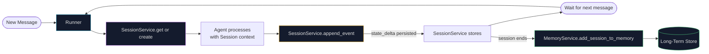

## The Stateless Agent Problem

Every agent pattern in this series — [chaining](/kohshh-portfolio/blog/2026/prompt-chaining/), [routing](/kohshh-portfolio/blog/2026/routing/), [planning](/kohshh-portfolio/blog/2026/planning/), [multi-agent](/kohshh-portfolio/blog/2026/multi-agent/) — has one silent assumption: the agent has context. It knows what the user said, what it did before, what tools it called.

But where does that context live?

Without explicit memory management, agents are stateless. Each call to the LLM starts fresh. Ask it "what's my order status?" and it has no idea who you are, what you ordered, or what you discussed five messages ago. That's not an agent — it's a very expensive autocomplete.

**Memory** is what transforms a stateless LLM call into an agent that can maintain context, track progress, personalize responses, and learn from past interactions.

There are two fundamentally different problems:
1. **Short-term**: remember what was said *in this conversation*
2. **Long-term**: remember what matters *across conversations*

Both require different mechanisms. Neither is optional for production agents.

---

## Two Types of Agent Memory

<div class="ns-diagram">
  <div class="ns-diagram-header">
    <span class="ns-diagram-label">MEMORY ARCHITECTURE</span>
    <button class="ns-expand-btn" onclick="openNsDiagram(this)"><svg width="11" height="11" viewBox="0 0 12 12" fill="none" stroke="currentColor" stroke-width="1.5"><path d="M1 5V1h4M11 7v4H7M1 5l4-4M11 7l-4 4"/></svg> Expand</button>
  </div>
  <div class="ns-diagram-body">
    <div class="ns-node ns-node-cyan">
      <div class="ns-node-title">User Message</div>
      <div class="ns-node-sub">Arrives at the Runner · new conversation turn</div>
    </div>
    <div class="ns-arrow"></div>
    <div class="ns-phase">
      <div class="ns-phase-title">Short-Term Memory — Session Scope</div>
      <div class="ns-phase-sub">Ephemeral · lost when session ends · lives in the LLM context window</div>
      <div class="ns-row">
        <div class="ns-node ns-node-purple">
          <div class="ns-node-title">Events</div>
          <div class="ns-node-sub">Full message history for this conversation</div>
        </div>
        <div class="ns-node ns-node-amber">
          <div class="ns-node-title">State</div>
          <div class="ns-node-sub">Key-value scratchpad · task progress, preferences</div>
        </div>
      </div>
    </div>
    <div class="ns-arrow"></div>
    <div class="ns-node">
      <div class="ns-node-title">Agent Processes · Responds</div>
      <div class="ns-node-sub">LLM has full session context · generates reply</div>
    </div>
    <div class="ns-arrow"></div>
    <div class="ns-phase">
      <div class="ns-phase-title">Long-Term Memory — Cross-Session Scope</div>
      <div class="ns-phase-sub">Persistent · survives session end · retrieved via semantic search</div>
      <div class="ns-row">
        <div class="ns-node ns-node-cyan">
          <div class="ns-node-title">MemoryService</div>
          <div class="ns-node-sub">Extracts facts from sessions · stores persistently</div>
        </div>
        <div class="ns-node ns-node-green">
          <div class="ns-node-title">Vector Database</div>
          <div class="ns-node-sub">Semantic search · retrieved into next session's context</div>
        </div>
      </div>
    </div>
    <div class="ns-arrow"></div>
    <div class="ns-node ns-node-green">
      <div class="ns-node-title">Persistent Knowledge</div>
      <div class="ns-node-sub">User preferences · past interactions · learned behaviors</div>
    </div>
  </div>
</div>

### Short-Term Memory

Short-term memory is the **context window** — everything the model sees on a single call: the system prompt, the conversation history, tool results, agent thoughts.

It's fast, has zero retrieval cost, and is always 100% relevant to the current conversation. But it's **ephemeral**: when the session ends, it's gone. And it has capacity limits — even a 1M token window fills up eventually, and processing the full history on every call is expensive.

### Long-Term Memory

Long-term memory is **external storage** — databases, vector stores, knowledge graphs — that persists across sessions. When an agent needs something from the past, it queries the store, retrieves the relevant data, and injects it into the current context.

Vector databases are the dominant storage type here because they support **semantic search**: the agent can find relevant memories by *meaning*, not just exact keyword match.

---

## Interactive: Watch Memory Work

<div class="mem-demo-wrapper">
  <div class="mem-demo-header">
    <span class="mem-demo-title">MEMORY TRACKER — 3-TURN CONVERSATION</span>
    <button class="mem-demo-btn" id="memDemoPlayBtn">▶ Run Conversation</button>
  </div>
  <div class="mem-demo-body">
    <div class="mem-demo-turns" id="memTurns"></div>
    <div class="mem-demo-state-panel" id="memStatePanel" style="display:none">
      <div class="mem-panel mem-panel-short">
        <div class="mem-panel-label">SHORT-TERM STATE (session.state)</div>
        <div class="mem-panel-content" id="memShortContent"></div>
      </div>
      <div class="mem-panel mem-panel-long">
        <div class="mem-panel-label">LONG-TERM MEMORY (MemoryService)</div>
        <div class="mem-panel-content" id="memLongContent"></div>
      </div>
    </div>
  </div>
</div>

<style>
.mem-demo-wrapper { border: 1px solid var(--global-divider-color); border-radius: 10px; overflow: hidden; margin: 2rem 0; }
.mem-demo-header { display: flex; align-items: center; justify-content: space-between; padding: 0.75rem 1.1rem; border-bottom: 1px solid var(--global-divider-color); background: rgba(128,128,128,0.05); }
.mem-demo-title { font-size: 0.68rem; font-weight: 700; letter-spacing: 0.12em; text-transform: uppercase; color: var(--global-text-color); }
.mem-demo-btn { font-family: monospace; font-size: 0.72rem; padding: 0.3rem 0.8rem; border-radius: 4px; border: 1px solid var(--global-divider-color); background: transparent; color: var(--global-text-color); cursor: pointer; transition: background 0.15s; }
.mem-demo-btn:hover { background: rgba(38,152,186,0.15); border-color:#2698ba; color:#2698ba; }
.mem-demo-body { padding: 1rem 1.1rem; display: flex; flex-direction: column; gap: 0.85rem; }
.mem-demo-turns { display: flex; flex-direction: column; gap: 0.6rem; }
.mem-turn { border: 1px solid var(--global-divider-color); border-radius: 7px; padding: 0.75rem 0.9rem; background: rgba(128,128,128,0.03); animation: memTurnIn 0.3s ease; }
@keyframes memTurnIn { from { opacity: 0; transform: translateY(4px); } to { opacity: 1; transform: none; } }
.mem-turn-header { display: flex; align-items: center; gap: 0.6rem; margin-bottom: 0.45rem; }
.mem-turn-icon { font-size: 0.9rem; }
.mem-turn-role { font-size: 0.68rem; font-weight: 700; letter-spacing: 0.07em; text-transform: uppercase; color: var(--global-text-color-light); }
.mem-turn-text { font-size: 0.82rem; color: var(--global-text-color); line-height: 1.55; }
.mem-turn-agent .mem-turn-text { color: #2698ba; }
.mem-turn-tags { display: flex; flex-wrap: wrap; gap: 0.35rem; margin-top: 0.4rem; }
.mem-tag { font-size: 0.62rem; font-family: monospace; padding: 0.1em 0.45em; border-radius: 3px; border: 1px solid var(--global-divider-color); color: var(--global-text-color-light); }
.mem-tag-short  { border-color: rgba(201,122,242,0.3); color: #c97af2; background: rgba(201,122,242,0.07); }
.mem-tag-long   { border-color: rgba(79,201,126,0.3);  color: #4fc97e; background: rgba(79,201,126,0.07); }
.mem-demo-state-panel { display: flex; gap: 0.75rem; flex-wrap: wrap; }
.mem-panel { flex: 1; min-width: 200px; border: 1px solid var(--global-divider-color); border-radius: 7px; overflow: hidden; }
.mem-panel-short { border-color: rgba(201,122,242,0.3); }
.mem-panel-long  { border-color: rgba(79,201,126,0.3); }
.mem-panel-label { font-size: 0.6rem; font-weight: 700; letter-spacing: 0.1em; text-transform: uppercase; padding: 0.4rem 0.75rem; border-bottom: 1px solid var(--global-divider-color); }
.mem-panel-short .mem-panel-label { color: #c97af2; background: rgba(201,122,242,0.06); }
.mem-panel-long  .mem-panel-label { color: #4fc97e; background: rgba(79,201,126,0.05); }
.mem-panel-content { padding: 0.6rem 0.75rem; font-size: 0.73rem; color: var(--global-text-color-light); line-height: 1.65; font-family: monospace; }
</style>

<script>
var MEM_TURNS = [
  {
    role: 'user', icon: '👤',
    text: 'Hi! My name is Sarah and I work in Tokyo as a data scientist.',
    tags: [
      { label: 'stored in session.state → user:name = "Sarah"', type: 'short' },
      { label: 'LTM: extracted → name=Sarah, role=data scientist, location=Tokyo', type: 'long' },
    ],
    shortState: '{\n  "user:name": "Sarah",\n  "user:location": "Tokyo",\n  "user:role": "data scientist"\n}',
    longMem: '• Name: Sarah\n• Role: Data scientist\n• Location: Tokyo\n• (extracted from Turn 1)',
  },
  {
    role: 'user', icon: '👤',
    text: 'Can you recommend some AI meetups I should attend?',
    tags: [
      { label: 'short-term: full Turn 1 in context window', type: 'short' },
      { label: 'LTM retrieved: location=Tokyo → scopes recommendation', type: 'long' },
    ],
    shortState: '{\n  "user:name": "Sarah",\n  "user:location": "Tokyo",\n  "user:role": "data scientist",\n  "task:active": "meetup_search"\n}',
    longMem: '• Retrieved: location=Tokyo (similarity search)\n• Retrieved: role=data scientist\n→ Agent recommends Tokyo AI/ML meetups specifically',
  },
  {
    role: 'agent', icon: '🤖',
    text: 'Based on your location in Tokyo, Sarah, I\'d recommend the Tokyo AI Meetup, ML Tokyo, and the Data Science Japan group — all very active for data scientists in 2025.',
    tags: [
      { label: 'used session.state[user:name] for personalization', type: 'short' },
      { label: 'used LTM location recall to scope recommendations', type: 'long' },
    ],
    shortState: '{\n  "user:name": "Sarah",\n  "user:location": "Tokyo",\n  "user:role": "data scientist",\n  "task:active": "meetup_search",\n  "last_recommendation": "Tokyo AI Meetup"\n}',
    longMem: '• Updated: user interested in AI meetups\n• Updated: task_type=recommendation\n• Stored for future sessions',
  }
];

document.addEventListener('DOMContentLoaded', function(){
  var playBtn = document.getElementById('memDemoPlayBtn');
  if (!playBtn) return;
  var running = false;

  playBtn.addEventListener('click', async function(){
    if (running) return;
    running = true;
    playBtn.textContent = '⏳ Running…';
    playBtn.disabled = true;

    var turns = document.getElementById('memTurns');
    var statePanel = document.getElementById('memStatePanel');
    turns.innerHTML = '';
    statePanel.style.display = 'none';

    for (var i = 0; i < MEM_TURNS.length; i++) {
      await new Promise(function(r){ setTimeout(r, 600); });
      var t = MEM_TURNS[i];
      var div = document.createElement('div');
      div.className = 'mem-turn mem-turn-' + t.role;
      var tagsHTML = t.tags.map(function(tg){
        return '<span class="mem-tag mem-tag-'+tg.type+'">'+tg.label+'</span>';
      }).join('');
      div.innerHTML =
        '<div class="mem-turn-header">' +
          '<span class="mem-turn-icon">'+t.icon+'</span>' +
          '<span class="mem-turn-role">'+t.role+'</span>' +
        '</div>' +
        '<div class="mem-turn-text">'+t.text+'</div>' +
        '<div class="mem-turn-tags">'+tagsHTML+'</div>';
      turns.appendChild(div);

      // update state panels
      document.getElementById('memShortContent').textContent = t.shortState;
      document.getElementById('memLongContent').textContent  = t.longMem;
      statePanel.style.display = 'flex';
    }

    running = false;
    playBtn.textContent = '↺ Replay';
    playBtn.disabled = false;
  });
});
</script>

---

## Google ADK: Session, State, and MemoryService

The ADK structures memory into three explicit components with distinct responsibilities.

### Session: The Conversation Thread

```python
from google.adk.sessions import InMemorySessionService

session_service = InMemorySessionService()
```

> A **`Session`** is one conversation thread. It holds:
> - `id` — unique identifier for this thread
> - `events` — ordered list of all messages, agent replies, and tool calls
> - `state` — temporary key-value data for this conversation
> - `last_update_time` — timestamp of the most recent activity
>
> You never create `Session` objects directly — the `SessionService` manages their lifecycle: create, retrieve, append events, delete.

### Three SessionService Implementations

<div class="mem-backends-grid">
  <div class="mem-backend-card mem-card-dev">
    <div class="mem-backend-tier">DEVELOPMENT</div>
    <div class="mem-backend-name">InMemorySessionService</div>
    <div class="mem-backend-code">
      <code>from google.adk.sessions import InMemorySessionService<br>session_service = InMemorySessionService()</code>
    </div>
    <ul class="mem-backend-props">
      <li>✓ Zero setup — no database needed</li>
      <li>✓ Fast for testing</li>
      <li>✗ Data lost on app restart</li>
      <li>✗ Single process only</li>
    </ul>
    <span class="mem-backend-use">Use for: local development, unit tests</span>
  </div>
  <div class="mem-backend-card mem-card-prod">
    <div class="mem-backend-tier">PRODUCTION</div>
    <div class="mem-backend-name">DatabaseSessionService</div>
    <div class="mem-backend-code">
      <code>from google.adk.sessions import DatabaseSessionService<br>session_service = DatabaseSessionService(db_url="sqlite:///./agent.db")</code>
    </div>
    <ul class="mem-backend-props">
      <li>✓ Persistent across restarts</li>
      <li>✓ Supports SQLite, PostgreSQL, MySQL</li>
      <li>✓ You control the database</li>
      <li>✗ Requires infra management</li>
    </ul>
    <span class="mem-backend-use">Use for: production apps, self-hosted</span>
  </div>
  <div class="mem-backend-card mem-card-cloud">
    <div class="mem-backend-tier">CLOUD SCALE</div>
    <div class="mem-backend-name">VertexAiSessionService</div>
    <div class="mem-backend-code">
      <code>from google.adk.sessions import VertexAiSessionService<br>session_service = VertexAiSessionService(project=PROJECT_ID, location="us-central1")</code>
    </div>
    <ul class="mem-backend-props">
      <li>✓ Fully managed by Google Cloud</li>
      <li>✓ Scales automatically</li>
      <li>✓ Integrated with Reasoning Engine</li>
      <li>✗ Requires GCP setup</li>
    </ul>
    <span class="mem-backend-use">Use for: enterprise, high-traffic production</span>
  </div>
</div>

<style>
.mem-backends-grid { display: grid; grid-template-columns: repeat(auto-fill, minmax(220px, 1fr)); gap: 0.85rem; margin: 1.5rem 0; }
.mem-backend-card { border: 1px solid var(--global-divider-color); border-radius: 8px; padding: 1rem; background: rgba(128,128,128,0.04); display: flex; flex-direction: column; gap: 0.5rem; }
.mem-card-dev   { border-left: 3px solid #e6a817; }
.mem-card-prod  { border-left: 3px solid #2698ba; }
.mem-card-cloud { border-left: 3px solid #4fc97e; }
.mem-backend-tier { font-size: 0.58rem; font-weight: 700; letter-spacing: 0.12em; text-transform: uppercase; color: var(--global-text-color-light); }
.mem-backend-name { font-size: 0.85rem; font-weight: 700; color: var(--global-text-color); }
.mem-backend-code { background: rgba(0,0,0,0.2); border-radius: 5px; padding: 0.5rem 0.6rem; font-size: 0.67rem; line-height: 1.55; color: #7dcfff; }
.mem-backend-code code { background: none; border: none; color: inherit; font-size: inherit; padding: 0; }
.mem-backend-props { list-style: none; padding: 0; margin: 0; font-size: 0.74rem; color: var(--global-text-color-light); display: flex; flex-direction: column; gap: 0.2rem; line-height: 1.45; }
.mem-backend-use { font-size: 0.68rem; font-family: monospace; color: #4fc97e; margin-top: auto; padding-top: 0.35rem; border-top: 1px solid var(--global-divider-color); }
</style>

### State: The Session's Scratchpad

`session.state` is a dictionary that lives within a `Session`. Think of it as a whiteboard for one conversation — agents read from it and write to it throughout the session.

```python
# The state has 4 key namespaces:

session.state["preference"]        # session-scoped (cleared when session ends)
session.state["user:name"]         # user-scoped (persists across this user's sessions)
session.state["app:config"]        # app-scoped (shared across all users)
session.state["temp:validation"]   # turn-scoped (cleared after each processing turn)
```

> **Key prefixes determine persistence.** Without a prefix, data lives only in the current session. With `user:`, it follows the user across all their sessions. With `app:`, it's global to the application. With `temp:`, it's cleared after each processing turn — useful for ephemeral flags.

**The right way to update state:**

```python
# ✓ Method 1: output_key on the agent (simplest — for agent text replies)
greeting_agent = LlmAgent(
    name       = "Greeter",
    model      = "gemini-2.0-flash",
    instruction = "Generate a short, friendly greeting.",
    output_key = "last_greeting",   # runner auto-saves the reply to state["last_greeting"]
)
```

> **Why `output_key`?** The Runner intercepts the agent's final response and writes it to `session.state["last_greeting"]` through the normal `append_event` flow. This means the change is recorded in the event history, properly persisted by the SessionService, and timestamped. It's the least error-prone option.

```python
# ✓ Method 2: tool that updates state via ToolContext (for complex updates)
from google.adk.tools.tool_context import ToolContext
import time

def log_user_login(tool_context: ToolContext) -> dict:
    """Tracks a user login. Updates login count, status, and timestamp."""
    state = tool_context.state

    login_count = state.get("user:login_count", 0) + 1
    state["user:login_count"]    = login_count
    state["task_status"]          = "active"
    state["user:last_login_ts"]   = time.time()
    state["temp:validation_needed"] = True

    return {"status": "success", "message": f"Login #{login_count} tracked."}
```

> **Why use a tool for state updates?** Tools have access to `ToolContext`, which wraps `session.state` with proper event-tracking. Changes made through `tool_context.state` get recorded in the event log and properly persisted.
>
> **Never do this:**
> ```python
> session = session_service.get_session(app_name, user_id, session_id)
> session.state["key"] = "value"  # ← bypasses event tracking, may not persist
> ```
> Direct dictionary writes bypass the `append_event` mechanism. They won't be persisted by `DatabaseSessionService` or `VertexAiSessionService` and won't appear in the event history.

### MemoryService: Long-Term Knowledge

```python
# Development
from google.adk.memory import InMemoryMemoryService
memory_service = InMemoryMemoryService()

# Production (Vertex AI RAG)
from google.adk.memory import VertexAiRagMemoryService
memory_service = VertexAiRagMemoryService(
    rag_corpus              = "projects/my-project/locations/us-central1/ragCorpora/my-corpus",
    similarity_top_k        = 5,      # retrieve top 5 most relevant memories
    vector_distance_threshold = 0.7,  # minimum similarity score to include
)
```

> **`VertexAiRagMemoryService`** stores memories as vector embeddings in a Vertex AI RAG Corpus. When an agent searches memory, it sends a semantic query and gets back the most similar stored facts — not exact keyword matches, but conceptually related information.
>
> **`similarity_top_k=5`**: retrieve at most 5 memories per query. Higher numbers give more context but consume more of the context window.
>
> **`vector_distance_threshold=0.7`**: only return memories with at least 70% similarity to the query. This prevents irrelevant memories from polluting the context.

```python
# After a session ends: extract facts and store in long-term memory
await memory_service.add_session_to_memory(session)

# When a new session starts: retrieve relevant past memories
relevant_memories = await memory_service.search_memory(
    app_name = "my_app",
    user_id  = "sarah_123",
    query    = "user preferences and past interactions",
)
```

### Session lifecycle in ADK



---

## LangChain & LangGraph Memory

### Short-Term: ConversationBufferMemory

```python
from langchain.memory import ConversationBufferMemory

memory = ConversationBufferMemory(
    memory_key      = "chat_history",   # must match the variable name in your prompt
    return_messages = True,              # return list of message objects, not a string
)

memory.save_context(
    {"input":  "What's the weather like?"},
    {"output": "It's sunny today."},
)
```

> **`memory_key="chat_history"`** — this string must exactly match the placeholder in your `ChatPromptTemplate`. If your prompt has `MessagesPlaceholder(variable_name="chat_history")`, LangChain injects the conversation history there automatically.
>
> **`return_messages=True`** — returns a list of `HumanMessage` / `AIMessage` objects instead of a single formatted string. Use this with chat models (ChatOpenAI, ChatGemini). The raw string format works for non-chat LLMs but loses role metadata.

```python
from langchain_openai import ChatOpenAI
from langchain.chains import LLMChain
from langchain_core.prompts import ChatPromptTemplate, MessagesPlaceholder

prompt = ChatPromptTemplate(messages=[
    ("system", "You are a friendly travel assistant."),
    MessagesPlaceholder(variable_name="chat_history"),
    ("human", "{question}"),
])

memory = ConversationBufferMemory(memory_key="chat_history", return_messages=True)
conversation = LLMChain(llm=ChatOpenAI(), prompt=prompt, memory=memory)

response = conversation.predict(question="I want to book a flight.")   # turn 1
response = conversation.predict(question="My name is Sam, by the way.") # turn 2
response = conversation.predict(question="What was my name again?")    # turn 3 — knows it's Sam
```

> The `memory` object maintains the conversation buffer. On each `predict()` call, it: 1) loads the existing history into `{chat_history}`, 2) generates the response, 3) saves the new exchange to the buffer. Turn 3 works because turns 1 and 2 are in the buffer.

### Long-Term: LangGraph InMemoryStore

LangGraph provides three long-term memory types, each mapped to a different human memory analogy:

<div class="mem-types-grid">
  <div class="mem-type-card">
    <div class="mem-type-icon">📖</div>
    <div class="mem-type-name">Semantic Memory</div>
    <div class="mem-type-sub">Remembering Facts</div>
    <div class="mem-type-desc">Stores facts and user preferences — a continuously updated profile or collection of factual documents. Used to ground responses with user-specific context.</div>
    <div class="mem-type-ex">user:name, location, preferences, domain knowledge</div>
  </div>
  <div class="mem-type-card">
    <div class="mem-type-icon">🎬</div>
    <div class="mem-type-name">Episodic Memory</div>
    <div class="mem-type-sub">Remembering Experiences</div>
    <div class="mem-type-desc">Stores past events and successful interaction sequences. Implemented via few-shot examples — the agent learns from past task completions to do them better next time.</div>
    <div class="mem-type-ex">successful tool call patterns, past task solutions</div>
  </div>
  <div class="mem-type-card">
    <div class="mem-type-icon">⚙</div>
    <div class="mem-type-name">Procedural Memory</div>
    <div class="mem-type-sub">Remembering Rules</div>
    <div class="mem-type-desc">The agent's core instructions and behaviors — often in the system prompt. Agents can update their own procedural memory through Reflection: reviewing past interactions and rewriting their own instructions.</div>
    <div class="mem-type-ex">system prompt rules, behavioral guidelines, self-updated instructions</div>
  </div>
</div>

<style>
.mem-types-grid { display: grid; grid-template-columns: repeat(auto-fill, minmax(200px, 1fr)); gap: 0.85rem; margin: 1.5rem 0; }
.mem-type-card { border: 1px solid var(--global-divider-color); border-radius: 8px; padding: 1rem; background: rgba(128,128,128,0.04); display: flex; flex-direction: column; gap: 0.4rem; }
.mem-type-icon { font-size: 1.1rem; }
.mem-type-name { font-size: 0.85rem; font-weight: 700; color: var(--global-text-color); }
.mem-type-sub  { font-size: 0.68rem; font-family: monospace; color: #c97af2; }
.mem-type-desc { font-size: 0.78rem; color: var(--global-text-color-light); line-height: 1.5; margin: 0; }
.mem-type-ex   { font-size: 0.67rem; font-family: monospace; color: #4fc97e; margin-top: auto; padding-top: 0.35rem; border-top: 1px solid var(--global-divider-color); }
</style>

### LangGraph Store: put, get, search

```python
from langgraph.store.memory import InMemoryStore

def embed(texts: list[str]) -> list[list[float]]:
    return [[1.0, 2.0] for _ in texts]   # replace with real embedding model in production

store = InMemoryStore(index={"embed": embed, "dims": 2})

# Namespace: (user_id, context_type) — like a folder structure
namespace = ("sarah_123", "preferences")

# Store a memory
store.put(
    namespace,
    "a-memory",           # key — like a filename
    {
        "rules": ["User likes short, direct responses", "User speaks English and Python"],
        "timezone": "Asia/Tokyo",
    },
)

# Retrieve by key
item = store.get(namespace, "a-memory")

# Semantic search within the namespace
results = store.search(
    namespace,
    filter = {"timezone": "Asia/Tokyo"},    # metadata filter
    query  = "language preferences",        # semantic similarity query
)
```

> **Namespace = `(user_id, context_type)`** — think of it as a two-level folder structure. The first level is the user, the second is the type of memory (preferences, episodes, instructions). This prevents memory from one user bleeding into another's.
>
> **`store.put(namespace, key, data)`** — the `key` is like a filename. If a memory with that key already exists, it's overwritten. Use descriptive keys like `"user-profile"` or `"booking-preferences"`.
>
> **`store.search()` with both `filter` and `query`** — `filter` does exact metadata matching (deterministic); `query` does vector similarity search (semantic). Using both together is the most precise retrieval.

### Procedural Memory: Self-Updating Instructions

```python
def update_instructions(state: State, store: BaseStore):
    """Reflection node: agent rewrites its own system prompt based on conversation."""
    namespace = ("instructions",)
    current_instructions = store.search(namespace)[0]

    # Ask the LLM to review its behavior and propose improvements
    prompt = prompt_template.format(
        instructions = current_instructions.value["instructions"],
        conversation = state["messages"],
    )
    output = llm.invoke(prompt)
    new_instructions = output["new_instructions"]

    # Overwrite stored instructions with the improved version
    store.put(("agent_instructions",), "agent_a", {"instructions": new_instructions})
```

> This is the [Reflection](/kohshh-portfolio/blog/2026/reflection/) pattern (Chapter 4) applied to procedural memory. The agent reads its own instructions, sees how the conversation went, and rewrites its prompt to do better next time. Each session, it gets slightly smarter.

---

## Vertex Memory Bank

For teams using Google Cloud, **Memory Bank** (part of Vertex AI Agent Engine) is a fully managed long-term memory service that works across frameworks — ADK, LangGraph, and CrewAI.

```python
from google.adk.memory import VertexAiMemoryBankService

memory_service = VertexAiMemoryBankService(
    project        = "my-gcp-project",
    location       = "us-central1",
    agent_engine_id = agent_engine_id,
)

# After a session completes: extract and store memories
session = await session_service.get_session(app_name=app_name, user_id="USER_ID", session_id=session.id)
await memory_service.add_session_to_memory(session)
```

> **How Memory Bank works:** After `add_session_to_memory()`, Gemini asynchronously analyzes the conversation history, extracts key facts and user preferences, and stores them persistently. On the next session, the agent retrieves relevant memories via similarity search — getting only the facts that matter for the current conversation, not the entire history.
>
> **What makes it different from `VertexAiRagMemoryService`:** Memory Bank actively uses Gemini to *understand* and *consolidate* memories — resolving contradictions, merging related facts, and updating existing preferences. It's not just a vector store; it's a managed memory intelligence layer.

---

## Storage Backend Comparison

<div class="mem-compare-wrapper">
  <div class="mem-compare-header">
    <span class="mem-compare-title">STORAGE BACKENDS — CAPABILITY COMPARISON</span>
    <span class="mem-compare-sub">Hover a bar for details</span>
  </div>
  <div style="overflow-x:auto;padding:0.75rem;">
    <canvas id="memCompareChart" width="620" height="260"></canvas>
  </div>
  <div class="mem-compare-legend">
    <div class="mem-leg-item"><span class="mem-leg-dot" style="background:#e6a817"></span>InMemory (dev)</div>
    <div class="mem-leg-item"><span class="mem-leg-dot" style="background:#2698ba"></span>Database (prod)</div>
    <div class="mem-leg-item"><span class="mem-leg-dot" style="background:#4fc97e"></span>Vertex AI (cloud)</div>
  </div>
  <div class="mem-compare-tooltip" id="memTooltip" style="display:none"></div>
</div>

<style>
.mem-compare-wrapper { border: 1px solid var(--global-divider-color); border-radius: 10px; overflow: hidden; margin: 2rem 0; position: relative; }
.mem-compare-header { display: flex; align-items: center; justify-content: space-between; padding: 0.75rem 1.1rem; border-bottom: 1px solid var(--global-divider-color); background: rgba(128,128,128,0.05); flex-wrap: wrap; gap: 0.4rem; }
.mem-compare-title { font-size: 0.68rem; font-weight: 700; letter-spacing: 0.12em; text-transform: uppercase; color: var(--global-text-color); }
.mem-compare-sub   { font-size: 0.65rem; color: var(--global-text-color-light); opacity: 0.7; }
.mem-compare-legend { display: flex; gap: 1.25rem; padding: 0.6rem 1.1rem; border-top: 1px solid var(--global-divider-color); flex-wrap: wrap; }
.mem-leg-item { display: flex; align-items: center; gap: 0.4rem; font-size: 0.72rem; color: var(--global-text-color-light); }
.mem-leg-dot  { width: 9px; height: 9px; border-radius: 2px; flex-shrink: 0; }
.mem-compare-tooltip { position: fixed; background: var(--global-bg-color); border: 1px solid var(--global-divider-color); border-radius: 6px; padding: 0.5rem 0.75rem; font-size: 0.73rem; color: var(--global-text-color); pointer-events: none; z-index: 200; max-width: 240px; line-height: 1.5; box-shadow: 0 4px 16px rgba(0,0,0,0.35); }
</style>

<script>
(function(){
  var canvas = document.getElementById('memCompareChart');
  if (!canvas) return;
  var ctx = canvas.getContext('2d');
  var tooltip = document.getElementById('memTooltip');

  var dims    = ['Setup ease', 'Persistence', 'Scalability', 'Semantic search', 'Cost'];
  var backends = ['InMemory', 'Database', 'Vertex AI'];
  var colors   = ['#e6a817', '#2698ba', '#4fc97e'];
  var scores   = [
    [5, 3, 1], // Setup ease
    [1, 4, 5], // Persistence
    [1, 3, 5], // Scalability
    [2, 2, 5], // Semantic search
    [5, 3, 2], // Cost (inverse — free = 5)
  ];
  var descs = [
    ['Zero config, no dependencies.', 'Need DB URL, driver install.', 'Requires GCP project + auth.'],
    ['Lost on restart — dev only.', 'Survives restarts, SQL-backed.', 'Fully managed, durable.'],
    ['Single process only.', 'Vertical scale, connection pooling.', 'Auto-scales with GCP infra.'],
    ['None — exact key lookup only.', 'None natively — add pgvector.', 'Built-in RAG + embeddings.'],
    ['Free — no infra cost.', 'Your DB hosting cost.', 'GCP billing per query.'],
  ];

  var dpr=window.devicePixelRatio||1, W=Math.min(620,canvas.parentElement.getBoundingClientRect().width-24), H=260;
  canvas.width=W*dpr; canvas.height=H*dpr; canvas.style.width=W+'px'; canvas.style.height=H+'px';
  ctx.scale(dpr,dpr);

  var ML=90,MR=20,MT=22,MB=36, PW=W-ML-MR, PH=H-MT-MB;
  var nD=dims.length,nB=backends.length, gW=PW/nD, bW=(gW*0.7)/nB, bGap=(gW*0.3)/(nB+1);
  var hitRects=[];

  function getTheme(){ var s=getComputedStyle(document.documentElement); return {text:s.getPropertyValue('--global-text-color').trim()||'#e0e0e0',muted:s.getPropertyValue('--global-text-color-light').trim()||'#888',div:s.getPropertyValue('--global-divider-color').trim()||'#333'}; }

  function draw(hD,hB){
    ctx.clearRect(0,0,W,H); hitRects=[];
    var th=getTheme();
    for(var v=1;v<=5;v++){
      var gy=MT+(1-(v-1)/4)*PH;
      ctx.strokeStyle=th.div; ctx.lineWidth=0.5; ctx.setLineDash([3,3]);
      ctx.beginPath(); ctx.moveTo(ML,gy); ctx.lineTo(ML+PW,gy); ctx.stroke();
      ctx.setLineDash([]); ctx.fillStyle=th.muted; ctx.font='10px monospace'; ctx.textAlign='right';
      ctx.fillText(v,ML-5,gy+3.5);
    }
    for(var di=0;di<nD;di++){
      var gx=ML+di*gW;
      for(var bi=0;bi<nB;bi++){
        var bx=gx+bGap*(bi+1)+bW*bi, sc=scores[di][bi];
        var bh=(sc-1)/4*PH, by=MT+PH-bh;
        var isH=(hD===di&&hB===bi), alpha=(hD===null)?1:(isH?1:0.22);
        ctx.globalAlpha=alpha; ctx.fillStyle=colors[bi];
        ctx.fillRect(bx,by,bW,bh); ctx.globalAlpha=1;
        hitRects.push({x:bx,y:by,w:bW,h:bh,di:di,bi:bi,sc:sc});
      }
      ctx.fillStyle=th.muted; ctx.font='9px monospace'; ctx.textAlign='center';
      ctx.fillText(dims[di],gx+gW/2,H-MB+14);
    }
  }
  draw(null,null);

  canvas.addEventListener('mousemove',function(e){
    var rect=canvas.getBoundingClientRect(), mx=e.clientX-rect.left, my=e.clientY-rect.top, hit=null;
    for(var i=0;i<hitRects.length;i++){ var r=hitRects[i]; if(mx>=r.x&&mx<=r.x+r.w&&my>=r.y&&my<=r.y+r.h){hit=r;break;} }
    if(hit){
      draw(hit.di,hit.bi);
      tooltip.style.display='block'; tooltip.style.left=(e.clientX+12)+'px'; tooltip.style.top=(e.clientY-10)+'px';
      tooltip.innerHTML='<strong>'+backends[hit.bi]+' — '+dims[hit.di]+'</strong><br><span style="color:var(--global-text-color-light)">'+descs[hit.di][hit.bi]+'</span>';
      canvas.style.cursor='pointer';
    } else { draw(null,null); tooltip.style.display='none'; canvas.style.cursor='default'; }
  });
  canvas.addEventListener('mouseleave',function(){ draw(null,null); tooltip.style.display='none'; });
})();
</script>

---

## At a Glance

<div class="mem-summary-card">
  <div class="mem-summary-col">
    <div class="mem-summary-label">WHAT</div>
    <p>A dual-component system: short-term memory (session context window) for the current conversation, and long-term memory (external vector store) for knowledge that persists across sessions.</p>
  </div>
  <div class="mem-summary-divider"></div>
  <div class="mem-summary-col">
    <div class="mem-summary-label">WHY</div>
    <p>Without memory, every conversation starts from zero. Agents can't maintain context, track progress, personalize responses, or learn from past interactions — making them useless for anything beyond single-turn Q&A.</p>
  </div>
  <div class="mem-summary-divider"></div>
  <div class="mem-summary-col">
    <div class="mem-summary-label">RULE OF THUMB</div>
    <p>Use short-term memory (Session + State) for any agent handling multi-turn conversations. Add long-term memory (MemoryService) when users expect personalization or continuity across sessions.</p>
  </div>
</div>

<style>
.mem-summary-card { display: flex; border: 1px solid var(--global-divider-color); border-radius: 10px; overflow: hidden; margin: 1.5rem 0; }
@media (max-width: 640px) { .mem-summary-card { flex-direction: column; } }
.mem-summary-col { flex: 1; padding: 1.1rem; background: rgba(128,128,128,0.03); }
.mem-summary-col p { font-size: 0.8rem; color: var(--global-text-color-light); line-height: 1.6; margin: 0.4rem 0 0; }
.mem-summary-divider { width: 1px; background: var(--global-divider-color); flex-shrink: 0; }
.mem-summary-label { font-size: 0.62rem; font-weight: 700; letter-spacing: 0.12em; color: #2698ba; }
</style>

---

## Key Takeaways

- **Memory has two fundamentally different problems:** short-term (within a conversation) and long-term (across conversations). They require different storage mechanisms and have different access patterns.
- **ADK's three primitives:** `Session` tracks the conversation thread. `State` is the session's temporary scratchpad (with namespace prefixes for scope). `MemoryService` is the searchable long-term knowledge store.
- **Update state through `append_event`, not direct dict writes.** `session.state["key"] = value` bypasses event tracking and may not persist. Use `output_key` on agents or `EventActions.state_delta` in events.
- **State key prefixes determine persistence:** `user:` persists across sessions for that user. `app:` is global. `temp:` clears each turn. No prefix = session-only.
- **Long-term memory uses vector search.** Semantic retrieval finds relevant memories by meaning, not keyword. `similarity_top_k` and `vector_distance_threshold` control how much you retrieve and how relevant it must be.
- **LangChain's `ConversationBufferMemory`** handles short-term automatically — loads history into the prompt, saves each turn. Use `return_messages=True` for chat models.
- **LangGraph's `InMemoryStore`** supports three long-term memory types: Semantic (facts), Episodic (past task solutions), and Procedural (self-updating instructions via Reflection).
- **Vertex Memory Bank** is the fully managed option — Gemini analyzes conversations, extracts facts, resolves contradictions, and provides personalized retrieval across ADK, LangGraph, and CrewAI.

---

*Next up — Chapter 9: Human-in-the-Loop, where agents pause, ask for approval, and incorporate human judgment at critical decision points.*
