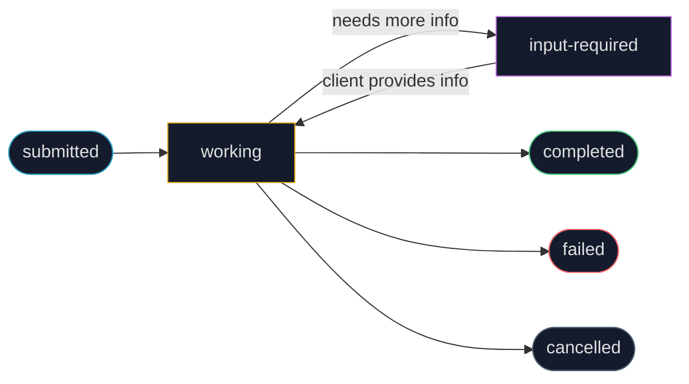

## The Missing Link in Multi-Agent Systems

<div class="concept-box">
  <span class="concept-label">Before You Start — Key Terms Explained</span>
  <p><strong>Interoperability:</strong> The ability of different systems — built by different companies, using different technologies — to work together without custom translation layers. USB is an interoperable standard. HTTP is an interoperable standard. A2A aims to be the interoperable standard for agent communication.</p>
  <p style="margin-top:0.5rem"><strong>Protocol:</strong> A set of agreed-upon rules for communication. (Covered in Chapter 10 — MCP.) A2A is a protocol specifically for agent-to-agent communication over HTTP.</p>
  <p style="margin-top:0.5rem"><strong>JSON-RPC 2.0:</strong> A protocol for calling functions remotely using JSON messages. Format: <code>{"jsonrpc":"2.0","method":"sendTask","params":{...},"id":1}</code>. A2A uses JSON-RPC 2.0 as its message format over HTTP/HTTPS.</p>
  <p style="margin-top:0.5rem"><strong>Server-Sent Events (SSE):</strong> A web standard where a server maintains a persistent HTTP connection and pushes data to the client over time, without the client needing to make repeated requests. Used in A2A for streaming updates from agent to agent.</p>
  <p style="margin-top:0.5rem"><strong>mTLS (Mutual TLS):</strong> A security protocol where BOTH sides of a connection authenticate themselves — not just the server proving its identity to the client, but the client also proving its identity to the server. Prevents unauthorized agents from connecting to your A2A server.</p>
  <p style="margin-top:0.5rem"><strong>Opaque system:</strong> A system where the internal implementation is hidden from the caller. An A2A server is "opaque" to its client — the client knows what the server can do (from the Agent Card) but not how it does it. This is essential for framework independence.</p>
  <p style="margin-top:0.5rem"><strong>Webhook:</strong> A URL that a server can call to notify another system of an event. In A2A, a client can register a webhook URL and the server will POST to it when a long-running task completes — no need to poll.</p>
</div>

In [Chapter 7](/kohshh-portfolio/blog/2026/multi-agent/), we built multi-agent systems where multiple agents collaborate. In [Chapter 10](/kohshh-portfolio/blog/2026/mcp/), we standardized how agents connect to tools via MCP. But there's a gap that neither pattern addresses:

**What happens when an agent built in Google ADK needs to collaborate with an agent built in LangGraph, which needs to call an agent built in CrewAI?**

Without a standard, each pair of collaborating agents needs a custom integration — agent A knows how to call agent B using B's specific API format, agent B knows how to call C using C's format, and so on. This is the same integration explosion problem that MCP solved for tools — but at the agent layer.

The table below shows why the problem gets serious fast:

| Agents | Framework pairs | Custom integrations needed (without A2A) |
|---|---|---|
| 5 | 10 pairs | 10 integrations |
| 10 | 45 pairs | 45 integrations |
| 50 | 1,225 pairs | 1,225 integrations |

**Agent2Agent (A2A)** is Google's open protocol, launched in April 2025, that solves this. It defines a universal communication standard for agents — any agent that speaks A2A can work with any other A2A-compliant agent, regardless of whether they're built with ADK, LangGraph, CrewAI, Azure AI Foundry, or any other framework.

---

## A2A vs MCP: Two Complementary Protocols

Before going deeper into A2A, the most important conceptual clarification:

<div class="a2a-comparison-split">
  <div class="a2a-comp-card a2a-comp-mcp">
    <div class="a2a-comp-icon">🔧</div>
    <div class="a2a-comp-name">Model Context Protocol (MCP)</div>
    <div class="a2a-comp-subtitle">Agent ↔ Tools / External Systems</div>
    <div class="a2a-comp-desc">MCP defines how an agent connects to external tools and data sources. When an agent needs to query a database, call a weather API, read a file, or execute code — it uses MCP to communicate with those resources.</div>
    <div class="a2a-comp-examples">
      <div class="a2a-comp-ex">Agent → database (query)</div>
      <div class="a2a-comp-ex">Agent → file system (read/write)</div>
      <div class="a2a-comp-ex">Agent → REST API (call)</div>
      <div class="a2a-comp-ex">Agent → code interpreter (execute)</div>
    </div>
    <div class="a2a-comp-analogy">Analogy: How a person uses tools — a hammer, a computer, a calculator. The tools don't know about each other.</div>
  </div>
  <div class="a2a-comp-arrow">+</div>
  <div class="a2a-comp-card a2a-comp-a2a">
    <div class="a2a-comp-icon">🤝</div>
    <div class="a2a-comp-name">Agent2Agent Protocol (A2A)</div>
    <div class="a2a-comp-subtitle">Agent ↔ Agent</div>
    <div class="a2a-comp-desc">A2A defines how agents communicate with each other. When an orchestrating agent needs to delegate a task to a specialist agent — possibly built by a different company in a different framework — it uses A2A to discover and interact with that remote agent.</div>
    <div class="a2a-comp-examples">
      <div class="a2a-comp-ex">ADK agent → LangGraph agent (delegate task)</div>
      <div class="a2a-comp-ex">CrewAI agent → ADK agent (request analysis)</div>
      <div class="a2a-comp-ex">Orchestrator → specialist agents (parallel)</div>
      <div class="a2a-comp-ex">Any agent → any A2A-compliant agent</div>
    </div>
    <div class="a2a-comp-analogy">Analogy: How team members collaborate — a manager delegates to specialists. The specialists may have completely different backgrounds and use different methods.</div>
  </div>
</div>

<style>
.a2a-comparison-split { display: flex; gap: 0.75rem; align-items: center; margin: 1.5rem 0; flex-wrap: wrap; }
.a2a-comp-card { flex: 1; min-width: 240px; border: 1px solid var(--global-divider-color); border-radius: 8px; padding: 1.1rem; display: flex; flex-direction: column; gap: 0.5rem; }
.a2a-comp-mcp { border-left: 3px solid #2698ba; background: rgba(38,152,186,0.04); }
.a2a-comp-a2a { border-left: 3px solid #4fc97e; background: rgba(79,201,126,0.04); }
.a2a-comp-arrow { font-size: 1.5rem; font-weight: 700; color: var(--global-text-color-light); flex-shrink: 0; }
.a2a-comp-icon { font-size: 1.2rem; }
.a2a-comp-name { font-size: 0.85rem; font-weight: 700; color: var(--global-text-color); }
.a2a-comp-subtitle { font-size: 0.72rem; font-family: monospace; color: #2698ba; }
.a2a-comp-a2a .a2a-comp-subtitle { color: #4fc97e; }
.a2a-comp-desc { font-size: 0.78rem; color: var(--global-text-color-light); line-height: 1.55; }
.a2a-comp-examples { display: flex; flex-direction: column; gap: 0.2rem; }
.a2a-comp-ex { font-size: 0.7rem; font-family: monospace; color: var(--global-text-color-light); }
.a2a-comp-analogy { font-size: 0.75rem; color: var(--global-text-color-light); font-style: italic; border-top: 1px solid var(--global-divider-color); padding-top: 0.4rem; margin-top: auto; }
</style>

**The key insight:** MCP and A2A are complementary. A single agent might use MCP to connect to its tools (databases, APIs, file systems) AND use A2A to collaborate with other agents. They solve different problems at different levels of the stack.

---

## The Three Core Actors

Every A2A interaction involves three roles:

<div class="ns-diagram">
  <div class="ns-diagram-header">
    <span class="ns-diagram-label">A2A ACTOR MODEL — three roles in every interaction</span>
    <button class="ns-expand-btn" onclick="openNsDiagram(this)"><svg width="11" height="11" viewBox="0 0 12 12" fill="none" stroke="currentColor" stroke-width="1.5"><path d="M1 5V1h4M11 7v4H7M1 5l4-4M11 7l-4 4"/></svg> Expand</button>
  </div>
  <div class="ns-diagram-body" style="flex-direction:row;align-items:stretch;gap:0.75rem;padding:1.1rem 1.25rem;flex-wrap:wrap;">
    <div class="ns-node ns-node-cyan" style="flex:1;min-width:150px;">
      <div class="ns-node-title">User</div>
      <div class="ns-node-sub">The human initiating the request. Provides the high-level goal. Doesn't need to know which agents will collaborate to achieve it.</div>
    </div>
    <div style="display:flex;align-items:center;color:#4a5a6a;font-size:1.2rem;flex-shrink:0;">→</div>
    <div class="ns-node ns-node-purple" style="flex:1;min-width:150px;">
      <div class="ns-node-title">A2A Client (Client Agent)</div>
      <div class="ns-node-sub">An AI agent acting on behalf of the user. Discovers remote agents via Agent Cards, formulates task requests, and coordinates the workflow. Could be ADK, LangGraph, CrewAI, or any framework.</div>
    </div>
    <div style="display:flex;align-items:center;color:#4a5a6a;font-size:1.2rem;flex-shrink:0;">→ HTTP →</div>
    <div class="ns-node ns-node-green" style="flex:1;min-width:150px;">
      <div class="ns-node-title">A2A Server (Remote Agent)</div>
      <div class="ns-node-sub">An AI agent that exposes an HTTP endpoint for receiving tasks. Processes requests using its own internal logic (opaque to the client) and returns results. Can be any framework.</div>
    </div>
  </div>
</div>

**Why "opaque"?** The client agent doesn't know whether the server agent uses GPT-4, Gemini, or Llama. It doesn't know if the server uses LangGraph, CrewAI, or a custom implementation. All it knows is the Agent Card — what tasks the server can handle, what inputs it accepts, and what outputs it produces. This opaqueness is the key that makes framework independence possible.

---

## The Agent Card: A Digital Identity

The Agent Card is the cornerstone of A2A. It's a JSON file that describes everything another agent needs to know to interact with yours — without you needing to share your internal implementation.

<div class="a2a-agentcard-wrapper">
  <div class="a2a-agentcard-header">
    <span class="a2a-agentcard-title">AGENT CARD EXPLORER — click any field to see what it means</span>
  </div>
  <div class="a2a-agentcard-body">
    <div class="a2a-card-left">
      <pre class="a2a-card-json" id="agentCardJson">{
  <span class="acj-field" onclick="acField('name')">"name"</span>: "WeatherBot",
  <span class="acj-field" onclick="acField('description')">"description"</span>: "Provides weather forecasts",
  <span class="acj-field" onclick="acField('url')">"url"</span>: "http://weather.example.com/a2a",
  <span class="acj-field" onclick="acField('version')">"version"</span>: "1.0.0",
  <span class="acj-field" onclick="acField('capabilities')">"capabilities"</span>: {
    "streaming": true,
    "pushNotifications": false,
    "stateTransitionHistory": true
  },
  <span class="acj-field" onclick="acField('authentication')">"authentication"</span>: {
    "schemes": ["apiKey"]
  },
  <span class="acj-field" onclick="acField('skills')">"skills"</span>: [
    {
      "id": "get_current_weather",
      "name": "Get Current Weather",
      "description": "Real-time weather for any location",
      "inputModes": ["text"],
      "outputModes": ["text"],
      "examples": ["What's the weather in Paris?"],
      "tags": ["weather", "current", "real-time"]
    }
  ]
}</pre>
    </div>
    <div class="a2a-card-right">
      <div class="a2a-card-explanation" id="acExplanation">
        <div class="ace-title">Click any field name</div>
        <div class="ace-desc">to see what it means and why it matters for agent interoperability</div>
      </div>
    </div>
  </div>
</div>

<style>
.a2a-agentcard-wrapper { border: 1px solid var(--global-divider-color); border-radius: 10px; overflow: hidden; margin: 1.5rem 0; }
.a2a-agentcard-header { padding: 0.75rem 1.1rem; border-bottom: 1px solid var(--global-divider-color); background: rgba(128,128,128,0.05); font-size: 0.68rem; font-weight: 700; letter-spacing: 0.12em; text-transform: uppercase; color: var(--global-text-color); }
.a2a-agentcard-body { display: flex; gap: 0; flex-wrap: wrap; }
.a2a-card-left { flex: 1.2; min-width: 260px; border-right: 1px solid var(--global-divider-color); }
.a2a-card-right { flex: 1; min-width: 220px; padding: 1rem; }
.a2a-card-json { background: #080808; margin: 0; padding: 1rem; font-size: 0.72rem; line-height: 1.7; color: #cdd6f4; border-radius: 0; border: none; white-space: pre; overflow-x: auto; }
.acj-field { color: #7dcfff; cursor: pointer; text-decoration: underline; text-underline-offset: 2px; }
.acj-field:hover { color: #2698ba; }
.a2a-card-explanation { display: flex; flex-direction: column; gap: 0.5rem; }
.ace-title { font-size: 0.85rem; font-weight: 700; color: var(--global-text-color); }
.ace-desc { font-size: 0.8rem; color: var(--global-text-color-light); line-height: 1.6; }
.ace-code { font-size: 0.72rem; font-family: monospace; color: #7dcfff; background: rgba(0,0,0,0.2); border-radius: 4px; padding: 0.4rem 0.6rem; }
</style>

<script>
var AC_EXPLANATIONS = {
  name: {
    title: '"name" — Human-readable identifier',
    desc: 'The display name of the agent. Used by client agents and discovery registries to present the agent. Should be unique and descriptive enough that another agent can distinguish it from similar agents.',
    code: '"name": "WeatherBot"'
  },
  description: {
    title: '"description" — What this agent does',
    desc: 'A natural-language description of the agent\'s purpose. Client agents (and the LLMs powering them) read this to decide whether to contact this agent for a given task. Write it as if explaining to a colleague, not just naming the agent.',
    code: '"description": "Provides accurate weather forecasts and historical data."'
  },
  url: {
    title: '"url" — The A2A endpoint',
    desc: 'The HTTP URL where this agent\'s A2A server is running. Client agents send task requests to this URL using JSON-RPC 2.0 over HTTPS. This is the "phone number" of the agent.',
    code: '"url": "http://weather-service.example.com/a2a"'
  },
  version: {
    title: '"version" — API version',
    desc: 'Semantic version (major.minor.patch). Client agents can use this to check compatibility. If a client agent was built against v1.x of this agent and the agent upgrades to v2.x with breaking changes, the version field signals incompatibility.',
    code: '"version": "1.0.0"'
  },
  capabilities: {
    title: '"capabilities" — Supported interaction modes',
    desc: '• streaming: true = supports Server-Sent Events for real-time incremental results\n• pushNotifications: false = does NOT support webhook callbacks for async completion\n• stateTransitionHistory: true = tracks and returns all task state changes\nClient agents use this to know which interaction pattern to use.',
    code: '"capabilities": {\n  "streaming": true,\n  "pushNotifications": false\n}'
  },
  authentication: {
    title: '"authentication" — How to authenticate',
    desc: 'Declares the authentication schemes this agent requires. "apiKey" = send an API key in the HTTP header. Other options: "bearer" (JWT token), "oauth2" (OAuth 2.0 flow). The client agent knows to include the right credentials before sending any request.',
    code: '"authentication": {"schemes": ["apiKey"]}'
  },
  skills: {
    title: '"skills" — Specific capabilities with examples',
    desc: 'An array of discrete capabilities the agent offers. Each skill has: id (machine-readable identifier), name (human-readable), description (what it does), inputModes/outputModes (text, audio, video), examples (few-shot demonstrations for LLMs), and tags (for discovery filtering). Skills allow fine-grained routing — a client can pick the exact skill it needs.',
    code: '"skills": [{"id": "get_current_weather", ...}]'
  }
};
function acField(key) {
  var ac = AC_EXPLANATIONS[key];
  if (!ac) return;
  var el = document.getElementById('acExplanation');
  el.innerHTML = '<div class="ace-title">' + ac.title + '</div>' +
    '<div class="ace-desc">' + ac.desc.replace(/\n/g, '<br>') + '</div>' +
    '<div class="ace-code">' + ac.code + '</div>';
}
</script>

**Where is the Agent Card served?** By convention, agents serve their Agent Card at `/.well-known/agent.json` on their domain. This is the **Well-Known URI** discovery method — any A2A client can find your agent's capabilities by fetching `https://your-agent-domain.com/.well-known/agent.json`. No prior coordination needed.

---

## The Four Interaction Mechanisms

A2A supports four distinct ways for agents to communicate, each suited to different latency and complexity requirements:

<div class="a2a-interact-wrapper">
  <div class="a2a-interact-header">
    <span class="a2a-interact-title">A2A INTERACTION MECHANISMS — select to compare</span>
  </div>
  <div class="a2a-interact-tabs">
    <button class="a2a-itab active" data-idx="0" onclick="a2aTab(0)">Synchronous</button>
    <button class="a2a-itab" data-idx="1" onclick="a2aTab(1)">Async Polling</button>
    <button class="a2a-itab" data-idx="2" onclick="a2aTab(2)">Streaming (SSE)</button>
    <button class="a2a-itab" data-idx="3" onclick="a2aTab(3)">Webhooks</button>
  </div>
  <div class="a2a-interact-body">
    <div class="a2a-icontent active" id="a2aIC0">
      <div class="a2a-iname">Synchronous Request/Response</div>
      <div class="a2a-idesc">Client sends a request and waits — blocking — until the server returns a complete response. Simple and predictable. Suitable for tasks that complete within seconds.</div>
      <div class="a2a-iwhen"><strong>When to use:</strong> Quick lookups (exchange rates, weather, simple calculations) where the response is fast and the client can afford to wait.</div>
      <div class="a2a-iflow">Client → <code>POST /a2a</code> (sendTask) → blocks → Server processes → complete result → Client continues</div>
      <pre class="a2a-ijson">{
  "jsonrpc": "2.0",
  "method": "sendTask",
  "id": "1",
  "params": {
    "id": "task-001",
    "sessionId": "session-001",
    "message": {
      "role": "user",
      "parts": [{"type": "text", "text": "Exchange rate USD to EUR?"}]
    },
    "acceptedOutputModes": ["text/plain"]
  }
}</pre>
    </div>
    <div class="a2a-icontent" id="a2aIC1">
      <div class="a2a-iname">Asynchronous Polling</div>
      <div class="a2a-idesc">Client sends request → server immediately returns "working" status + task ID → client goes off and does other work → client periodically polls for completion. Non-blocking for the client.</div>
      <div class="a2a-iwhen"><strong>When to use:</strong> Tasks that take 10+ seconds (research, document generation, complex analysis) where blocking the client thread would be wasteful.</div>
      <div class="a2a-iflow">Client → sendTask → "working" + taskId → [client does other things] → Client polls getTask(taskId) → eventually "completed" + result</div>
      <pre class="a2a-ijson">// Initial request → server returns: {"status": "working", "id": "task-001"}
// Later poll:
{
  "jsonrpc": "2.0",
  "method": "getTask",
  "params": {"id": "task-001"}
}
// Response: {"status": "completed", "result": {...}}</pre>
    </div>
    <div class="a2a-icontent" id="a2aIC2">
      <div class="a2a-iname">Streaming (Server-Sent Events)</div>
      <div class="a2a-idesc">Client uses <code>sendTaskSubscribe</code> to open a persistent HTTP connection. The server pushes incremental results as they become available — like watching a document being written in real time. No polling needed.</div>
      <div class="a2a-iwhen"><strong>When to use:</strong> Long documents, live research, real-time analysis where showing progress matters more than waiting for final output. The agent declares <code>"streaming": true</code> in its Agent Card.</div>
      <div class="a2a-iflow">Client → sendTaskSubscribe → open SSE connection → Server pushes: chunk 1 → chunk 2 → chunk 3 → "completed"</div>
      <pre class="a2a-ijson">{
  "jsonrpc": "2.0",
  "method": "sendTaskSubscribe",
  "id": "2",
  "params": {
    "id": "task-002",
    "message": {
      "parts": [{"type": "text", "text": "Write a market analysis..."}]
    }
  }
}
// Server sends SSE events:
// data: {"type": "progress", "content": "Researching market trends..."}
// data: {"type": "artifact", "content": "## Market Analysis\n\n..."}
// data: {"type": "completed"}</pre>
    </div>
    <div class="a2a-icontent" id="a2aIC3">
      <div class="a2a-iname">Push Notifications (Webhooks)</div>
      <div class="a2a-idesc">Client registers a webhook URL when submitting a task. The client disconnects entirely. When the server finishes (hours or days later), it POSTs the result to the webhook URL. No persistent connection, no polling.</div>
      <div class="a2a-iwhen"><strong>When to use:</strong> Very long-running tasks (overnight batch processing, multi-day research) where maintaining any connection would be wasteful. The agent declares <code>"pushNotifications": true</code> in its Agent Card.</div>
      <div class="a2a-iflow">Client → sendTask + webhookUrl → Server: "acknowledged" → [hours pass] → Server → POST webhookUrl → result delivered</div>
      <pre class="a2a-ijson">{
  "jsonrpc": "2.0",
  "method": "sendTask",
  "params": {
    "id": "task-003",
    "message": {"parts": [{"type": "text", "text": "Analyze all Q1 data..."}]},
    "pushNotification": {
      "url": "https://my-agent.com/webhook/task-003",
      "authentication": {"schemes": ["bearer"]}
    }
  }
}</pre>
    </div>
  </div>
</div>

<style>
.a2a-interact-wrapper { border: 1px solid var(--global-divider-color); border-radius: 10px; overflow: hidden; margin: 2rem 0; }
.a2a-interact-header { padding: 0.75rem 1.1rem; border-bottom: 1px solid var(--global-divider-color); background: rgba(128,128,128,0.05); font-size: 0.68rem; font-weight: 700; letter-spacing: 0.12em; text-transform: uppercase; color: var(--global-text-color); }
.a2a-interact-tabs { display: flex; overflow-x: auto; border-bottom: 1px solid var(--global-divider-color); }
.a2a-itab { flex-shrink: 0; padding: 0.5rem 0.9rem; font-family: monospace; font-size: 0.7rem; border: none; border-right: 1px solid var(--global-divider-color); background: transparent; color: var(--global-text-color-light); cursor: pointer; transition: background 0.15s; }
.a2a-itab:last-child { border-right: none; }
.a2a-itab.active { background: rgba(79,201,126,0.1); color: #4fc97e; font-weight: 700; }
.a2a-interact-body { padding: 1.1rem; }
.a2a-icontent { display: none; flex-direction: column; gap: 0.65rem; }
.a2a-icontent.active { display: flex; }
.a2a-iname { font-size: 0.95rem; font-weight: 700; color: var(--global-text-color); }
.a2a-idesc { font-size: 0.83rem; color: var(--global-text-color); line-height: 1.65; }
.a2a-iwhen { font-size: 0.8rem; color: var(--global-text-color-light); line-height: 1.6; }
.a2a-iflow { font-size: 0.75rem; font-family: monospace; color: #4fc97e; background: rgba(79,201,126,0.06); border-radius: 5px; padding: 0.45rem 0.7rem; line-height: 1.6; }
.a2a-ijson { background: #080808; margin: 0; padding: 0.8rem 1rem; font-size: 0.7rem; line-height: 1.65; color: #cdd6f4; border-radius: 6px; border: 1px solid rgba(255,255,255,0.07); white-space: pre; overflow-x: auto; }
</style>

<script>
function a2aTab(idx) {
  document.querySelectorAll('.a2a-itab').forEach(function(t){ t.classList.remove('active'); });
  document.querySelectorAll('.a2a-icontent').forEach(function(c){ c.classList.remove('active'); });
  document.querySelector('.a2a-itab[data-idx="'+idx+'"]').classList.add('active');
  document.getElementById('a2aIC'+idx).classList.add('active');
}
</script>

---

## The Task Lifecycle

Every piece of work in A2A is a **Task** — an asynchronous unit of work with a unique ID and a defined state machine:



The `input-required` state is particularly important for multi-turn interactions. A remote agent might partially complete a task, determine it needs more information from the client, and pause — waiting for the client to provide the missing data before continuing. This enables rich back-and-forth collaboration between agents, not just one-shot requests.

---

## The Code: Building an A2A Calendar Agent

The A2A samples repository provides a complete example of a calendar agent built with ADK that exposes itself as an A2A server. Let's walk through the key components.

### Part 1: The ADK Agent with Calendar Tools

```python
import datetime
from google.adk.agents import LlmAgent
from google.adk.tools.google_api_tool import CalendarToolset

async def create_agent(client_id, client_secret) -> LlmAgent:
    """Constructs the ADK calendar agent with Google Calendar access."""
    # Initialize the Google Calendar tool with OAuth credentials
    toolset = CalendarToolset(client_id=client_id, client_secret=client_secret)

    return LlmAgent(
        model       = 'gemini-2.0-flash-001',
        name        = 'calendar_agent',
        description = "An agent that can help manage a user's calendar",
        instruction = f"""
You are an agent that can help manage a user's calendar.
Users will request information about their calendar or ask to make changes.
Use the provided tools for interacting with the Calendar API.

If not specified, assume the user wants their 'primary' calendar.
When using Calendar API tools, use well-formed RFC3339 timestamps.
Today is {datetime.datetime.now()}.
""",
        tools = await toolset.get_tools(),
    )
```

> **`CalendarToolset`**: A pre-built ADK toolset that wraps the Google Calendar API as MCP-compatible tools. It handles OAuth 2.0 authentication flow, token management, and API call formatting. `toolset.get_tools()` returns a list of tool objects that the agent can call to read/write calendar data.

> **`f"Today is {datetime.datetime.now()}"` in the instruction**: This is dynamic instruction injection — the current date is embedded at agent creation time. Without it, the LLM might calculate "tomorrow" relative to its training cutoff date rather than today. This small detail ensures all date calculations are anchored to real-world time.

> **Why `async def create_agent()`?** The `toolset.get_tools()` call requires async execution (it may need to make network calls to fetch the tool schema from the Calendar API). The entire function is marked `async` to enable this. The `await` keyword pauses execution until `get_tools()` completes before constructing the agent.

### Part 2: Defining the Agent Card and Starting the A2A Server

```python
from a2a.types import AgentSkill, AgentCard, AgentCapabilities
from a2a.server.apps import A2AStarletteApplication
from a2a.server.request_handlers import DefaultRequestHandler
from a2a.server.tasks import InMemoryTaskStore
from google.adk.runners import Runner
```

> **Why these imports?** A2A provides a Python SDK (`a2a` package) that handles the protocol details — JSON-RPC framing, task state management, SSE streaming, etc. Without it, you'd need to implement the full A2A protocol specification manually. The ADK `Runner` manages the agent's execution lifecycle, session management, and tool call routing.

```python
def main(host: str, port: int):
    # 1. Define the agent's skill (what it can do)
    skill = AgentSkill(
        id          = 'check_availability',
        name        = 'Check Availability',
        description = "Checks a user's availability for a time using their Google Calendar",
        tags         = ['calendar'],
        examples     = ['Am I free from 10am to 11am tomorrow?'],
    )
```

> **`AgentSkill` is the fine-grained capability descriptor.** While the `AgentCard` describes the agent overall, each `AgentSkill` describes a specific capability. This enables precise routing: if an orchestrating agent needs to check calendar availability (and not, say, create events), it can specifically request the `check_availability` skill. This granularity makes multi-agent systems more precise.

```python
    # 2. Define the Agent Card (the agent's public identity)
    agent_card = AgentCard(
        name                = 'Calendar Agent',
        description         = "An agent that can manage a user's calendar",
        url                 = f'http://{host}:{port}/',
        version             = '1.0.0',
        defaultInputModes   = ['text'],
        defaultOutputModes  = ['text'],
        capabilities        = AgentCapabilities(streaming=True),
        skills              = [skill],
    )
```

> **`AgentCard` is the agent's published identity.** This is what gets served at `/.well-known/agent.json`. Any A2A client — regardless of framework — can fetch this URL and immediately understand: what this agent does, where to send requests, what authentication is required, whether streaming is supported, and which specific skills are available. The Agent Card makes the agent self-describing and discoverable without any prior coordination.

```python
    # 3. Create the ADK agent with credentials from environment
    adk_agent = asyncio.run(create_agent(
        client_id     = os.getenv('GOOGLE_CLIENT_ID'),
        client_secret = os.getenv('GOOGLE_CLIENT_SECRET'),
    ))
```

> **Why `os.getenv()` for credentials?** Never hardcode API keys or OAuth secrets in source code — they'd be committed to version control and exposed. Environment variables are the standard way to pass secrets to running processes without embedding them in code. In production, these would be set via secrets management services (AWS Secrets Manager, Google Secret Manager, etc.).

```python
    # 4. Wire the ADK agent to the A2A execution infrastructure
    runner = Runner(
        app_name        = agent_card.name,
        agent           = adk_agent,
        artifact_service = InMemoryArtifactService(),   # stores file outputs
        session_service  = InMemorySessionService(),    # tracks conversation state
        memory_service   = InMemoryMemoryService(),     # long-term memory
    )

    agent_executor = ADKAgentExecutor(runner, agent_card)
```

> **`ADKAgentExecutor`** is the bridge between the A2A protocol layer and the ADK agent. When an A2A task request arrives (a JSON-RPC `sendTask` message), the executor: (1) extracts the message content, (2) calls `runner.run()` with the message, (3) collects the ADK agent's responses and tool calls, and (4) formats them as A2A protocol responses. This adapter pattern means the ADK agent doesn't need to know anything about the A2A protocol — the executor handles the translation.

```python
    # 5. Create the A2A web application
    request_handler = DefaultRequestHandler(
        agent_executor = agent_executor,
        task_store     = InMemoryTaskStore()  # tracks task states
    )

    a2a_app = A2AStarletteApplication(
        agent_card    = agent_card,
        http_handler  = request_handler
    )

    # 6. Add OAuth callback route (needed for Google Calendar auth)
    routes = a2a_app.routes()
    routes.append(Route(
        path     = '/authenticate',
        methods  = ['GET'],
        endpoint = handle_auth,
    ))

    # 7. Start the HTTP server
    app = Starlette(routes=routes)
    uvicorn.run(app, host=host, port=port)
```

> **`A2AStarletteApplication`**: Creates a Starlette web application (a Python async web framework) that: (1) serves the Agent Card at `/.well-known/agent.json`, (2) handles incoming A2A task requests, (3) manages task state, (4) sends streaming responses via SSE when `streaming: true`. The entire A2A HTTP server is encapsulated in this single object.

> **`InMemoryTaskStore`**: Stores the state of all active tasks (submitted, working, completed, failed) in memory. In production, you'd replace this with a persistent store (database) so task state survives server restarts. For development, in-memory is sufficient.

> **`uvicorn.run()`**: Starts the ASGI server that will serve your A2A agent over HTTP. Uvicorn is a fast Python async HTTP server. Your agent is now accessible at `http://host:port/` — any A2A-compliant client can discover it via `/.well-known/agent.json` and send tasks to `/`.

---

## The Complete A2A Flow Visualized

```mermaid
graph TD
    U([User: "Plan a birthday party for March 15"]) --> CA[Client Agent — Orchestrator]
    CA -->|GET /.well-known/agent.json| DISC[Agent Discovery]
    DISC -->|Agent Card: capabilities, skills| CA
    CA -->|POST /a2a sendTask| CALSERV[Calendar Agent A2A Server]
    CALSERV --> ADK[ADK Agent Executor]
    ADK -->|tool call| GCAL[Google Calendar API]
    GCAL -->|availability data| ADK
    ADK -->|SSE streaming| CALSERV
    CALSERV -->|incremental results| CA
    CA --> RESP([Final response to user])
    style CA fill:#141b2d,stroke:#2698ba,color:#e0e0e0
    style CALSERV fill:#141b2d,stroke:#4fc97e,color:#e0e0e0
    style ADK fill:#141b2d,stroke:#c97af2,color:#e0e0e0
    style GCAL fill:#141b2d,stroke:#e6a817,color:#e0e0e0
```

---

## Security: How A2A Stays Safe

Security is built into A2A at multiple levels:

<div class="a2a-security-grid">
  <div class="a2a-sec-card">
    <div class="a2a-sec-icon">🔒</div>
    <h4>Mutual TLS (mTLS)</h4>
    <p>Both the A2A client and server authenticate themselves with TLS certificates. This prevents unauthorized agents from connecting and ensures both sides can trust the other's identity. Essential for enterprise deployments where you don't want random clients calling your agent.</p>
  </div>
  <div class="a2a-sec-card">
    <div class="a2a-sec-icon">🔑</div>
    <h4>Credential Handling</h4>
    <p>Authentication credentials (API keys, OAuth tokens) are passed via HTTP Authorization headers — never in the URL or request body. The Agent Card declares which authentication scheme is required, so clients know what to send before making any requests.</p>
  </div>
  <div class="a2a-sec-card">
    <div class="a2a-sec-icon">📋</div>
    <h4>Audit Logs</h4>
    <p>All inter-agent communications are logged — which agent sent what to which agent, when, and what was returned. This creates an immutable audit trail for accountability, debugging, security analysis, and compliance with regulations that require traceability of AI decisions.</p>
  </div>
  <div class="a2a-sec-card">
    <div class="a2a-sec-icon">🪪</div>
    <h4>Agent Card Security</h4>
    <p>Even though Agent Cards contain capability descriptions (not secrets), they should be access-controlled. In enterprise environments, not everyone should be able to discover which agents exist and what they can do. Secure discovery endpoints with network restrictions or access tokens.</p>
  </div>
</div>

<style>
.a2a-security-grid { display: grid; grid-template-columns: repeat(auto-fill, minmax(220px, 1fr)); gap: 0.85rem; margin: 1.5rem 0; }
.a2a-sec-card { border: 1px solid var(--global-divider-color); border-radius: 8px; padding: 1rem; background: rgba(128,128,128,0.04); display: flex; flex-direction: column; gap: 0.4rem; }
.a2a-sec-icon { font-size: 1.1rem; }
.a2a-sec-card h4 { font-size: 0.85rem; font-weight: 700; margin: 0; color: var(--global-text-color); }
.a2a-sec-card p  { font-size: 0.78rem; color: var(--global-text-color-light); margin: 0; line-height: 1.5; }
</style>

---

## Practical Applications

<div class="a2a-usecases-grid">
  <div class="a2a-uc-card">
    <span class="a2a-uc-num">01</span>
    <h4>Multi-Framework Collaboration</h4>
    <p>An ADK orchestrator delegates research to a LangGraph specialist, analysis to a CrewAI analyst, and report generation to another ADK agent — all communicating through A2A regardless of framework differences.</p>
  </div>
  <div class="a2a-uc-card">
    <span class="a2a-uc-num">02</span>
    <h4>Enterprise Workflow Automation</h4>
    <p>A master agent decomposes a complex business process: collect data → delegate to analyst agent → delegate to compliance agent → delegate to report agent. Each agent operates independently and communicates via A2A tasks.</p>
  </div>
  <div class="a2a-uc-card">
    <span class="a2a-uc-num">03</span>
    <h4>Dynamic Capability Discovery</h4>
    <p>An orchestrator agent discovers available specialist agents at runtime by querying a registry of Agent Cards, selects the most appropriate one for each sub-task, and delegates — without any hardcoded agent references.</p>
  </div>
  <div class="a2a-uc-card">
    <span class="a2a-uc-num">04</span>
    <h4>Cross-Organization Collaboration</h4>
    <p>Your company's AI agent collaborates with a partner company's AI agent via A2A. Neither side needs to expose internal implementation details — just the Agent Card interface. Inter-company AI integration becomes as easy as an API call.</p>
  </div>
</div>

<style>
.a2a-usecases-grid { display: grid; grid-template-columns: repeat(auto-fill, minmax(220px, 1fr)); gap: 0.85rem; margin: 1.5rem 0; }
.a2a-uc-card { border: 1px solid var(--global-divider-color); border-radius: 8px; padding: 1rem; background: rgba(128,128,128,0.04); display: flex; flex-direction: column; gap: 0.4rem; }
.a2a-uc-num { font-family: monospace; font-size: 0.65rem; font-weight: 700; letter-spacing: 0.1em; color: #4fc97e; }
.a2a-uc-card h4 { font-size: 0.85rem; font-weight: 700; margin: 0; color: var(--global-text-color); }
.a2a-uc-card p  { font-size: 0.78rem; color: var(--global-text-color-light); margin: 0; line-height: 1.5; }
</style>

---

## At a Glance

<div class="a2a-summary-card">
  <div class="a2a-summary-col">
    <div class="a2a-summary-label">WHAT</div>
    <p>An open, HTTP-based standard for agent-to-agent communication. A2A defines how agents discover each other (Agent Cards), how they exchange tasks (JSON-RPC 2.0), and how results are returned (sync, polling, streaming, webhooks) — regardless of the framework each agent uses.</p>
  </div>
  <div class="a2a-summary-divider"></div>
  <div class="a2a-summary-col">
    <div class="a2a-summary-label">WHY</div>
    <p>Without A2A, integrating N agents from M frameworks requires N×M custom integrations. A2A reduces this to N+M standard implementations. It's the USB standard for agent collaboration — write once, work with any compliant agent.</p>
  </div>
  <div class="a2a-summary-divider"></div>
  <div class="a2a-summary-col">
    <div class="a2a-summary-label">vs MCP</div>
    <p>MCP = how an agent connects to tools and external resources. A2A = how agents connect to each other. Both are needed in production systems: MCP gives individual agents their capabilities; A2A lets capable agents collaborate.</p>
  </div>
</div>

<style>
.a2a-summary-card { display: flex; border: 1px solid var(--global-divider-color); border-radius: 10px; overflow: hidden; margin: 1.5rem 0; }
@media (max-width: 640px) { .a2a-summary-card { flex-direction: column; } }
.a2a-summary-col { flex: 1; padding: 1.1rem; background: rgba(128,128,128,0.03); }
.a2a-summary-col p { font-size: 0.8rem; color: var(--global-text-color-light); line-height: 1.6; margin: 0.4rem 0 0; }
.a2a-summary-divider { width: 1px; background: var(--global-divider-color); flex-shrink: 0; }
.a2a-summary-label { font-size: 0.62rem; font-weight: 700; letter-spacing: 0.12em; color: #4fc97e; }
</style>

---

## Key Takeaways

- **A2A is the missing standard between MCP and multi-agent systems.** MCP connects agents to tools. A2A connects agents to each other. Together, they form a complete ecosystem: agents with tool access (MCP) collaborating with other agents (A2A).

- **The Agent Card is the protocol's foundation.** It makes agents self-describing and discoverable — any A2A client can learn an agent's capabilities, endpoint, authentication requirements, and skills just by fetching its Agent Card JSON. This is what makes true interoperability possible.

- **Four interaction patterns cover every latency profile.** Synchronous for fast tasks, polling for medium tasks, streaming SSE for incremental results, webhooks for overnight tasks. The Agent Card declares which patterns are supported — clients choose accordingly.

- **The `input-required` state enables multi-turn agent conversations.** A remote agent can pause mid-task, request more information from the client, and resume once the information is provided. This supports complex collaborative workflows, not just one-shot requests.

- **A2A is opaque by design.** The client agent doesn't know or care what framework the server agent uses, what LLM it calls, or how it processes requests. This opacity is what makes framework independence real — you can replace the server-side implementation entirely without changing any client.

- **The A2A Python SDK encapsulates all protocol complexity.** `A2AStarletteApplication`, `ADKAgentExecutor`, `DefaultRequestHandler`, and `InMemoryTaskStore` handle the JSON-RPC framing, task state machine, SSE streaming, and HTTP routing. You implement the agent logic; the SDK handles the protocol.

- **Security must be explicit.** Declare authentication requirements in the Agent Card. Use mTLS for production. Log all inter-agent communications. Control who can discover your Agent Card. These aren't optional features — they're prerequisites for deploying A2A in enterprise environments.

- **Industry adoption is accelerating.** Atlassian, Box, LangChain, MongoDB, Salesforce, SAP, ServiceNow, Microsoft (Azure AI Foundry), Auth0 — the A2A ecosystem is growing fast. Agents you build today to the A2A standard will be composable with agents from any of these platforms.
