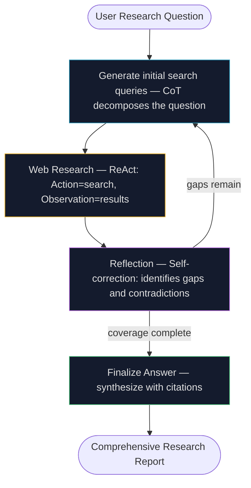

## Why Reasoning Matters

<div class="concept-box">
  <span class="concept-label">Before You Start — Key Terms Explained</span>
  <p><strong>Chain-of-Thought (CoT):</strong> A prompting technique that instructs the LLM to generate explicit intermediate reasoning steps before producing a final answer. Instead of "What is 17 × 24? → 408," it produces "17 × 24 = 17 × 20 + 17 × 4 = 340 + 68 = 408." The intermediate steps improve accuracy on complex problems.</p>
  <p style="margin-top:0.5rem"><strong>Tree-of-Thought (ToT):</strong> An extension of CoT that explores multiple reasoning paths simultaneously rather than committing to one sequence. Like a chess player considering several moves ahead, ToT branches into alternatives, evaluates each path, and backtracks from dead ends.</p>
  <p style="margin-top:0.5rem"><strong>ReAct (Reasoning + Acting):</strong> A framework that interleaves the LLM's reasoning steps with actual tool calls. The loop is: Thought (what should I do?) → Action (call a tool) → Observation (what did the tool return?) → Thought (what should I do next?) → ... until done.</p>
  <p style="margin-top:0.5rem"><strong>Self-correction:</strong> When an agent evaluates its own output against specified criteria and iteratively refines it without external feedback. Related to the Reflection pattern (Chapter 4) but applied specifically within a reasoning chain.</p>
  <p style="margin-top:0.5rem"><strong>RLVR (Reinforcement Learning with Verifiable Rewards):</strong> A training technique for reasoning models. The model is trained on problems with known correct answers (math, code). It generates reasoning chains, checks its own answer, and learns which types of reasoning chains lead to correct answers. This is what trains models like o1, o3, and DeepSeek-R1.</p>
  <p style="margin-top:0.5rem"><strong>Scaling Inference Law:</strong> The observation that more computation at inference time (letting the model "think longer") predictably improves output quality — even for the same model. A smaller model given a large thinking budget can outperform a larger model with a small thinking budget.</p>
  <p style="margin-top:0.5rem"><strong>PALM (Program-Aided Language Model):</strong> An approach where the LLM generates code (Python, SQL, etc.) and executes it to get precise answers, rather than computing in natural language. "17 × 24 = ?" → generate `print(17 * 24)` → execute → 408. Eliminates arithmetic errors.</p>
</div>

An LLM without structured reasoning is like a student answering a complex exam question by writing the first thing that comes to mind. Sometimes it's right. Often it's not. The question is: how do you make the model *think* rather than just *respond*?

The answer is a collection of techniques that make the model's internal reasoning process explicit, systematic, and verifiable. Some of these are prompting strategies (CoT, ToT). Some are architectural patterns (ReAct). Some are training approaches (RLVR). All of them share one principle: **allocating more computational "thinking" — more steps, more paths, more iterations — produces significantly better results on complex problems**.

This isn't obvious. Intuitively, you might think a more capable model always produces better results. But the Scaling Inference Law shows something counterintuitive: a smaller model that reasons carefully through multiple steps can outperform a larger model that answers in a single pass. Computation at inference time is a powerful lever — often more cost-effective than using a bigger model.

This chapter covers the full spectrum of reasoning techniques, from the simple (CoT prompting) to the frontier (MASS-optimized multi-agent debates).

---

## Reasoning Technique Overview

<div class="rt-technique-selector">
  <div class="rt-ts-header">
    <span class="rt-ts-title">REASONING TECHNIQUES — click to explore each</span>
  </div>
  <div class="rt-ts-tabs">
    <button class="rt-tab active" data-idx="0" onclick="rtTab(0)">CoT</button>
    <button class="rt-tab" data-idx="1" onclick="rtTab(1)">ToT</button>
    <button class="rt-tab" data-idx="2" onclick="rtTab(2)">Self-Correct</button>
    <button class="rt-tab" data-idx="3" onclick="rtTab(3)">PALM</button>
    <button class="rt-tab" data-idx="4" onclick="rtTab(4)">ReAct</button>
    <button class="rt-tab" data-idx="5" onclick="rtTab(5)">CoD / GoD</button>
    <button class="rt-tab" data-idx="6" onclick="rtTab(6)">RLVR</button>
  </div>
  <div class="rt-ts-body">
    <div class="rt-tc active" id="rtTC0">
      <div class="rt-tc-name">Chain-of-Thought (CoT)</div>
      <div class="rt-tc-meta">Wei et al., 2022 · Google Brain</div>
      <div class="rt-tc-desc">Guide the LLM to generate explicit intermediate reasoning steps before the final answer. Transform one hard problem into many easier sequential steps. The model's "thinking" becomes visible and auditable.</div>
      <div class="rt-tc-mechanism"><strong>Mechanism:</strong> Add "Let's think step by step" to the prompt, or provide few-shot examples showing step-by-step reasoning. The model learns to decompose before answering.</div>
      <div class="rt-tc-when"><strong>Best for:</strong> Arithmetic, multi-step logic, commonsense reasoning, factual synthesis. Any task where errors arise from skipping intermediate steps.</div>
      <div class="rt-tc-flow">Input → Step 1 → Step 2 → Step 3 → ... → Final Answer</div>
    </div>
    <div class="rt-tc" id="rtTC1">
      <div class="rt-tc-name">Tree-of-Thought (ToT)</div>
      <div class="rt-tc-meta">Yao et al., 2023 · Princeton & Google</div>
      <div class="rt-tc-desc">Extend CoT from a single chain into a tree of possible reasoning paths. The model branches into multiple alternatives, evaluates each branch, and backtracks from dead ends — like a chess player considering multiple moves.</div>
      <div class="rt-tc-mechanism"><strong>Mechanism:</strong> At each reasoning step, generate N alternative continuations. Score each (via the LLM or heuristic). Expand the most promising. Prune weak branches. Use BFS or DFS over the tree of thoughts.</div>
      <div class="rt-tc-when"><strong>Best for:</strong> Complex planning, creative generation, puzzle-solving, problems where the first approach often fails and backtracking is needed. Requires more compute than linear CoT.</div>
      <div class="rt-tc-flow">Input → [Path A, Path B, Path C] → evaluate → expand best → [A1, A2, B1] → ... → Best Answer</div>
    </div>
    <div class="rt-tc" id="rtTC2">
      <div class="rt-tc-name">Self-Correction</div>
      <div class="rt-tc-meta">Madaan et al., 2023 · "Self-Refine"</div>
      <div class="rt-tc-desc">The model generates an initial response, then critiques its own output using specified criteria, then refines based on the critique. A closed-loop quality improvement cycle without external feedback. Related to the Reflection pattern (Chapter 4).</div>
      <div class="rt-tc-mechanism"><strong>Mechanism:</strong> Generate response → provide critique criteria → model identifies weaknesses → generate revised response → repeat until quality threshold met or max iterations reached.</div>
      <div class="rt-tc-when"><strong>Best for:</strong> Content generation (social media, reports), code review, factual verification, any task with well-defined quality criteria. Less effective when the model lacks the knowledge to identify its own errors.</div>
      <div class="rt-tc-flow">Draft → Critique → Identify Weaknesses → Revise → [repeat] → Final Output</div>
    </div>
    <div class="rt-tc" id="rtTC3">
      <div class="rt-tc-name">Program-Aided LMs (PALM)</div>
      <div class="rt-tc-meta">Gao et al., 2023 · CMU</div>
      <div class="rt-tc-desc">Instead of computing in natural language, the LLM generates executable code (Python, SQL) to solve the problem. The code is executed in a sandbox; the result is returned and incorporated into the final answer. Eliminates arithmetic errors and enables complex data manipulation.</div>
      <div class="rt-tc-mechanism"><strong>Mechanism:</strong> LLM receives question → generates Python code that computes the answer → code executor runs it → exact result returned → LLM formats into natural language response. (This is what BuiltInCodeExecutor in ADK enables.)</div>
      <div class="rt-tc-when"><strong>Best for:</strong> Mathematics, data analysis, statistical computation, any task where precise deterministic calculation is required. The LLM handles understanding and formulation; code handles computation.</div>
      <div class="rt-tc-flow">Question → Generate Code → Execute in Sandbox → Exact Result → Format Answer</div>
    </div>
    <div class="rt-tc" id="rtTC4">
      <div class="rt-tc-name">ReAct (Reasoning + Acting)</div>
      <div class="rt-tc-meta">Yao et al., 2023 · Princeton & Google</div>
      <div class="rt-tc-desc">Interleave reasoning steps with actual tool calls. The agent alternates: think about what to do → do it (call a tool) → observe the result → think about the next step. This connects reasoning to the real world through dynamic feedback.</div>
      <div class="rt-tc-mechanism"><strong>Mechanism:</strong> Thought: "I need to find the current population of Tokyo." Action: `search("Tokyo population 2025")`. Observation: "13.96 million in city, 37.4 million metro." Thought: "Now I have the data, I can answer." This repeats until the agent has enough information.</div>
      <div class="rt-tc-when"><strong>Best for:</strong> Any task requiring external data, tool use, or multi-step interaction with an environment. This is the foundation of most production agent systems — nearly every LLM-based agent uses ReAct or a variant.</div>
      <div class="rt-tc-flow">Thought → Action (Tool) → Observation → Thought → Action → ... → Final Answer</div>
    </div>
    <div class="rt-tc" id="rtTC5">
      <div class="rt-tc-name">Chain of Debates (CoD) / Graph of Debates (GoD)</div>
      <div class="rt-tc-meta">Microsoft Research, 2024</div>
      <div class="rt-tc-desc"><strong>CoD:</strong> Multiple diverse LLM instances debate a question, critiquing each other's reasoning. The final answer emerges from consensus after structured argument exchange — like peer review. <strong>GoD:</strong> Extends CoD from a linear debate chain into a non-linear graph where arguments (nodes) are connected by "supports" or "refutes" edges. More realistic to actual debate dynamics.</div>
      <div class="rt-tc-mechanism"><strong>CoD mechanism:</strong> Agent A presents answer + reasoning → Agent B critiques → A responds → B revises → synthesizer produces consensus.<br><strong>GoD mechanism:</strong> Arguments form a dynamic graph; the conclusion is the most robustly supported argument cluster, not the last one in a sequence.</div>
      <div class="rt-tc-when"><strong>Best for:</strong> High-stakes decisions requiring objectivity, fact-checking, bias reduction, complex analysis with multiple valid perspectives. Significantly reduces hallucination rate by requiring arguments to withstand peer scrutiny.</div>
      <div class="rt-tc-flow">Agent A → argues → Agent B → critiques → Agent A → responds → ... → Consensus</div>
    </div>
    <div class="rt-tc" id="rtTC6">
      <div class="rt-tc-name">RLVR — Reinforcement Learning with Verifiable Rewards</div>
      <div class="rt-tc-meta">Training technique behind o1, o3, DeepSeek-R1, 2024-2025</div>
      <div class="rt-tc-desc">A training methodology (not a prompting technique) that teaches models to reason by training them on problems with verifiable correct answers (math, code, logic puzzles). The model generates long reasoning chains, checks its answer, and learns from success/failure — developing genuine problem-solving strategies through trial and error.</div>
      <div class="rt-tc-mechanism"><strong>Mechanism:</strong> Collect problems with ground-truth answers → model generates reasoning chain → check answer against ground truth → positive reward for correct, negative for incorrect → update model weights to favor reasoning patterns that led to correct answers.</div>
      <div class="rt-tc-when"><strong>Result:</strong> Models trained with RLVR produce "reasoning trajectories" — extended internal monologues that include planning, monitoring, backtracking, and self-correction. OpenAI's o-series, Google's Gemini 2.5 "thinking" features, and DeepSeek-R1 all use variants of this approach.</div>
      <div class="rt-tc-flow">Problem → [generate long CoT] → check answer → reward/penalty → update policy → better reasoning next time</div>
    </div>
  </div>
</div>

<style>
.rt-technique-selector { border: 1px solid var(--global-divider-color); border-radius: 10px; overflow: hidden; margin: 2rem 0; }
.rt-ts-header { padding: 0.75rem 1.1rem; border-bottom: 1px solid var(--global-divider-color); background: rgba(128,128,128,0.05); font-size: 0.68rem; font-weight: 700; letter-spacing: 0.12em; text-transform: uppercase; color: var(--global-text-color); }
.rt-ts-tabs { display: flex; overflow-x: auto; border-bottom: 1px solid var(--global-divider-color); }
.rt-tab { flex-shrink: 0; padding: 0.5rem 0.9rem; font-family: monospace; font-size: 0.7rem; border: none; border-right: 1px solid var(--global-divider-color); background: transparent; color: var(--global-text-color-light); cursor: pointer; }
.rt-tab:last-child { border-right: none; }
.rt-tab.active { background: rgba(38,152,186,0.1); color: #2698ba; font-weight: 700; }
.rt-ts-body { padding: 1.1rem; }
.rt-tc { display: none; flex-direction: column; gap: 0.65rem; }
.rt-tc.active { display: flex; }
.rt-tc-name { font-size: 0.95rem; font-weight: 700; color: var(--global-text-color); }
.rt-tc-meta { font-size: 0.68rem; font-family: monospace; color: var(--global-text-color-light); }
.rt-tc-desc { font-size: 0.83rem; color: var(--global-text-color); line-height: 1.65; }
.rt-tc-mechanism { font-size: 0.8rem; color: var(--global-text-color-light); line-height: 1.6; }
.rt-tc-when { font-size: 0.8rem; color: var(--global-text-color-light); line-height: 1.6; }
.rt-tc-flow { font-size: 0.72rem; font-family: monospace; color: #4fc97e; background: rgba(79,201,126,0.06); border-radius: 5px; padding: 0.45rem 0.7rem; line-height: 1.6; }
</style>

<script>
function rtTab(idx) {
  document.querySelectorAll('.rt-tab').forEach(function(t){ t.classList.remove('active'); });
  document.querySelectorAll('.rt-tc').forEach(function(c){ c.classList.remove('active'); });
  document.querySelector('.rt-tab[data-idx="'+idx+'"]').classList.add('active');
  document.getElementById('rtTC'+idx).classList.add('active');
}
</script>

---

## Chain-of-Thought in Depth

CoT is the foundational technique. Everything else in this chapter builds on it. Let's see exactly how it works with a full example.

**Without CoT:** The prompt says "Explain the differences between classical and quantum computers." The LLM retrieves and assembles an answer in one forward pass. It might be mostly correct, might miss key points, and the user has no way to verify the reasoning.

**With CoT:** The prompt instructs the model to follow explicit reasoning steps. The model's thought process becomes a structured sequence:

```
You are an Information Retrieval Agent. Answer comprehensively by thinking step-by-step.

Process to follow:
1. Analyze the Query: identify core subject, key entities, type of information needed
2. Formulate Search Queries: list precise queries you'd use to retrieve information
3. Simulate Retrieval: for each query, consider what relevant snippets would look like
4. Synthesize: combine findings into a coherent answer
5. Review: critically evaluate accuracy, completeness, clarity

User Query: "Explain the main differences between classical and quantum computers,
and briefly describe a potential application."
```

The model then produces visible reasoning:

```
Thought 1 (Analyze): User wants (1) differences, (2) one application.
Keywords: classical computers, quantum computers, bits, qubits, superposition.

Thought 2 (Search Queries):
- "classical vs quantum computer architecture"
- "superposition entanglement explained"
- "quantum computing applications 2025"

Thought 3 (Simulate Retrieval):
From "classical vs quantum": bits (0 or 1), transistors, binary logic
vs qubits, superposition, entanglement, probabilistic computation.

Thought 4 (Synthesize): Classical computers process information as bits — each
bit is deterministically 0 or 1. Quantum computers use qubits, which can
exist in superposition (0 and 1 simultaneously) and become entangled, enabling
exponentially more complex computations for specific problem classes.

Thought 5 (Review): Covers bits vs qubits ✓, superposition ✓, entanglement ✓,
practical implication ✓. Application included ✓. Concise ✓.
```

**Why does making reasoning explicit improve accuracy?** Three reasons:

1. **Error containment.** Each step is a checkpoint. A mistake in Step 2 is visible and doesn't automatically corrupt Steps 3-5. In single-pass generation, one wrong assumption silently propagates through the entire response.

2. **Attention anchoring.** By writing out the reasoning steps, the model forces its own attention to remain focused on the relevant concepts. Long single-pass answers let attention drift.

3. **Self-verification.** The model can "read" its own intermediate steps and notice if they're inconsistent — this is the foundation of self-correction.

---

## Tree-of-Thought: When the First Path Fails

Linear CoT has a fundamental weakness: it commits to one reasoning path at the start and follows it to conclusion. If the initial approach is wrong, the model may not backtrack — it just follows the wrong path confidently.

Tree-of-Thought solves this by maintaining multiple candidate reasoning paths simultaneously:

<div class="ns-diagram">
  <div class="ns-diagram-header">
    <span class="ns-diagram-label">TREE-OF-THOUGHT vs CHAIN-OF-THOUGHT</span>
    <button class="ns-expand-btn" onclick="openNsDiagram(this)"><svg width="11" height="11" viewBox="0 0 12 12" fill="none" stroke="currentColor" stroke-width="1.5"><path d="M1 5V1h4M11 7v4H7M1 5l4-4M11 7l-4 4"/></svg> Expand</button>
  </div>
  <div class="ns-diagram-body" style="padding:1.25rem 1.5rem;">
    <div class="ns-row" style="max-width:560px;align-items:flex-start;gap:1rem;">
      <div class="ns-branch" style="flex:1;">
        <span style="font-size:0.65rem;font-weight:700;letter-spacing:0.1em;color:#e6a817;text-transform:uppercase;display:block;margin-bottom:0.5rem;">Chain-of-Thought — Linear</span>
        <div class="ns-node ns-node-cyan" style="max-width:none;"><div class="ns-node-title">Input</div></div>
        <div class="ns-arrow"></div>
        <div class="ns-node" style="max-width:none;"><div class="ns-node-title">Step A</div></div>
        <div class="ns-arrow"></div>
        <div class="ns-node" style="max-width:none;"><div class="ns-node-title">Step B</div></div>
        <div class="ns-arrow"></div>
        <div class="ns-node ns-node-red" style="max-width:none;"><div class="ns-node-title">Step C (wrong path!)</div><div class="ns-node-sub">No backtracking — follows error to completion</div></div>
      </div>
      <div class="ns-branch" style="flex:1;">
        <span style="font-size:0.65rem;font-weight:700;letter-spacing:0.1em;color:#4fc97e;text-transform:uppercase;display:block;margin-bottom:0.5rem;">Tree-of-Thought — Branching</span>
        <div class="ns-node ns-node-cyan" style="max-width:none;"><div class="ns-node-title">Input</div></div>
        <div class="ns-arrow"></div>
        <div class="ns-row" style="gap:0.4rem;max-width:none;">
          <div class="ns-node ns-node-dim" style="flex:1;"><div class="ns-node-title">Path A</div><div class="ns-node-sub">scored: 0.4</div></div>
          <div class="ns-node ns-node-green" style="flex:1;"><div class="ns-node-title">Path B ✓</div><div class="ns-node-sub">scored: 0.9</div></div>
          <div class="ns-node ns-node-dim" style="flex:1;"><div class="ns-node-title">Path C</div><div class="ns-node-sub">scored: 0.3</div></div>
        </div>
        <div class="ns-arrow ns-arrow-green"></div>
        <div class="ns-node ns-node-green" style="max-width:none;"><div class="ns-node-title">Expand Path B → B1, B2</div><div class="ns-node-sub">B2 scored highest → final answer</div></div>
      </div>
    </div>
  </div>
</div>

**How ToT works in practice:**

1. At each decision point, generate N alternative next steps (typically 3-5)
2. Score each alternative (using the LLM itself to evaluate: "Is this reasoning direction promising?")
3. Expand the highest-scoring path
4. If a path reaches a dead end or low score, backtrack and try the next best alternative
5. Continue until a satisfactory solution is found or compute budget is exhausted

**The computational cost.** Exploring a tree with branching factor 3 and depth 4 requires evaluating 3⁴ = 81 paths. This is 10-80× more LLM calls than linear CoT. ToT is appropriate for genuinely hard problems where errors are expensive (strategic planning, complex code generation, research synthesis) — not for everyday queries.

---

## ReAct: The Core Agentic Loop

ReAct is arguably the most important reasoning technique for agents because it's the one that connects reasoning to the *real world*. Without ReAct (or a variant), an agent is just a sophisticated text generator. With ReAct, it can gather information, execute code, call APIs, and adapt its plan based on what it finds.

The loop:

```
Thought:  I need to find the current GDP of France.
Action:   search("France GDP 2025")
Observation: "France GDP in 2025 estimated at $3.1 trillion, 0.8% growth YoY"

Thought:  Good. Now I need to compare this with Germany.
Action:   search("Germany GDP 2025")
Observation: "Germany GDP in 2025 approximately $4.2 trillion, -0.3% growth"

Thought:  I have both figures. France GDP $3.1T (+0.8%) vs Germany $4.2T (-0.3%).
          I can now answer the question with current data.
Action:   finish("France's GDP in 2025 is $3.1 trillion (growing 0.8%), while
          Germany's is $4.2 trillion (contracting 0.3%). France shows positive
          momentum despite being smaller. Source: search results.")
```

**Why the observation step is critical.** In linear CoT, the model imagines what search results would say. In ReAct, it actually gets them. This means the model's reasoning is grounded in real, current data — not hallucinated simulations. Every `Observation` is a reality check that can confirm or falsify the model's current hypothesis.

**The frequency of thoughts.** For knowledge-intensive tasks (fact-checking, research), thoughts appear before every action — the model explicitly reasons about each piece of information before acting. For decision-making tasks requiring many actions (navigating an environment, executing a long workflow), thoughts are used more sparingly — the model acts more on intuition and only stops to reason when facing genuine ambiguity.

<div class="ns-diagram">
  <div class="ns-diagram-header">
    <span class="ns-diagram-label">REACT LOOP — thought, action, observation cycle</span>
    <button class="ns-expand-btn" onclick="openNsDiagram(this)"><svg width="11" height="11" viewBox="0 0 12 12" fill="none" stroke="currentColor" stroke-width="1.5"><path d="M1 5V1h4M11 7v4H7M1 5l4-4M11 7l-4 4"/></svg> Expand</button>
  </div>
  <div class="ns-diagram-body" style="padding:1.25rem 1.5rem;">
    <div class="ns-node ns-node-cyan" style="max-width:300px;"><div class="ns-node-title">User Query</div><div class="ns-node-sub">Complex question requiring external data or multi-step interaction</div></div>
    <div class="ns-arrow"></div>
    <div class="ns-phase" style="max-width:440px;">
      <div class="ns-phase-title">ReAct Loop — repeats until goal achieved</div>
      <div class="ns-phase-sub">Each iteration: think → act → observe → think again</div>
      <div class="ns-node ns-node-purple" style="max-width:none;"><div class="ns-node-title">THOUGHT</div><div class="ns-node-sub">Internal reasoning: "What do I know? What do I need? What should I do next?"</div></div>
      <div class="ns-arrow"></div>
      <div class="ns-node ns-node-amber" style="max-width:none;"><div class="ns-node-title">ACTION</div><div class="ns-node-sub">Call a tool: search, calculate, read file, call API, execute code, write output</div></div>
      <div class="ns-arrow"></div>
      <div class="ns-node" style="max-width:none;"><div class="ns-node-title">OBSERVATION</div><div class="ns-node-sub">Tool result: actual data from the real world. Updates the agent's context.</div></div>
    </div>
    <div class="ns-arrow"></div>
    <div class="ns-decision" style="max-width:200px;"><div class="ns-node-title">Goal achieved?</div></div>
    <div class="ns-arrow"></div>
    <div class="ns-branch-row" style="max-width:440px;">
      <div class="ns-branch">
        <span class="ns-label-red">No</span>
        <div class="ns-arrow ns-arrow-red"></div>
        <div class="ns-node ns-node-dim"><div class="ns-node-title">↑ Back to THOUGHT</div></div>
      </div>
      <div class="ns-branch">
        <span class="ns-label-green">Yes</span>
        <div class="ns-arrow ns-arrow-green"></div>
        <div class="ns-node ns-node-green"><div class="ns-node-title">Final Answer</div><div class="ns-node-sub">Grounded in real observations, not hallucinations</div></div>
      </div>
    </div>
  </div>
</div>

---

## PALM: Offloading Computation to Code

LLMs are probabilistic — they approximate. For calculations like "What is 17.8% of $2,847.50?" the model might answer $506.85 when the correct answer is $507.05. Not a huge error, but in finance or science, even small arithmetic errors compound into significant mistakes.

Program-Aided Language Models solve this by never doing arithmetic in natural language:

```python
# The LLM generates this code when asked "What is 17.8% of $2,847.50?"
amount = 2847.50
percentage = 17.8
result = amount * (percentage / 100)
print(f"${result:.2f}")

# Execution returns: $507.05  ← exact, deterministic
```

The ADK implementation uses `BuiltInCodeExecutor`:

```python
from google.adk.agents import Agent
from google.adk.code_executors import BuiltInCodeExecutor

coding_agent = Agent(
    model         = 'gemini-2.0-flash',
    name          = 'CodeAgent',
    instruction   = "For any mathematical computation, generate Python code and execute it. Never calculate in natural language.",
    code_executor = [BuiltInCodeExecutor],   # sandboxed Python interpreter
)
```

> **Why a sandboxed executor?** The code runs in an isolated environment that can't affect the host system — it can't read your files, make network requests, or consume excessive resources. This is the same principle as the Docker containerization discussed in Chapter 9 (SICA), applied at the code execution level.

---

## The Self-Correction Agent in Action

Self-correction is CoT applied to quality improvement. The agent generates output, then acts as its own critic:

```
ORIGINAL REQUIREMENTS: "Write a short, engaging social media post (max 150 chars)
announcing GreenTech Gadgets, a new eco-friendly product line."

INITIAL DRAFT: "We have new products. They are green and techy. Buy GreenTech Gadgets now!"

Self-Correction Process:

Thought 1 (Requirements check):
- Max 150 chars: ✓ (64 chars — well under)
- Short: ✓
- Engaging: ✗ — "We have new products" is completely flat
- Announces GreenTech: ✓ (mentioned at end)
- Eco-friendly emphasis: ✗ — "green" is vague, not compelling

Thought 2 (Identify weaknesses):
- No excitement about the launch
- "eco-friendly" is the USP but barely mentioned
- Call to action "Buy now!" is weak
- No visual elements (emojis) for social media engagement
- Hashtags missing — crucial for discoverability

Thought 3 (Propose improvements):
- Open with an eco-friendly signal emoji
- Lead with the key benefit (eco-friendly + innovative)
- Stronger CTA with "Shop now!"
- Add relevant hashtags

Thought 4 (Revised version):
"🌱 Discover GreenTech Gadgets! Our new eco-friendly line blends innovation
with sustainability. Go green, go smart! Shop now! #EcoFriendly #GreenTech"
(148 chars — within limit ✓)
```

The improvement is dramatic — from a generic, flat announcement to an engaging, hashtag-equipped post that leads with the product's key differentiator. The same LLM produced both, but the second pass had structured criteria to evaluate against.

---

## RLVR: How Modern Reasoning Models Learn to Think

RLVR is the training technique behind OpenAI's o-series models, Google's Gemini 2.5 "thinking" mode, and DeepSeek-R1. Understanding it explains why these models reason so differently from standard LLMs.

**The problem with standard fine-tuning for reasoning.** Standard supervised fine-tuning trains a model by showing it (question, correct_answer) pairs and minimizing the difference between what the model generates and the correct answer. This teaches the model to *imitate* correct answers but doesn't teach it *how to reason* to those answers.

**What RLVR does differently:**

1. Collect problems with *verifiable* correct answers — math problems, coding problems, logical puzzles. These are the training problems where you know definitively whether the answer is right or wrong.

2. Let the model generate its answer *plus* a long reasoning chain. The model isn't given the correct answer — it generates its own reasoning trajectory.

3. Check the final answer against the known correct answer. If right, give a positive reward. If wrong, give a negative reward.

4. Update the model's weights to favor the *types of reasoning chains* that led to correct answers. The model learns which reasoning patterns work — exploring alternatives, self-checking, backtracking — through trial and error.

**Why "verifiable rewards" specifically?** In RLHF (standard human feedback RL), a reward model judges answer quality. But a reward model is itself an LLM that can be "gamed" — the reasoning model learns to produce text that *scores well on the reward model* rather than text that's actually correct. This is the reward hacking problem from Chapter 9 (Learning and Adaptation).

With verifiable rewards, there's no reward model to hack. The reward is binary and objective: is the final answer correct? The model can't game math. Either 17 × 24 = 408 or it doesn't.

**What RLVR-trained models do.** After RLVR training, models like o3 and DeepSeek-R1 produce extended reasoning traces with behaviors they were never explicitly taught:
- **Planning:** "Let me think about the overall approach before diving in..."
- **Self-monitoring:** "Wait, I made an error in step 3. Let me recalculate..."
- **Backtracking:** "That approach isn't working. Let me try a different method..."
- **Verification:** "Let me check my answer by working backwards..."

These behaviors emerged from trial-and-error training — the model discovered that they increase the probability of getting the right answer, so it learned to do them.

---

## The Scaling Inference Law: More Thinking = Better Results

The Scaling Inference Law states: **for a given model, performance improves predictably as more computational resources are allocated at inference time**.

This seems obvious — of course more compute helps. But the law's practical implication is counterintuitive:

> **A smaller model with a large thinking budget can outperform a larger model with a small thinking budget.**

This has concrete implications for system design:

<div class="rt-scaling-chart-wrapper">
  <div class="rt-sc-header">
    <span class="rt-sc-title">SCALING INFERENCE LAW — quality vs thinking budget</span>
    <span class="rt-sc-sub">Relative illustration; exact curves vary by model and task</span>
  </div>
  <canvas id="scalingCanvas" style="display:block;width:100%;max-width:560px;margin:0 auto;"></canvas>
  <div class="rt-sc-legend">
    <div class="rt-sc-leg"><span class="rt-sc-dot" style="background:#ff6b6b"></span>Large model, small thinking budget</div>
    <div class="rt-sc-leg"><span class="rt-sc-dot" style="background:#e6a817"></span>Medium model, medium budget</div>
    <div class="rt-sc-leg"><span class="rt-sc-dot" style="background:#4fc97e"></span>Small model, large thinking budget</div>
  </div>
</div>

<style>
.rt-scaling-chart-wrapper { border: 1px solid var(--global-divider-color); border-radius: 10px; overflow: hidden; margin: 1.5rem 0; }
.rt-sc-header { display: flex; align-items: center; justify-content: space-between; padding: 0.75rem 1.1rem; border-bottom: 1px solid var(--global-divider-color); background: rgba(128,128,128,0.05); flex-wrap: wrap; gap: 0.4rem; }
.rt-sc-title { font-size: 0.68rem; font-weight: 700; letter-spacing: 0.12em; text-transform: uppercase; color: var(--global-text-color); }
.rt-sc-sub { font-size: 0.65rem; color: var(--global-text-color-light); }
.rt-sc-legend { display: flex; gap: 1.25rem; padding: 0.6rem 1.1rem; border-top: 1px solid var(--global-divider-color); flex-wrap: wrap; }
.rt-sc-leg { display: flex; align-items: center; gap: 0.4rem; font-size: 0.72rem; color: var(--global-text-color-light); }
.rt-sc-dot { width: 12px; height: 3px; border-radius: 1px; flex-shrink: 0; }
</style>

<script>
(function(){
  var canvas = document.getElementById('scalingCanvas');
  if (!canvas) return;
  var ctx = canvas.getContext('2d');
  var dpr = window.devicePixelRatio || 1;
  var W = Math.min(560, canvas.parentElement.getBoundingClientRect().width - 24);
  var H = 200;
  canvas.width = W*dpr; canvas.height = H*dpr;
  canvas.style.width = W+'px'; canvas.style.height = H+'px';
  ctx.scale(dpr, dpr);

  var ML=55, MR=20, MT=20, MB=40;
  var PW=W-ML-MR, PH=H-MT-MB;

  function getTheme(){ var s=getComputedStyle(document.documentElement); return {text:s.getPropertyValue('--global-text-color').trim()||'#e0e0e0',muted:s.getPropertyValue('--global-text-color-light').trim()||'#888',div:s.getPropertyValue('--global-divider-color').trim()||'#333'}; }
  var th = getTheme();

  // Draw axes
  ctx.strokeStyle=th.div; ctx.lineWidth=0.5;
  for(var i=0;i<=5;i++){
    var gy=MT+PH*(1-i/5);
    ctx.setLineDash([3,3]); ctx.beginPath(); ctx.moveTo(ML,gy); ctx.lineTo(ML+PW,gy); ctx.stroke();
    ctx.setLineDash([]);
    ctx.fillStyle=th.muted; ctx.font='9px monospace'; ctx.textAlign='right';
    ctx.fillText((i*20)+'%',ML-4,gy+3.5);
  }
  ctx.fillStyle=th.muted; ctx.font='9px monospace'; ctx.textAlign='center';
  ctx.fillText('Thinking Budget →', ML+PW/2, H-MB+20);
  ctx.save(); ctx.translate(14,MT+PH/2); ctx.rotate(-Math.PI/2);
  ctx.textAlign='center'; ctx.fillText('Task Performance', 0, 0); ctx.restore();

  // Three curves
  var curves = [
    { color:'#ff6b6b', pts: [[0,0.6],[0.2,0.65],[0.5,0.68],[1,0.70]] }, // large model, flat (no thinking)
    { color:'#e6a817', pts: [[0,0.45],[0.2,0.58],[0.5,0.72],[1,0.82]] }, // medium model
    { color:'#4fc97e', pts: [[0,0.30],[0.2,0.50],[0.5,0.75],[1,0.88]] }, // small model, large budget
  ];

  curves.forEach(function(c){
    ctx.beginPath(); ctx.strokeStyle=c.color; ctx.lineWidth=2.5;
    c.pts.forEach(function(p,i){
      var x=ML+p[0]*PW, y=MT+PH*(1-p[1]);
      if(i===0) ctx.moveTo(x,y); else ctx.lineTo(x,y);
    });
    ctx.stroke();
    // Endpoint dot
    var last=c.pts[c.pts.length-1];
    ctx.beginPath(); ctx.arc(ML+last[0]*PW, MT+PH*(1-last[1]), 4, 0, Math.PI*2);
    ctx.fillStyle=c.color; ctx.fill();
  });

  // Crossover annotation
  ctx.fillStyle=th.muted; ctx.font='9px monospace'; ctx.textAlign='center';
  ctx.fillText('crossover point', ML+PW*0.42, MT+PH*0.35);
})();
</script>

**What the chart shows:** As thinking budget increases (x-axis), all models improve (y-axis). But the smaller model (green) improves *more steeply* because it was previously bottlenecked by not having enough steps to reason through the problem — once given adequate budget, it catches up to and surpasses the large model's single-pass performance.

**Practical implications for system design:**

1. **Adaptive compute allocation.** Detect query complexity at routing time (Chapter 16 technique). For easy queries, use small budget. For hard queries, allocate large budget. Don't waste compute on questions that don't need extended thinking.

2. **Test-time compute vs training compute.** Increasing a model's thinking budget at inference is often more cost-effective than training a larger model. A 1B parameter model with 100 thinking steps can match a 10B parameter model with 1 thinking step on many tasks.

3. **Problem-specific tuning.** Some problem types benefit more from extended thinking (complex math, novel reasoning) than others (factual recall, simple extraction). Profile your use case before defaulting to maximum thinking budget.

---

## Deep Research: All Techniques Combined

Google's Deep Research (covered in Chapter 6 from the planning perspective) is the clearest real-world demonstration of all these reasoning techniques working together:



The LangGraph implementation (from `gemini-fullstack-langgraph-quickstart`):

```python
from langgraph.graph import StateGraph, START, END

builder = StateGraph(OverallState, config_schema=Configuration)

# CoT: decompose the question into targeted search queries
builder.add_node("generate_query", generate_query)

# ReAct: actually execute the searches (Action), observe results
builder.add_node("web_research", web_research)

# Self-correction: evaluate what was found, identify gaps
builder.add_node("reflection", reflection)

# Synthesis: produce the final report
builder.add_node("finalize_answer", finalize_answer)

# The flow: generate → search in parallel → reflect → [more research if needed] → finalize
builder.add_edge(START, "generate_query")
builder.add_conditional_edges("generate_query", continue_to_web_research, ["web_research"])
builder.add_edge("web_research", "reflection")
builder.add_conditional_edges("reflection", evaluate_research, ["web_research", "finalize_answer"])
builder.add_edge("finalize_answer", END)

graph = builder.compile(name="pro-search-agent")
```

> **`add_conditional_edges` after reflection**: The `evaluate_research` function decides: has enough information been gathered, or are there still significant knowledge gaps? If gaps remain, the graph loops back to `generate_query` with refined search terms (self-correction in action). If coverage is sufficient, it proceeds to `finalize_answer`. This loop implements the Scaling Inference Law — the agent keeps allocating more inference compute (more search iterations) until quality is sufficient.

> **`continue_to_web_research` generates parallel branches**: The initial query decomposition produces multiple sub-queries. `add_conditional_edges` can spawn multiple simultaneous `web_research` nodes — one per sub-query — implementing the Parallelization pattern (Chapter 3) within the reasoning graph.

---

## MASS: Automating Multi-Agent System Design

For most teams, the hard part of multi-agent reasoning is not the implementation — it's figuring out the *right* agent topology and *right* prompts. This is a vast search space. MASS (Multi-Agent System Search) automates this.

**The three-stage MASS optimization:**

<div class="ns-diagram">
  <div class="ns-diagram-header">
    <span class="ns-diagram-label">MASS OPTIMIZATION — three-stage automated MAS design</span>
    <button class="ns-expand-btn" onclick="openNsDiagram(this)"><svg width="11" height="11" viewBox="0 0 12 12" fill="none" stroke="currentColor" stroke-width="1.5"><path d="M1 5V1h4M11 7v4H7M1 5l4-4M11 7l-4 4"/></svg> Expand</button>
  </div>
  <div class="ns-diagram-body" style="padding:1.25rem 1.5rem;">
    <div class="ns-row" style="max-width:560px;align-items:flex-start;gap:0.75rem;">
      <div class="ns-node ns-node-cyan" style="flex:1;">
        <div class="ns-node-title">Stage 1 — Block-Level Prompt Optimization</div>
        <div class="ns-node-sub">Optimize prompts for each individual agent type (Predictor, Debater, Summarizer, Tool-user) independently. Ensures each component performs its role well before integration.</div>
      </div>
      <div style="display:flex;align-items:center;color:#4a5a6a;font-size:1rem;flex-shrink:0;">→</div>
      <div class="ns-node ns-node-purple" style="flex:1;">
        <div class="ns-node-title">Stage 2 — Topology Optimization</div>
        <div class="ns-node-sub">Search over which agents to include and how they connect. Uses influence-weighted sampling — topologies with higher performance gain vs baseline are explored more. Discovers non-obvious structures (e.g., iterative refinement + external verification for coding).</div>
      </div>
      <div style="display:flex;align-items:center;color:#4a5a6a;font-size:1rem;flex-shrink:0;">→</div>
      <div class="ns-node ns-node-green" style="flex:1;">
        <div class="ns-node-title">Stage 3 — Workflow-Level Prompt Re-optimization</div>
        <div class="ns-node-sub">Fine-tune all prompts together for the chosen topology. Agents are now optimized as an integrated system, not in isolation. Captures inter-agent dependencies that weren't visible in Stage 1.</div>
      </div>
    </div>
  </div>
</div>

**Key finding from MASS research:** The most effective multi-agent systems discovered by MASS consistently have three properties:
1. Individual agents with high-quality, specialized prompts (not generic)
2. Topologies that combine iterative self-correction with external validation (not just debate without grounding)
3. Prompts that are re-optimized for the full workflow after the topology is fixed

This means the order matters: optimize agents → find topology → re-optimize together. Skipping any stage degrades final performance.

---

## Practical Applications of Reasoning Techniques

<div class="rt-applications-grid">
  <div class="rt-app-card">
    <span class="rt-app-num">CoT</span>
    <h4>Complex Q&A</h4>
    <p>Multi-hop questions that require combining information from multiple sources with logical deduction. "Given these financial reports, which company grew faster in emerging markets?"</p>
  </div>
  <div class="rt-app-card">
    <span class="rt-app-num">ToT</span>
    <h4>Strategic Planning</h4>
    <p>Problems where the first approach often fails and exploration of multiple strategies is needed. Architecture design, resource allocation, creative problem-solving.</p>
  </div>
  <div class="rt-app-card">
    <span class="rt-app-num">ReAct</span>
    <h4>Research & Analysis</h4>
    <p>Any task requiring external data. The agent's iterative Thought-Action-Observation loop retrieves, synthesizes, and adapts — the foundation of all data-grounded agents.</p>
  </div>
  <div class="rt-app-card">
    <span class="rt-app-num">PALM</span>
    <h4>Mathematical Computation</h4>
    <p>Financial calculations, statistical analysis, physics simulations — anywhere precise arithmetic matters. The LLM formulates the problem; Python computes it exactly.</p>
  </div>
  <div class="rt-app-card">
    <span class="rt-app-num">Self-Correct</span>
    <h4>Content Generation</h4>
    <p>Marketing copy, legal documents, technical reports — any output with defined quality criteria. Multiple passes of critique-and-revise dramatically improve polish.</p>
  </div>
  <div class="rt-app-card">
    <span class="rt-app-num">CoD/GoD</span>
    <h4>High-Stakes Decisions</h4>
    <p>Medical diagnosis, legal analysis, investment decisions — where multiple perspectives reduce error and bias. The debate structure forces reasoning to withstand peer scrutiny.</p>
  </div>
</div>

<style>
.rt-applications-grid { display: grid; grid-template-columns: repeat(auto-fill, minmax(200px, 1fr)); gap: 0.85rem; margin: 1.5rem 0; }
.rt-app-card { border: 1px solid var(--global-divider-color); border-radius: 8px; padding: 1rem; background: rgba(128,128,128,0.04); display: flex; flex-direction: column; gap: 0.4rem; }
.rt-app-num { font-family: monospace; font-size: 0.65rem; font-weight: 700; letter-spacing: 0.1em; color: #2698ba; }
.rt-app-card h4 { font-size: 0.85rem; font-weight: 700; margin: 0; color: var(--global-text-color); }
.rt-app-card p  { font-size: 0.78rem; color: var(--global-text-color-light); margin: 0; line-height: 1.5; }
</style>

---

## Key Takeaways

- **Reasoning techniques make thinking explicit and auditable.** When an agent's reasoning is a visible chain of steps, errors are detectable, decisions are explainable, and the system is debuggable. Opaque single-pass generation offers none of these properties.

- **CoT is the foundation.** "Think step by step" transforms difficult problems into sequences of easier ones. Every other technique in this chapter builds on CoT — ToT extends it to trees, ReAct combines it with tool calls, Self-Correction applies it to quality improvement.

- **ToT handles problems where the first approach fails.** When the search space is large and initial attempts are likely to be wrong, branching exploration with backtracking dramatically outperforms linear reasoning. The cost: 10-80× more LLM calls.

- **ReAct is how agents interact with the real world.** The Thought-Action-Observation loop is the fundamental operating pattern of virtually every production AI agent. Without it, agents reason about what tools might return; with it, they actually use the tools and ground their reasoning in real results.

- **PALM eliminates arithmetic errors.** Never have the LLM compute — have it write code and execute it. The LLM handles language and logic; Python handles numbers. Combine their strengths.

- **RLVR explains why modern reasoning models are so different.** Models trained with RLVR (o1, o3, DeepSeek-R1, Gemini 2.5 thinking) spontaneously exhibit planning, self-monitoring, and backtracking — behaviors they discovered through trial-and-error training, not from explicit instruction.

- **The Scaling Inference Law challenges "bigger is better."** Giving a smaller model more thinking time often outperforms a larger model with minimal thinking. Inference compute is a tunable resource — allocate it where it matters most.

- **Deep Research demonstrates all techniques working together:** CoT for query decomposition, ReAct for search + observation, Self-Correction for gap detection, Scaling Inference Law for iterative deepening, Parallelization for simultaneous sub-queries.

- **MASS shows that MAS design can be automated.** The right agent topology and prompts are hard to find manually in a vast search space. MASS's three-stage optimization (individual → topology → integrated) consistently discovers configurations that outperform hand-crafted designs.
