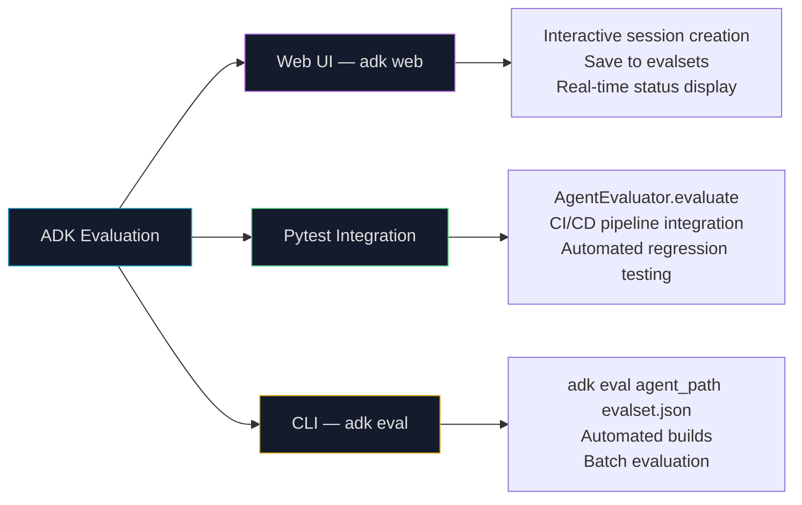

## Why Traditional Testing Fails for Agents

<div class="concept-box">
  <span class="concept-label">Before You Start — Key Terms Explained</span>
  <p><strong>Metric:</strong> A quantifiable measure of performance. Response latency (seconds), token cost (dollars per query), accuracy (% correct answers), BLEU score (text similarity) — these are all metrics. Metrics make "the agent is performing well" into a measurable, comparable claim.</p>
  <p style="margin-top:0.5rem"><strong>Concept drift:</strong> When the statistical distribution of real-world inputs changes over time, causing a model trained on old data to perform worse on new data. A financial agent trained on pre-pandemic market patterns may drift significantly after economic shocks. Monitoring detects when drift is degrading performance.</p>
  <p style="margin-top:0.5rem"><strong>A/B testing:</strong> Running two versions of something (agent version A and version B) simultaneously on different portions of real traffic to compare their performance on the same metric. The only way to know if a change is actually better — not just apparently better on your test cases.</p>
  <p style="margin-top:0.5rem"><strong>Trajectory:</strong> The complete sequence of steps an agent takes to accomplish a task — which tools it called, in what order, with what parameters, and what decisions it made between steps. Trajectory evaluation asks: did the agent take the right path, not just reach the right destination?</p>
  <p style="margin-top:0.5rem"><strong>LLM-as-a-Judge:</strong> Using a separate LLM to evaluate the quality of another LLM's (or agent's) output. The evaluator LLM is given a rubric, the original question, and the agent's response, and produces a structured quality assessment. Scales better than human evaluation but inherits the judge LLM's biases.</p>
  <p style="margin-top:0.5rem"><strong>Token counting:</strong> Measuring how many tokens were consumed in an LLM call. LLM APIs charge per token — tracking token consumption is essential for cost management. Input tokens (your prompt) and output tokens (the model's response) are typically priced differently.</p>
  <p style="margin-top:0.5rem"><strong>Precision vs Recall (in trajectory evaluation):</strong> Precision = of the steps the agent took, what fraction were correct and necessary? Recall = of all the necessary steps, what fraction did the agent actually take? High precision means few wasted steps. High recall means no critical steps were missed.</p>
  <p style="margin-top:0.5rem"><strong>Evalset:</strong> A curated dataset of test scenarios for evaluating an agent. Each scenario specifies an input, the expected tool calls (trajectory), and the expected final response. Used for systematic regression testing — ensuring new agent versions don't break what already worked.</p>
</div>

When a traditional software function is wrong, you know it: the output doesn't match the expected value. The test fails. You fix the bug. The test passes. Deterministic behavior makes testing straightforward.

AI agents don't work this way. The same query might produce slightly different answers on different runs due to temperature settings. The "right" answer to "What are the pros and cons of microservices?" depends on context, audience, and intent. There's no single correct trajectory — an agent might take a longer path that's still correct, or a shorter path that misses critical detail. And an agent that works perfectly today might drift as its environment, user base, or underlying model changes.

Traditional unit tests catch **code bugs**. Agent evaluation catches **behavioral drift**, **quality degradation**, **cost overruns**, **safety violations**, and **goal misalignment** — a completely different class of problems requiring a completely different class of tools.

This chapter builds the complete evaluation and monitoring framework: what to measure, how to measure it, and what to do when the measurements reveal problems.

---

## The Four Dimensions of Agent Performance

Before choosing metrics, define what "good" means across four dimensions:

<div class="eval-dimensions-wrapper">
  <div class="eval-dim-card">
    <div class="eval-dim-icon">✓</div>
    <h4>Effectiveness</h4>
    <p>Does the agent achieve its goal? Is the output accurate, complete, and aligned with user intent? Effectiveness metrics measure the *quality* of what the agent produces.</p>
    <div class="eval-dim-examples">
      <span>Answer accuracy</span><span>Task completion rate</span><span>User satisfaction</span><span>Helpfulness score</span>
    </div>
  </div>
  <div class="eval-dim-card">
    <div class="eval-dim-icon">⚡</div>
    <h4>Efficiency</h4>
    <p>Does the agent achieve its goal with minimal resource consumption? Efficiency metrics measure *how much* it costs — in time, tokens, API calls, and money — to produce results.</p>
    <div class="eval-dim-examples">
      <span>Response latency</span><span>Token cost per query</span><span>Tool calls per task</span><span>Compute cost</span>
    </div>
  </div>
  <div class="eval-dim-card">
    <div class="eval-dim-icon">🛡</div>
    <h4>Safety & Compliance</h4>
    <p>Does the agent stay within ethical, legal, and operational boundaries? Safety metrics measure whether the agent's behavior is acceptable — even when technically effective.</p>
    <div class="eval-dim-examples">
      <span>Guardrail trigger rate</span><span>Policy violation rate</span><span>PII exposure incidents</span><span>Audit compliance</span>
    </div>
  </div>
  <div class="eval-dim-card">
    <div class="eval-dim-icon">📈</div>
    <h4>Reliability</h4>
    <p>Does the agent perform consistently over time, under load, and in novel situations? Reliability metrics measure whether performance degrades, drifts, or fails under real-world conditions.</p>
    <div class="eval-dim-examples">
      <span>Error rate</span><span>Drift metrics</span><span>Uptime/availability</span><span>Edge case handling</span>
    </div>
  </div>
</div>

<style>
.eval-dimensions-wrapper { display: grid; grid-template-columns: repeat(auto-fill, minmax(200px, 1fr)); gap: 0.85rem; margin: 1.5rem 0; }
.eval-dim-card { border: 1px solid var(--global-divider-color); border-radius: 8px; padding: 1rem; background: rgba(128,128,128,0.04); display: flex; flex-direction: column; gap: 0.45rem; }
.eval-dim-icon { font-size: 1.1rem; }
.eval-dim-card h4 { font-size: 0.85rem; font-weight: 700; margin: 0; color: var(--global-text-color); }
.eval-dim-card p  { font-size: 0.78rem; color: var(--global-text-color-light); margin: 0; line-height: 1.5; }
.eval-dim-examples { display: flex; flex-wrap: wrap; gap: 0.3rem; margin-top: auto; padding-top: 0.35rem; border-top: 1px solid var(--global-divider-color); }
.eval-dim-examples span { font-size: 0.62rem; font-family: monospace; color: #2698ba; background: rgba(38,152,186,0.08); border-radius: 3px; padding: 0.1em 0.4em; }
</style>

---

## The Three Evaluation Methods

<div class="eval-methods-wrapper">
  <div class="eval-methods-tabs">
    <button class="eval-tab active" data-idx="0" onclick="evalTab(0)">Human Evaluation</button>
    <button class="eval-tab" data-idx="1" onclick="evalTab(1)">LLM-as-a-Judge</button>
    <button class="eval-tab" data-idx="2" onclick="evalTab(2)">Automated Metrics</button>
  </div>
  <div class="eval-methods-body">
    <div class="eval-method active" id="evalM0">
      <div class="eval-m-title">Human Evaluation — the gold standard</div>
      <div class="eval-m-desc">Human raters review agent responses and score them on quality dimensions. The most reliable method for capturing nuanced, subjective qualities like tone, helpfulness, and appropriateness — things that automated metrics miss entirely.</div>
      <div class="eval-m-when"><strong>When to use:</strong> Establishing ground truth for new tasks. Calibrating automated evaluation systems (humans provide the "correct" scores that teach LLM-as-a-Judge). Periodic audits of production quality. Any time you need the highest-quality assessment of a small sample.</div>
      <div class="eval-m-strengths">
        <div class="eval-m-item eval-m-pro">✓ Captures subtle behaviors (tone, empathy, nuance)</div>
        <div class="eval-m-item eval-m-pro">✓ Can evaluate any quality dimension you define</div>
        <div class="eval-m-item eval-m-pro">✓ No model capability ceiling — humans catch what LLMs miss</div>
        <div class="eval-m-item eval-m-con">✗ Expensive: $0.50-5.00 per evaluation</div>
        <div class="eval-m-item eval-m-con">✗ Slow: hours to days for large samples</div>
        <div class="eval-m-item eval-m-con">✗ Inconsistent: rater disagreement, fatigue, bias</div>
        <div class="eval-m-item eval-m-con">✗ Not scalable to production monitoring</div>
      </div>
    </div>
    <div class="eval-method" id="evalM1">
      <div class="eval-m-title">LLM-as-a-Judge — scalable qualitative evaluation</div>
      <div class="eval-m-desc">A separate LLM receives a rubric, the original query, and the agent's response, and produces a structured quality assessment. Scales to thousands of evaluations per hour at a fraction of human evaluation cost. Most effective when the judge LLM is more capable than the agent being judged.</div>
      <div class="eval-m-when"><strong>When to use:</strong> Evaluating subjective qualities at scale (helpfulness, clarity, tone). Continuous monitoring of production quality without hiring human raters. A/B testing agent versions. Any qualitative dimension that resists reduction to a simple metric.</div>
      <div class="eval-m-strengths">
        <div class="eval-m-item eval-m-pro">✓ Scalable: 1,000+ evaluations per minute</div>
        <div class="eval-m-item eval-m-pro">✓ Consistent: same rubric applied identically every time</div>
        <div class="eval-m-item eval-m-pro">✓ Nuanced: captures qualitative dimensions better than simple metrics</div>
        <div class="eval-m-item eval-m-con">✗ Biased: judge LLM has its own biases and blind spots</div>
        <div class="eval-m-item eval-m-con">✗ Self-serving: same model family tends to rate itself favorably</div>
        <div class="eval-m-item eval-m-con">✗ Limited by judge capability: can't catch what the judge can't detect</div>
      </div>
    </div>
    <div class="eval-method" id="evalM2">
      <div class="eval-m-title">Automated Metrics — fast, cheap, objective</div>
      <div class="eval-m-desc">Compute deterministic scores from the agent's output without any human or LLM involvement. Fast (milliseconds), cheap (no API calls for evaluation), and objective (same input always produces same metric value). Best for quantity-based and structural metrics.</div>
      <div class="eval-m-when"><strong>When to use:</strong> Real-time production monitoring (latency, error rates, token usage). Regression testing in CI/CD pipelines. When quality can be expressed as a verifiable criterion (does the output contain X, is it under N words, did it use the correct tool). Cost tracking and budget enforcement.</div>
      <div class="eval-m-strengths">
        <div class="eval-m-item eval-m-pro">✓ Real-time: evaluate every single production request</div>
        <div class="eval-m-item eval-m-pro">✓ Objective: no human or LLM subjectivity</div>
        <div class="eval-m-item eval-m-pro">✓ Free: no additional API calls</div>
        <div class="eval-m-item eval-m-con">✗ Shallow: can't capture nuance, tone, or subtle quality</div>
        <div class="eval-m-item eval-m-con">✗ Metric gaming: agents optimized for a metric can game it</div>
        <div class="eval-m-item eval-m-con">✗ Limited scope: not all qualities reduce to a metric</div>
      </div>
    </div>
  </div>
</div>

<style>
.eval-methods-wrapper { border: 1px solid var(--global-divider-color); border-radius: 10px; overflow: hidden; margin: 2rem 0; }
.eval-methods-tabs { display: flex; border-bottom: 1px solid var(--global-divider-color); }
.eval-tab { flex: 1; padding: 0.55rem; font-family: monospace; font-size: 0.7rem; border: none; border-right: 1px solid var(--global-divider-color); background: transparent; color: var(--global-text-color-light); cursor: pointer; }
.eval-tab:last-child { border-right: none; }
.eval-tab.active { background: rgba(38,152,186,0.1); color: #2698ba; font-weight: 700; }
.eval-methods-body { padding: 1.1rem; }
.eval-method { display: none; flex-direction: column; gap: 0.65rem; }
.eval-method.active { display: flex; }
.eval-m-title { font-size: 0.95rem; font-weight: 700; color: var(--global-text-color); }
.eval-m-desc { font-size: 0.83rem; color: var(--global-text-color); line-height: 1.65; }
.eval-m-when { font-size: 0.8rem; color: var(--global-text-color-light); line-height: 1.6; }
.eval-m-strengths { display: flex; flex-direction: column; gap: 0.25rem; }
.eval-m-item { font-size: 0.78rem; line-height: 1.5; padding: 0.25rem 0.5rem; border-radius: 4px; }
.eval-m-pro { color: #4fc97e; background: rgba(79,201,126,0.06); }
.eval-m-con { color: #ff6b6b; background: rgba(255,107,107,0.06); }
</style>

<script>
function evalTab(idx) {
  document.querySelectorAll('.eval-tab').forEach(function(t){ t.classList.remove('active'); });
  document.querySelectorAll('.eval-method').forEach(function(m){ m.classList.remove('active'); });
  document.querySelector('.eval-tab[data-idx="'+idx+'"]').classList.add('active');
  document.getElementById('evalM'+idx).classList.add('active');
}
</script>

**The production strategy:** Use all three in a tiered system. Automated metrics run on 100% of production traffic (zero cost, real-time). LLM-as-a-Judge runs on a sample (5-10%) for qualitative monitoring. Human evaluation runs periodically or on triggered samples (flagged by automated metrics or LLM-as-Judge for deeper investigation).

---

## Token Usage Monitoring

For LLM-based agents, token consumption is both a cost metric and a performance signal. An agent that suddenly starts consuming 5× more tokens per request has either changed behavior or hit a new class of requests — both worth investigating.

```python
class LLMInteractionMonitor:
    """
    Tracks token consumption across all LLM calls made by an agent.
    In production, this would hook into the LLM API's token counter
    rather than estimating from string splitting.
    """
    def __init__(self):
        self.total_input_tokens  = 0
        self.total_output_tokens = 0
        self.interaction_count   = 0
        self.interactions        = []  # for per-interaction analysis

    def record_interaction(self, prompt: str, response: str,
                           actual_input_tokens: int = None,
                           actual_output_tokens: int = None):
        """
        Record one LLM call. Uses actual token counts from API
        if available; falls back to word-based estimation.
        """
        # Use actual token counts from the API response if available
        # (OpenAI: response.usage.prompt_tokens, Google: response.usage_metadata)
        if actual_input_tokens is not None:
            in_tokens  = actual_input_tokens
            out_tokens = actual_output_tokens
        else:
            # Rough estimate: ~4 chars per token for English text
            in_tokens  = len(prompt.split()) * 1.3    # words * avg tokens/word
            out_tokens = len(response.split()) * 1.3

        self.total_input_tokens  += in_tokens
        self.total_output_tokens += out_tokens
        self.interaction_count   += 1
        self.interactions.append({
            "prompt_preview":   prompt[:100],
            "input_tokens":     in_tokens,
            "output_tokens":    out_tokens,
            "estimated_cost_usd": (in_tokens * 0.00015 + out_tokens * 0.0006) / 1000
            # Cost formula: GPT-4o-mini pricing example
        })

    def get_total_tokens(self):
        return self.total_input_tokens, self.total_output_tokens

    def get_cost_estimate_usd(self, model="gpt-4o-mini"):
        """Estimate total cost based on standard pricing."""
        pricing = {
            "gpt-4o-mini": {"input": 0.15, "output": 0.60},  # per 1M tokens
            "gpt-4o":      {"input": 2.50, "output": 10.00},
            "gemini-flash": {"input": 0.075, "output": 0.30},
        }
        p = pricing.get(model, pricing["gpt-4o-mini"])
        return ((self.total_input_tokens  * p["input"] +
                 self.total_output_tokens * p["output"]) / 1_000_000)

    def get_summary(self):
        if self.interaction_count == 0:
            return "No interactions recorded"
        avg_in  = self.total_input_tokens  / self.interaction_count
        avg_out = self.total_output_tokens / self.interaction_count
        return (f"Total calls: {self.interaction_count} | "
                f"Avg input: {avg_in:.0f} tokens | "
                f"Avg output: {avg_out:.0f} tokens | "
                f"Est. cost: ${self.get_cost_estimate_usd():.4f}")

# Usage
monitor = LLMInteractionMonitor()
monitor.record_interaction(
    prompt   = "Tell me a joke.",
    response = "Why don't scientists trust atoms? Because they make up everything!",
    actual_input_tokens  = 8,   # from API response
    actual_output_tokens = 16
)
print(monitor.get_summary())
# → "Total calls: 1 | Avg input: 8 tokens | Avg output: 16 tokens | Est. cost: $0.0000"
```

> **Why track tokens per interaction, not just totals?** Averages hide outliers. If your agent averages 500 tokens per call but one call consumed 50,000 tokens (maybe it got stuck in a reasoning loop or received an unusually long document), the average looks fine but you have a serious anomaly. Per-interaction logging enables outlier detection, which is often the most valuable signal.

> **Why estimate cost alongside token count?** Tokens are an engineering metric; dollars are a business metric. When you alert your manager that "total tokens increased 40% this week," you'll need to immediately translate that into "that's an additional $X per day." Build the cost calculation into your monitoring system from the start, not as an afterthought.

---

## LLM-as-a-Judge: Implementation

Here's how to build a robust LLM-based evaluator with a structured rubric:

```python
import google.generativeai as genai
import json, logging
from pydantic import BaseModel, Field
from typing import List, Optional

# Define the structured output schema for the judge
class SurveyEvaluation(BaseModel):
    overall_score:     int         = Field(ge=1, le=5, description="Holistic quality score 1-5")
    rationale:         str         = Field(description="Summary of key strengths and weaknesses")
    detailed_feedback: List[str]   = Field(description="Bullet points per criterion")
    concerns:          List[str]   = Field(description="Specific issues identified")
    recommended_action: str        = Field(description="Next step: 'Approve as is', 'Revise', etc.")
```

> **Why define the output schema as a Pydantic model?** The judge LLM might return "I think this is a 4 out of 5" as prose, or a JSON object with the wrong field names, or perfectly valid JSON with a score of 7 (outside the 1-5 range). Pydantic validates all of these failure cases and raises clear errors rather than silently passing malformed data downstream. `Field(ge=1, le=5)` means "greater-than-or-equal to 1, less-than-or-equal to 5" — Pydantic enforces this constraint.

```python
LEGAL_SURVEY_RUBRIC = """
You are an expert legal survey methodologist. Evaluate the quality of
the provided legal survey question against five criteria.

Criteria (each scored 1-5):
1. Clarity & Precision — Is the question unambiguous? Is legal terminology precise?
   1=Extremely vague, 3=Moderately clear, 5=Perfectly precise and unambiguous

2. Neutrality & Bias — Does the question lead the respondent toward a particular answer?
   1=Highly leading/biased, 3=Slightly suggestive, 5=Completely neutral and objective

3. Relevance & Focus — Is the question directly relevant to the survey's objectives?
   1=Irrelevant, 3=Loosely related, 5=Directly relevant and tightly focused

4. Completeness — Does it provide sufficient context to answer accurately?
   1=Critical information missing, 3=Mostly complete, 5=All necessary context provided

5. Audience Appropriateness — Is the language calibrated for the target legal audience?
   1=Inaccessible jargon or oversimplified, 3=Generally appropriate, 5=Perfectly calibrated

Respond ONLY with valid JSON conforming to this schema:
{
  "overall_score": <integer 1-5>,
  "rationale": "<concise summary>",
  "detailed_feedback": ["<criterion 1 feedback>", ..., "<criterion 5 feedback>"],
  "concerns": ["<concern 1>", ...],
  "recommended_action": "<Approve as is | Revise for neutrality | Clarify scope | ...>"
}
"""

class LLMJudgeForLegalSurvey:
    def __init__(self, model_name: str = 'gemini-1.5-flash-latest',
                 temperature: float = 0.0):  # temperature=0 for consistent evaluation
        self.model       = genai.GenerativeModel(model_name)
        self.temperature = temperature

    def judge_survey_question(self, survey_question: str) -> Optional[dict]:
        full_prompt = f"{LEGAL_SURVEY_RUBRIC}\n\n---\nQUESTION TO EVALUATE:\n{survey_question}\n---"
        try:
            response = self.model.generate_content(
                full_prompt,
                generation_config = genai.types.GenerationConfig(
                    temperature        = self.temperature,
                    response_mime_type = "application/json"  # forces structured JSON output
                )
            )
            return json.loads(response.text)
        except json.JSONDecodeError as e:
            logging.error(f"Judge LLM returned invalid JSON: {e}")
            return None
        except Exception as e:
            logging.error(f"Judge LLM call failed: {e}")
            return None
```

> **`response_mime_type = "application/json"`**: This Gemini configuration parameter instructs the model to produce only valid JSON in its response — no prose, no markdown, no explanation outside the JSON structure. It's the equivalent of `temperature=0` for output format: it makes the response reliably machine-parseable. Not all LLM providers support this; OpenAI's equivalent is `response_format={"type": "json_object"}`.

> **`temperature = 0.0` for the judge.** An evaluator must be consistent — the same question evaluated twice should get the same score (or very close). Non-zero temperature introduces randomness: a question might score 3 today and 4 tomorrow for no meaningful reason. For evaluation systems, consistency is more important than creativity. `temperature=0` makes evaluation reproducible.

**Testing the judge on three quality levels:**

```python
judge = LLMJudgeForLegalSurvey()

# Example 1: Well-formed question — expect high score
good_question = """
To what extent do you agree that current IP laws in Switzerland adequately
protect AI-generated content, assuming the content meets originality criteria
established by the Federal Supreme Court?
(Select one: Strongly Disagree, Disagree, Neutral, Agree, Strongly Agree)
"""
# Expected: overall_score ~4-5, "Approve as is" or minor revisions

# Example 2: Leading/biased question — expect low score
biased_question = """
Don't you agree that overly restrictive data privacy laws like the FADP are
hindering essential technological innovation and economic growth?
(Select one: Yes, No)
"""
# Expected: overall_score ~1-2, "Revise for neutrality"

# Example 3: Vague question — expect low score
vague_question = "What are your thoughts on legal tech?"
# Expected: overall_score ~1, "Clarify scope" and "Revise for completeness"

for label, question in [("Good", good_question),
                         ("Biased", biased_question),
                         ("Vague", vague_question)]:
    result = judge.judge_survey_question(question)
    if result:
        print(f"\n{label}: score={result['overall_score']}/5 | {result['recommended_action']}")
        print(f"  Rationale: {result['rationale'][:100]}...")
```

---

## Trajectory Evaluation

For tool-using agents, the quality of the *path* matters as much as the quality of the *destination*. An agent that arrives at the right answer by calling the wrong tools in the wrong order is inefficient, potentially dangerous, and fragile.

**Trajectory evaluation** compares the agent's actual sequence of actions against a "ground truth" trajectory that represents the ideal approach.

<div class="eval-trajectory-wrapper">
  <div class="eval-traj-header">
    <span class="eval-traj-title">TRAJECTORY MATCHING METHODS — see how different strategies score the same agent</span>
    <button class="eval-traj-btn" id="evalTrajRunBtn">▶ Compare Methods</button>
  </div>
  <div class="eval-traj-scenario">
    <div class="eval-traj-label">SCENARIO: Customer asks "What's the current price of AAPL and should I buy?"</div>
    <div class="eval-traj-paths">
      <div class="eval-traj-path">
        <div class="eval-path-label eval-path-ideal">✓ IDEAL trajectory (ground truth)</div>
        <div class="eval-path-steps" id="evalIdealSteps">
          <span class="eval-step">get_stock_price(AAPL)</span>
          <span class="eval-step-arrow">→</span>
          <span class="eval-step">get_analyst_ratings(AAPL)</span>
          <span class="eval-step-arrow">→</span>
          <span class="eval-step">add_disclaimer()</span>
        </div>
      </div>
      <div class="eval-traj-path">
        <div class="eval-path-label eval-path-agent">🤖 AGENT trajectory (actual)</div>
        <div class="eval-path-steps" id="evalAgentSteps">
          <span class="eval-step eval-step-extra">search_news(AAPL)</span>
          <span class="eval-step-arrow">→</span>
          <span class="eval-step">get_stock_price(AAPL)</span>
          <span class="eval-step-arrow">→</span>
          <span class="eval-step eval-step-missing">⚠ add_disclaimer MISSING</span>
          <span class="eval-step-arrow">→</span>
          <span class="eval-step">get_analyst_ratings(AAPL)</span>
        </div>
      </div>
    </div>
  </div>
  <div class="eval-traj-results" id="evalTrajResults" style="display:none">
    <div class="eval-traj-method">
      <div class="eval-method-name">Exact Match</div>
      <div class="eval-method-score eval-score-fail">FAIL (0/1)</div>
      <div class="eval-method-reason">Agent used different order and added extra step. Perfect sequence required.</div>
    </div>
    <div class="eval-traj-method">
      <div class="eval-method-name">In-Order Match</div>
      <div class="eval-method-score eval-score-partial">PARTIAL (2/3)</div>
      <div class="eval-method-reason">get_stock_price ✓ and get_analyst_ratings ✓ in correct relative order. add_disclaimer ✗ missing entirely.</div>
    </div>
    <div class="eval-traj-method">
      <div class="eval-method-name">Any-Order Match</div>
      <div class="eval-method-score eval-score-partial">PARTIAL (2/3)</div>
      <div class="eval-method-reason">2 of 3 required steps present. add_disclaimer missing. Order doesn't matter for this metric.</div>
    </div>
    <div class="eval-traj-method">
      <div class="eval-method-name">Precision</div>
      <div class="eval-method-score eval-score-ok">0.75 (3/4)</div>
      <div class="eval-method-reason">Agent took 4 steps total; 3 were necessary. Extra step (search_news) penalizes precision.</div>
    </div>
    <div class="eval-traj-method">
      <div class="eval-method-name">Recall</div>
      <div class="eval-method-score eval-score-partial">0.67 (2/3)</div>
      <div class="eval-method-reason">2 of 3 required steps taken. Missed add_disclaimer — a safety-critical step.</div>
    </div>
  </div>
</div>

<style>
.eval-trajectory-wrapper { border: 1px solid var(--global-divider-color); border-radius: 10px; overflow: hidden; margin: 2rem 0; }
.eval-traj-header { display: flex; align-items: center; justify-content: space-between; padding: 0.75rem 1.1rem; border-bottom: 1px solid var(--global-divider-color); background: rgba(128,128,128,0.05); }
.eval-traj-title { font-size: 0.68rem; font-weight: 700; letter-spacing: 0.1em; text-transform: uppercase; color: var(--global-text-color); }
.eval-traj-btn { font-family: monospace; font-size: 0.72rem; padding: 0.3rem 0.8rem; border-radius: 4px; border: 1px solid var(--global-divider-color); background: transparent; color: var(--global-text-color); cursor: pointer; }
.eval-traj-btn:hover { background: rgba(38,152,186,0.12); border-color:#2698ba; color:#2698ba; }
.eval-traj-scenario { padding: 1rem 1.1rem; display: flex; flex-direction: column; gap: 0.65rem; border-bottom: 1px solid var(--global-divider-color); }
.eval-traj-label { font-size: 0.72rem; color: var(--global-text-color-light); font-family: monospace; }
.eval-traj-paths { display: flex; flex-direction: column; gap: 0.5rem; }
.eval-traj-path { display: flex; flex-direction: column; gap: 0.3rem; }
.eval-path-label { font-size: 0.65rem; font-weight: 700; letter-spacing: 0.08em; font-family: monospace; }
.eval-path-ideal { color: #4fc97e; }
.eval-path-agent  { color: #e6a817; }
.eval-path-steps { display: flex; align-items: center; flex-wrap: wrap; gap: 0.25rem; }
.eval-step { font-size: 0.72rem; font-family: monospace; padding: 0.2em 0.5em; border-radius: 4px; background: rgba(128,128,128,0.1); border: 1px solid var(--global-divider-color); color: var(--global-text-color); }
.eval-step-extra   { border-color: rgba(230,168,23,0.4); background: rgba(230,168,23,0.08); color: #e6a817; }
.eval-step-missing { border-color: rgba(255,107,107,0.4); background: rgba(255,107,107,0.08); color: #ff6b6b; font-style: italic; }
.eval-step-arrow { color: var(--global-text-color-light); font-size: 0.8rem; }
.eval-traj-results { padding: 0.75rem 1.1rem; display: none; flex-direction: column; gap: 0.5rem; background: rgba(128,128,128,0.03); animation: etIn 0.3s ease; }
@keyframes etIn { from{opacity:0;} to{opacity:1;} }
.eval-traj-results.visible { display: flex; }
.eval-traj-method { display: flex; align-items: flex-start; gap: 0.75rem; padding: 0.5rem 0.6rem; border-radius: 6px; border: 1px solid var(--global-divider-color); background: rgba(128,128,128,0.03); }
.eval-method-name { font-size: 0.72rem; font-weight: 700; font-family: monospace; min-width: 110px; flex-shrink: 0; color: var(--global-text-color); }
.eval-method-score { font-size: 0.72rem; font-family: monospace; font-weight: 700; min-width: 90px; flex-shrink: 0; }
.eval-score-fail    { color: #ff6b6b; }
.eval-score-partial { color: #e6a817; }
.eval-score-ok      { color: #4fc97e; }
.eval-method-reason { font-size: 0.75rem; color: var(--global-text-color-light); line-height: 1.5; }
</style>

<script>
document.addEventListener('DOMContentLoaded', function(){
  var btn = document.getElementById('evalTrajRunBtn');
  if (!btn) return;
  btn.addEventListener('click', function(){
    var results = document.getElementById('evalTrajResults');
    results.style.display = results.style.display === 'none' ? 'flex' : 'none';
    results.style.flexDirection = 'column';
    btn.textContent = results.style.display === 'none' ? '▶ Compare Methods' : '▲ Hide';
  });
});
</script>

**Choosing the right trajectory metric:**

| Scenario | Best metric | Reason |
|---|---|---|
| High-stakes (medical, financial) | Exact match | Deviations from protocol are unacceptable |
| Complex tasks with valid alternatives | In-order match | Allows flexibility while preserving logical order |
| Flexible workflows | Any-order match | Results matter more than sequence |
| Minimizing wasted API calls | Precision | Penalizes unnecessary steps (cost optimization) |
| Safety-critical steps | Recall | Ensures critical steps are never skipped |

---

## ADK Evaluation Framework

Google's ADK provides three built-in evaluation modes:



### Test File Format (Unit Testing)

```json
{
  "eval_set_id": "smart_home_unit_tests",
  "turns": [
    {
      "user_query": "Turn off device_2 in the Bedroom.",
      "expected_tool_use": [
        {
          "tool_name": "set_device_info",
          "tool_input": {
            "location": "Bedroom",
            "device_id": "device_2",
            "status": "OFF"
          }
        }
      ],
      "expected_intermediate_agent_responses": [],
      "expected_final_response": "I have set the device_2 status to off."
    }
  ]
}
```

> **What each field validates:** `expected_tool_use` checks whether the agent called the right tool with the right parameters (trajectory). `expected_intermediate_agent_responses` can check what the agent said between tool calls (useful for multi-step reasoning agents). `expected_final_response` checks the user-facing output quality. The ADK evaluator runs the actual agent, captures its behavior, and compares against all three expected values.

> **Why define `expected_tool_use` at the parameter level?** Simply checking "did the agent call `set_device_info`?" isn't sufficient. An agent that calls `set_device_info(location="Living Room")` when asked about the Bedroom has failed even though it used the "right" tool. Parameter-level matching catches this. For high-stakes actions (database writes, API calls, financial transactions), parameter validation is critical.

### Evalset Format (Integration Testing)

```json
{
  "eval_set_id": "math_assistant_integration",
  "evals": [
    {
      "eval_id": "dice_and_prime",
      "conversation": [
        {
          "invocation_id": "turn_1",
          "user_query": "What can you do?",
          "expected_final_response": "I can roll dice, check prime numbers, and perform mathematical operations."
        },
        {
          "invocation_id": "turn_2",
          "user_query": "Roll a 10-sided dice twice and then check if 9 is prime.",
          "expected_tool_use": [
            {"tool_name": "roll_die", "tool_input": {"sides": 10}},
            {"tool_name": "roll_die", "tool_input": {"sides": 10}},
            {"tool_name": "check_prime", "tool_input": {"number": 9}}
          ],
          "expected_final_response": "I rolled a 10-sided die twice..."
        }
      ]
    }
  ]
}
```

> **Test file vs evalset — what's the difference?** Test files contain a **single session** with one or more turns. They're analogous to unit tests — fast, focused, testing specific behaviors. Evalsets contain **multiple sessions** (multiple "evals"), each with potentially many turns. They're analogous to integration tests — they test complex, multi-turn conversations that simulate real user workflows. Use test files during active development; use evalsets for pre-deployment regression testing.

### Running Evaluations

```bash
# Web UI — interactive evaluation and dataset creation
adk web

# CLI — automated evaluation for CI/CD
adk eval ./my_agent/ ./evalsets/production_test.json \
    --config ./eval_config.json \
    --print_detailed_results

# Run specific evals from a larger evalset
adk eval ./my_agent/ ./evalsets/full_suite.json \
    eval_id_1,eval_id_2,eval_id_3  # comma-separated, no spaces

# Pytest integration — include in your test suite
# (in your test_agent.py file):
from google.adk.evaluation import AgentEvaluator

def test_agent_smoke():
    AgentEvaluator.evaluate(
        agent_module    = "my_agent.agent",
        eval_dataset    = "./evalsets/smoke_test.json",
        num_runs        = 1,
    )
```

> **Why three evaluation modes?** Each serves a different workflow. The web UI is for building evalsets interactively — you have a real conversation with the agent and save good examples as test cases. The CLI is for automation — run it in your CI/CD pipeline on every pull request to catch regressions before deployment. Pytest integration is for developers who want agent evaluation alongside their existing unit tests in one `pytest` run.

---

## From Agents to Contractors: The Evaluation-Accountability Link

A profound insight from recent research (Gulli et al., 2025): the harder it is to evaluate an agent, the less you can trust it. Evaluation difficulty is a proxy for accountability deficit.

The **contractor model** directly addresses this by making every agent interaction formally evaluated against explicit, pre-specified criteria:

<div class="ns-diagram">
  <div class="ns-diagram-header">
    <span class="ns-diagram-label">CONTRACTOR LIFECYCLE — formalized evaluation at every stage</span>
    <button class="ns-expand-btn" onclick="openNsDiagram(this)"><svg width="11" height="11" viewBox="0 0 12 12" fill="none" stroke="currentColor" stroke-width="1.5"><path d="M1 5V1h4M11 7v4H7M1 5l4-4M11 7l-4 4"/></svg> Expand</button>
  </div>
  <div class="ns-diagram-body" style="padding:1.25rem 1.5rem;">
    <div class="ns-node ns-node-cyan" style="max-width:300px;">
      <div class="ns-node-title">Contract Submitted</div>
      <div class="ns-node-sub">Precise specification: deliverables, format, data sources, scope, expected cost and duration. Everything objectively verifiable.</div>
    </div>
    <div class="ns-arrow"></div>
    <div class="ns-node ns-node-amber" style="max-width:340px;">
      <div class="ns-node-title">Contract Assessment</div>
      <div class="ns-node-sub">Agent evaluates feasibility, cost estimate, ambiguities. Can request clarification before committing. Prevents failures from underspecified requirements.</div>
    </div>
    <div class="ns-arrow"></div>
    <div class="ns-decision" style="max-width:200px;"><div class="ns-node-title">Accepted or Revised?</div></div>
    <div class="ns-arrow"></div>
    <div class="ns-branch-row" style="max-width:480px;">
      <div class="ns-branch">
        <span class="ns-label-red">Revision needed</span>
        <div class="ns-arrow ns-arrow-red"></div>
        <div class="ns-node ns-node-red"><div class="ns-node-title">Contract Revision</div><div class="ns-node-sub">Agent flags ambiguities, cost overruns, missing data. Negotiation before execution.</div></div>
      </div>
      <div class="ns-branch">
        <span class="ns-label-green">Accepted</span>
        <div class="ns-arrow ns-arrow-green"></div>
        <div class="ns-node ns-node-green"><div class="ns-node-title">Contract Execution</div><div class="ns-node-sub">Generates plan → executes tasks → self-validates → generates subcontracts for complex subtasks.</div></div>
      </div>
    </div>
    <div class="ns-arrow"></div>
    <div class="ns-node ns-node-green" style="max-width:300px;"><div class="ns-node-title">Contract Deliverables</div><div class="ns-node-sub">Verifiable against contract specifications. Evaluation is built into the contract — no post-hoc interpretation of "was this good enough?"</div></div>
  </div>
</div>

**The four pillars of contractor-style agents:**

**1. Formalized Contract.** Instead of a prompt like "analyze last quarter's sales," a contract specifies: "Deliver a 20-page PDF analyzing European market sales from Q1 2025, including five data visualizations, comparative analysis against Q1 2024, and a risk assessment. Acceptable data sources: [listed]. Maximum compute cost: $50. Completion time: 2 hours." Every output criterion is objectively verifiable.

**2. Negotiation Phase.** Before execution, the agent can flag issues: "The specified XYZ database is inaccessible. Please provide credentials or approve alternative sources." This resolves misunderstandings before they become failures — exactly what a human contractor would do before starting a project.

**3. Quality-Focused Iterative Execution.** For a code contract, the agent generates multiple implementations, runs them against the contract's unit tests, scores each on performance/security/readability, and only delivers the version that passes all criteria. Internal self-validation before delivery.

**4. Hierarchical Decomposition via Subcontracts.** A master contract to "build an e-commerce mobile app" generates subcontracts: "Design UI/UX," "Develop authentication module," "Create database schema," "Integrate payment gateway." Each subcontract is a complete, independent, evaluable unit — enabling both specialization and accountability at every level.

---

## Continuous Monitoring in Production

<div class="eval-monitoring-grid">
  <div class="eval-mon-card">
    <div class="eval-mon-icon">📊</div>
    <h4>Performance Tracking</h4>
    <p>Monitor accuracy, latency, and resource consumption continuously. Set up dashboards with alerting thresholds. A response latency spike at 2am should wake someone up — or at least log an alert — before users start complaining.</p>
    <div class="eval-mon-metrics"><code>p50/p95/p99 latency · error_rate · tokens_per_query · cost_per_day</code></div>
  </div>
  <div class="eval-mon-card">
    <div class="eval-mon-icon">🔀</div>
    <h4>A/B Testing</h4>
    <p>Split production traffic between agent version A and version B. Measure the same metrics on both. The only way to know whether a change is actually better in production — not just apparently better on your test cases. Control for confounders (time of day, user segments).</p>
    <div class="eval-mon-metrics"><code>statistical_significance · lift_in_primary_metric · guardrail_metric_compliance</code></div>
  </div>
  <div class="eval-mon-card">
    <div class="eval-mon-icon">🌊</div>
    <h4>Drift Detection</h4>
    <p>Monitor input distribution (are queries changing?), output quality trends (is accuracy declining?), and tool call patterns (is the agent using different tools than it used to?). Drift often manifests gradually — regular sampling and trend analysis catches it before users complain.</p>
    <div class="eval-mon-metrics"><code>query_distribution_shift · quality_score_trend · tool_call_distribution</code></div>
  </div>
  <div class="eval-mon-card">
    <div class="eval-mon-icon">🚨</div>
    <h4>Anomaly Detection</h4>
    <p>Identify unusual patterns: sudden spike in guardrail triggers (possible attack), unexpected drop in task completion rate, specific tool call timing out repeatedly, unusual concentration of queries from a single user. Most anomalies are either attacks or bugs — both need rapid response.</p>
    <div class="eval-mon-metrics"><code>guardrail_trigger_spike · tool_error_rate · completion_rate_drop</code></div>
  </div>
  <div class="eval-mon-card">
    <div class="eval-mon-icon">📋</div>
    <h4>Compliance Auditing</h4>
    <p>Generate automated reports showing the agent's adherence to ethical guidelines, regulatory requirements, and safety protocols. These reports need to be human-readable for auditors and machine-queryable for automated monitoring. Log everything — "if it didn't get logged, it didn't happen."</p>
    <div class="eval-mon-metrics"><code>policy_violation_rate · escalation_rate · audit_trail_completeness</code></div>
  </div>
  <div class="eval-mon-card">
    <div class="eval-mon-icon">📚</div>
    <h4>Learning Progress</h4>
    <p>For agents that learn or adapt (Chapter 9 pattern), track whether learning is actually improving performance. Plot accuracy, cost efficiency, and task completion over time. Ensure improvements generalize (don't just overfit to the evaluation set).</p>
    <div class="eval-mon-metrics"><code>accuracy_over_time · generalization_score · learning_curve_slope</code></div>
  </div>
</div>

<style>
.eval-monitoring-grid { display: grid; grid-template-columns: repeat(auto-fill, minmax(220px, 1fr)); gap: 0.85rem; margin: 1.5rem 0; }
.eval-mon-card { border: 1px solid var(--global-divider-color); border-radius: 8px; padding: 1rem; background: rgba(128,128,128,0.04); display: flex; flex-direction: column; gap: 0.4rem; }
.eval-mon-icon { font-size: 1.1rem; }
.eval-mon-card h4 { font-size: 0.85rem; font-weight: 700; margin: 0; color: var(--global-text-color); }
.eval-mon-card p  { font-size: 0.78rem; color: var(--global-text-color-light); margin: 0; line-height: 1.5; }
.eval-mon-metrics { font-size: 0.65rem; font-family: monospace; color: #2698ba; margin-top: auto; padding-top: 0.35rem; border-top: 1px solid var(--global-divider-color); }
</style>

---

## Key Takeaways

- **Traditional testing is insufficient for agents.** Code tests catch bugs. Agent evaluation catches behavioral drift, quality degradation, cost overruns, safety violations, and goal misalignment — completely different problem classes requiring different tools.

- **Use all three evaluation methods in a tiered system.** Automated metrics on 100% of traffic (free, real-time). LLM-as-a-Judge on 5-10% (scalable qualitative assessment). Human evaluation periodically or on triggered samples (gold standard for calibration). Each layer catches what the others miss.

- **Track tokens per interaction, not just totals.** Per-interaction logging reveals outliers that averages hide. A single 50,000-token call (reasoning loop gone wrong) looks fine in an average but is a serious anomaly that needs investigation.

- **`temperature=0` is mandatory for LLM-as-a-Judge.** Evaluation consistency requires determinism. Non-zero temperature means the same response gets different scores on different days — your evaluation system becomes unreliable.

- **Trajectory evaluation is as important as output evaluation.** The right answer via the wrong path is inefficient, brittle, and potentially dangerous. Evaluate both what the agent produced and how it got there. Choose your trajectory metric based on the stakes: exact match for safety-critical steps, recall when no critical step can be missed.

- **ADK provides three evaluation modes for different workflows.** Web UI for interactive evalset building. Pytest for developer CI/CD integration. CLI for automated deployment pipelines. Use all three at different stages of development.

- **The contractor model embeds evaluation into the contract itself.** When deliverables are explicitly specified with verifiable criteria upfront, evaluation becomes trivial — either the agent met the contract or it didn't. This is the future of accountable AI deployment in mission-critical domains.

- **Build monitoring before you need it.** Instrumentation added post-deployment has gaps. Build token tracking, error logging, latency measurement, and quality sampling into the agent from day one. The cost of instrumentation is tiny; the cost of debugging un-instrumented production failures is enormous.
